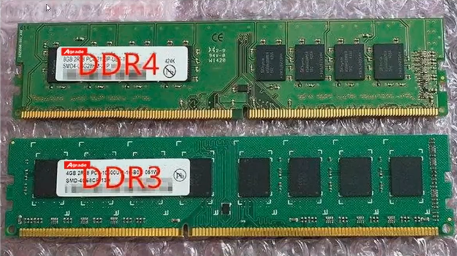
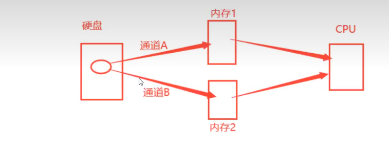

### 内存说明

内存，是作为CPU和硬盘之间交互数据时的缓冲区，提高CPU的使用效率，本身是存储设备，有个特点就是内存中的数据断电会丢失，硬盘中的数据不会断电消失。运行起来的程序和程序中临时产生的数据都会先保存在内存中。

手机上我们不叫内存，叫做运行内存，好多人说手机内存其实它说的是手机磁盘的存储容量，

比如我们可能听过什么8+256，8表示的是8G运行内存，256G说的是存储，也就是硬盘容量

我们有看到有个机带RAM，这就是内存了，我的内存是32GB大小，内存这个东西到底可以有多大呢？有大小边界吗？内存的大小主要受限于这几个因子：操作系统、总线、CPU，我们可以看到，我上面图中系统类型位64位操作系统，基于x64的处理器，这个x64是x86_64位的简写形式，说的是这个电脑的CPU是x86架构的，具备64位处理能力的。而我们安装软件，也就是程序员开发的软件也是分32位和64位的。比如QQ、微信、网易云音乐等等。我们自己现在安装一些常用软件的时候，基本看不到这个位数的体现了，因为我们现在的电脑系统大多数都是64位的了，而不管是32位的软件还是64位的软件都是支持安装在64位的系统上运行的。但是如果你的系统是32位的，那么是无法安装运行64位的软件的，这又是为什么呢？接下来我们讲解一下，看图：

CPU是64位的表示CPU寄存器存储的数据和CPU一次性计算的数据大小为64位的二进制数据，既然CPU能够一次性操作64位的数据，那么数据总线和操作系统也应该按照64位来进行设计，数据总线是CPU去内存中获取数据的电路线，64位地址总线表示的是数据总线一次性传输数据的大小为64位的，而操作操作系统作为各个硬件的控制程序，它应该也要支持64位数据的控制。那么也就是说操作系统能够在内存中找到64位的数据，这个我们叫做系统在内存中的寻址空间，然后数据总线将64位的数据传输给CPU，CPU正好也可以一次性加工处理64位的数据，这样CPU的使用效率就很高。

操作系统的寻址空间直接决定着所能够支持的最大内存是多少，并且决定着这个系统上可以安装的软件是64位的还是23位的，我们拿64位操作系统来举例，计算机底层存储、加工处理的数据都是二进制数据，0和1，是因为通过0和1这样的二进制方便对应控制电路的低电压和高电压，只要是运行起来进入到内存中的程序都已经是二进制的数据。
32位操作系统所能支持的最大内存为2的32次方。
64位操作系统所能支持的最大内存为2的64次方。

### 查看内存参数

**鲁大师**

如果要更换内存最好参数是一样的

是否可拆卸:一般显示一个或两个插槽,如果超过了两个插槽可能就不可拆卸

### 内存颗粒

内存颗粒：其实就是内存中的芯片，内存的存储能力就靠它。4G的内存，如果有8个内存颗粒，那么每个内存颗粒的空间大小为4*1024/8=512MB。

### 双通道技术

当我们有两根内存时，就可以使用到双通道技术，一块数据可以分两部分写入到两个内存中，速度更快，效率更高

