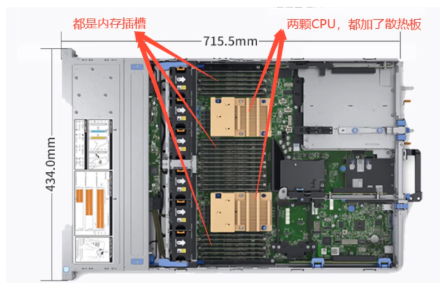

### 计算机分类

```txt
按照性能分类:
1、巨型机：也叫超算，即超级计算机，采用大规模并行处理的体系结构，是运算速度最快、体积最大、价格最昂贵的主机，主要用于尖端科学研究领域，比如灾难预测、天气预报、军事等等。中国有银河II、神威的太湖之光等，太湖之光有40个计算机仓，每个机舱包含1024颗理器，共40960个神威CPU。

2、大型机：是指运算速度快、处理能力强、存储容量大、功能完善的计算机，多采用对称多处理器结构，有数十个处理器。比如IBMz15大型机。

3、小型机：是一种供部门使用的计算机，规模较小、结构简单、成本较低、操作简便、维护容易，能满足部门的要求，可供中小企事业单位使用。比如IBM的小型机，这个小机的小是相对于巨型机和大型机对比来说的，实际上也不是很小昂。

4、微型计算机：又称为个人电脑或微型计算机。这类计算机面向个人、家庭、学校等，应用十分广泛。它由微处理器、半导体存储器和输入输出接口等芯片组成，因此其体积更小、价格更低、通用性更强、可靠性更高、使用更加方便。比如台式机、笔记本、智能手机等

按照功能分类：

服务器：它并不代表计算机的一种类型，小型机、微机都可以作为服务器来使用。如果硬要说的话pc服务器属于微型计算机。比如de11的R740服务器。

工作站：20世纪70年代后期出现的一种新塑的计算机系统，配有大屏幕显示器和大容量存储器，有较强的网络通信能力，主要适用于CAD/CAM和办公自动化等领域，如美国sUN公司的sUN-3、sUN-4，还有联想的ThinkStation，还有戴尔的一些工作站，还有苹果的macstudio工作站等等，现在在视频剪辑领域会有一些人在使用，不适用于玩游戏，适用于办公。

信息设备：它们是便携式设备，旨在执行一组有限的任务，如基本计算、播放多媒体、浏览互联网等。它们通常被称为移动设备。它们的内存和灵活性非常有限，通常按“原样”运行。

嵌入式计算机：它们是用于其他机器以满足有限需求的计算设备。它们遵循非易失性存储器的指令，不需要执行重启或重置。此类设备中使用的处理单元仅满足这些基本要求，并且与个人计算机中使用的处理单元不同－更为人所知的是工作站。
```


### 服务器


再看内部，服务器一般有两颗CPU，有的甚至有4个CPU，是专用CPU，和个人电脑的CPU不同，也不是按照什么辽、i9来分的，服务器的CPU性能更高、更贵，比如Intel的至强CPU、AMD的锐龙CPU等，有些服务器可以有18个内存插槽，如果每个内存条为16G，那么18*16=288G运行内存，有些最新的服务器甚至能够支持1TB的运行内存。服务器使用的是ECC内存和我们个人使用的普通电脑的内存不同，ECC内存条有纠错功能，它添置ECC错误校验技术，经过错误校验、纠正，可以有效的保证服务器系统的稳定性和可靠性。而普通内存条不配备校正错误技术，因此字检测到错误时，并不能确定错误位置，也无法修正错误。

我们普通电脑都是单路的，一个电源接口，服务器一般都是双路电源，两个电源接口，一个接国家电网的电路，另一个接备用电源的电路，这样如果国家电网停电了，另外一个接口的电源能够立马接上使用，让服务器可以一直运行。服务器都是按照长期稳定运行来设计的。服务器一般有更高的性能、更高的稳定性、功耗大、噪音大，好多公司都会把服务器放到专门的IDC机房去管理，机房里面说话的时候要声音很大，要不听不到。

