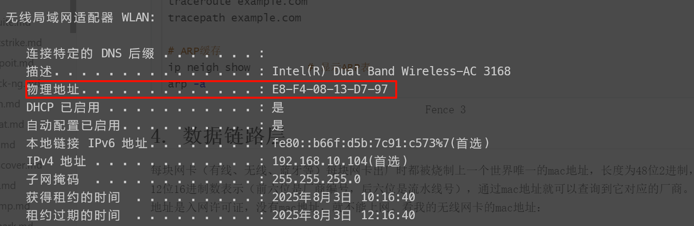

大家制定协议的时候，基本都是遵循的osi七层模型来设计的。


每一层都设计出了很多种协议，来完成特定的工作和数据传输，其实简单理解协议的话，其实就是不同协议需要加工不同的数据格式。


## 应用层

**功能**：提供特定应用程序服务

**协议示例**：
- HTTP/HTTPS (网页)
- DNS (域名解析)
- SSH (安全登录)
- SMTP (邮件发送)
- FTP (文件传输)

**相关命令**：
```bash
# HTTP请求
curl -v https://example.com
wget https://example.com

# DNS查询
dig example.com
nslookup example.com

# 邮件测试
swaks --to user@example.com

# SSH连接
ssh username@host

# 端口测试(应用层)
nc -zv example.com 80
telnet example.com 80
```


## 传输层

**功能**：端到端通信，流量控制

**协议**：
- TCP (可靠传输)
- UDP (高效传输)


**TCP协议**


**UDP协议**


**相关命令**：

```bash
# 查看TCP/UDP连接
ss -tulnp       # 显示所有连接
ss -t -a        # 显示TCP连接
ss -u -a        # 显示UDP连接

# 端口扫描
nmap -sT example.com  # TCP扫描
nmap -sU example.com  # UDP扫描

# 网络测试
nc -l 8080            # 监听端口
nc example.com 80     # TCP连接测试

# 带宽测试
iperf3 -c server_ip   # 需要服务端
```


## 网络层

**功能**：寻址和路由

**协议**：
- IPv4/IPv6
- ICMP (ping)
- ARP (地址解析)

**相关命令**：
```bash
# IP地址配置
ip addr show          # 显示所有IP
ip addr add 192.168.1.100/24 dev eth0  # 添加IP

# 路由管理
ip route show         # 显示路由表
ip route add default via 192.168.1.1

# 网络测试
ping example.com
ping6 ipv6.example.com

# 路径追踪
traceroute example.com
tracepath example.com

# ARP缓存
ip neigh show         # 显示ARP表
arp -a
```


## 数据链路层

**功能:**成帧、错误检测、MAC寻址、介质访问控制。

**协议:**

- Ethernet(以太网协议)
- Wi-Fi
- PPP
- HDLC
- VLAN

每块网卡（有线、无线、蓝牙等）每块网卡出厂时都被烧制上一个世界唯一的mac地址，长度为48位2进制，通常由12位16进制数表示（前六位是厂商编号，后六位是流水线号），通过mac地址就可以查询到它对应的厂商。这个mac地址是入网许可证，没有mac地址，就不能上网。看我的无线网卡的mac地址：



数据链路层的由来：单纯的电信号0和1没有任何意义，必须规定电信号多少位一组，每组什么意思

数据链路层的功能：定义了电信号的分组方式


**以太网协议(Ethernet)**

早期的时候各个公司都有自己的分组方式，后来形成了统一的标准，即以太网协议

- 一组电信号构成一个数据包，叫做帧

- 每一数据帧分成：报头head和数据data两部分

head(固定18个字节):

- 发送者/源地址，6个字节(mac地址)
- 接收者/目标地址，6个字节(mac地址)
- 数据类型，6个字节

data(最短46个字节,最长1500个字节):

- 数据包的具体内容


**相关命令:**

```zsh
# 查看mac地址
ip link show eth0 | grep ether

# 查看 ARP 表（IP ↔ MAC 映射）
ip neigh

# 修改 MAC 地址（临时）
sudo ip link set dev eth0 address 00:11:22:33:44:55
```


## 物理层

**功能:**解决信号转换的问题，基本都是数字信号，二进制数据控制的电路信号、电磁信号：电信号、光纤（光信号：光纤网卡可以将电信号转换为光信号）、电磁波。这个基本不需要我们关注，设备厂商就帮我们解决了。

**协议:**

- Ethernet (802.3)
- Wi-Fi (802.11)
- USB
- HDMI


**相关命令:**

```zsh
# 查看网络接口状态
ip link show

# 查看网卡详细信息（如速度、双工模式）
ethtool eth0

# 启用/禁用网卡（物理层开关）
ip link set eth0 down  # 禁用网卡
ip link set eth0 up    # 启用网卡
```

