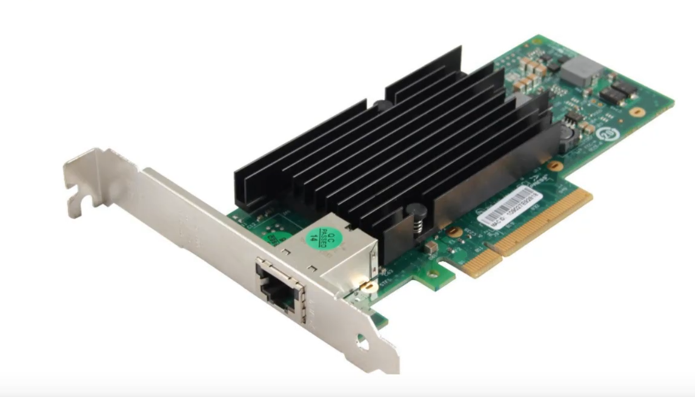
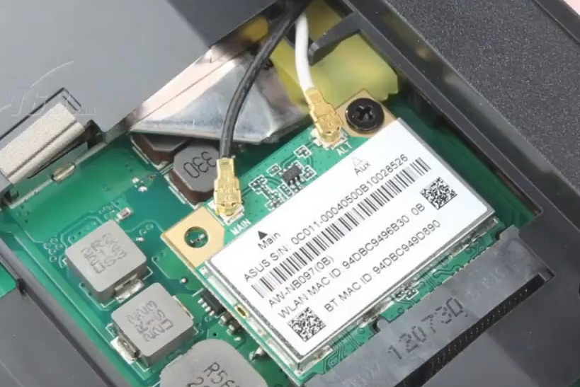
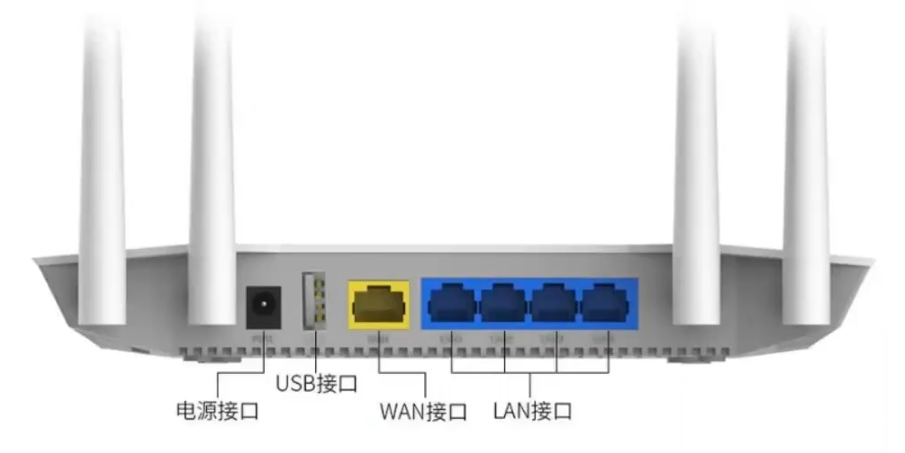

## 设备连接


**带宽运营商**

运营商是指提供网络服务的供应商，如华为、中兴、诺基亚、爱立信等这些通信设备的生产厂家叫生产商，而中国移动、中国联通、中国电信、中国广电这些公司叫运营商。

带宽:买了相应速度的带宽,必须要保证网络连接设备的带宽都能够支持才可以

```
带宽 指的是 网络通道的最大数据传输速率，通常以 比特每秒（bps, bits per second） 为单位。

1 Mbps = 1,000,000 bps（注意：计算机存储单位中的 **1 MB = 8 Mb**，因为 1 Byte = 8 bits）

带宽 ≠ 实际网速，因为实际传输速度受网络拥塞、协议开销、信号衰减等因素影响。
```


## 网卡

网卡的功能就是用来接收网络信号的,根据接收的介质不同分为有线网卡和无线网卡

**有线网卡:双绞线**





**无线网卡:无线电波**





wifi信号:

2.4Ghz:频率低,网速慢,波长长,范围远

5.0Ghz:频率高,网速快,波长短,范围近


网卡将接收到的信号交给操作系统,之后由操作系统进行硬件的调控

多数笔记本都是有两种网卡:有线网卡,无线网卡,手机内置无线网卡


## 光猫


光猫是一种调制解调器，是光调制信号转化为电信号，如果入户线是光纤的，那么需要光猫来将光信号转换为电信号，然后的功能，但是一般不太好用，所以一般都是建议光猫和路由器一起来使用，各同其职。如果入户线不是光纤，那么只要有个路由


## 交换机 (Switch)


### 基本概念

交换机是工作在OSI模型第二层(数据链路层)的网络设备，主要功能是根据MAC地址转发数据帧。

### 工作原理
- **MAC地址学习**：交换机通过记录每个端口连接的设备的MAC地址建立MAC地址表
- **帧转发**：根据目标MAC地址将数据帧转发到特定端口
- **广播处理**：对未知目标MAC地址的帧进行广播

### 主要类型
- **非管理型交换机**：即插即用，无配置界面
- **管理型交换机**：可配置VLAN、QoS等高级功能
- **PoE交换机**：支持通过网线供电(Power over Ethernet)

### 常用命令(Linux相关)
```bash
# 查看ARP表(包含MAC地址信息)
ip neigh

# 查看网络接口信息
ip link

# 使用ethtool查看网卡信息
sudo ethtool eth0
```


## 路由器 (Router)



### 基本概念

路由器是工作在OSI模型第三层(网络层)的设备，负责在不同网络之间转发数据包。

### 工作原理
- **路由表查询**：根据目标IP地址查询路由表决定转发路径
- **NAT(网络地址转换)**：将私有IP转换为公有IP
- **连接不同网络**：连接LAN和WAN，实现跨网络通信

### 主要功能
- 静态路由和动态路由(RIP, OSPF, BGP等)
- 访问控制(ACL)
- DHCP服务
- VPN支持

### 常用命令(Linux相关)
```bash
# 查看路由表
ip route
# 或
route -n

# 追踪路由路径
traceroute example.com
# 或
tracepath example.com

# 添加静态路由
sudo ip route add 192.168.1.0/24 via 192.168.0.1
```


## 防火墙 (Firewall)

### 基本概念
防火墙是网络安全设备，用于控制网络流量进出，保护内部网络免受外部威胁。

### 工作原理
- **包过滤**：基于IP、端口、协议等过滤数据包
- **状态检测**：跟踪连接状态，只允许合法连接
- **应用层过滤**：深度包检测(DPI)识别应用层协议

### 主要类型
- **网络层防火墙**：基于IP和端口过滤
- **应用层防火墙**：理解应用协议(HTTP, FTP等)
- **下一代防火墙(NGFW)**：集成入侵防御、恶意软件检测等

### Linux防火墙工具
#### iptables (传统)
```bash
# 查看规则
sudo iptables -L -n -v

# 允许SSH访问
sudo iptables -A INPUT -p tcp --dport 22 -j ACCEPT

# 默认拒绝所有输入
sudo iptables -P INPUT DROP
```

#### nftables (新一代)
```bash
# 查看规则
sudo nft list ruleset

# 添加简单规则
sudo nft add rule inet filter input tcp dport 22 accept
```

#### firewalld (高级管理)
```bash
# 查看活动区域
sudo firewall-cmd --get-active-zones

# 允许服务
sudo firewall-cmd --add-service=http --permanent
sudo firewall-cmd --reload
```


## 三者的协同工作

1. **数据流路径**：设备 → 交换机 → 路由器 → 防火墙 → 互联网
2. **分工**：
   - 交换机负责局域网内设备通信
   - 路由器负责不同网络间通信
   - 防火墙负责安全策略实施

3. **典型部署**：
   ```
   [内部设备] ↔ [交换机] ↔ [路由器] ↔ [防火墙] ↔ [互联网]
   ```


## 网络问题

```
设备带宽：各个设备之间进行网络数据传输，那么如果电脑网卡是千兆网卡，而路由器是百兆路由器，那么上网的最高速度也就是百兆，千兆网卡就浪费了。
通信介质：电磁波、光纤等。
多操作系统：各种操作系统信号兼容问题。
目标：信号发送和信号接收，要解决目标问题。
目标程序：qq对qq，微信对微信等等，需要用网络的程序很多，还要解决多个软件同时使用网络的问题。
保密：传输信号保密问题。
```


网络其实有这么多的问题需要解决，才能正常上网，所以网络需要更多的设计，解决这些问题都需要大家各种协商来解决，因此设定很多的规范，大家都遵守这个规范，我们称之为叫做协议，大家都遵守这个协议就能正常交互数据。
协议其实就是大家协商一致的规则。
网络上有很多很多协议，有些协议是全世界都遵守的，叫做通用协议，有些协议是内部通信自行设计的，叫做私有协议。