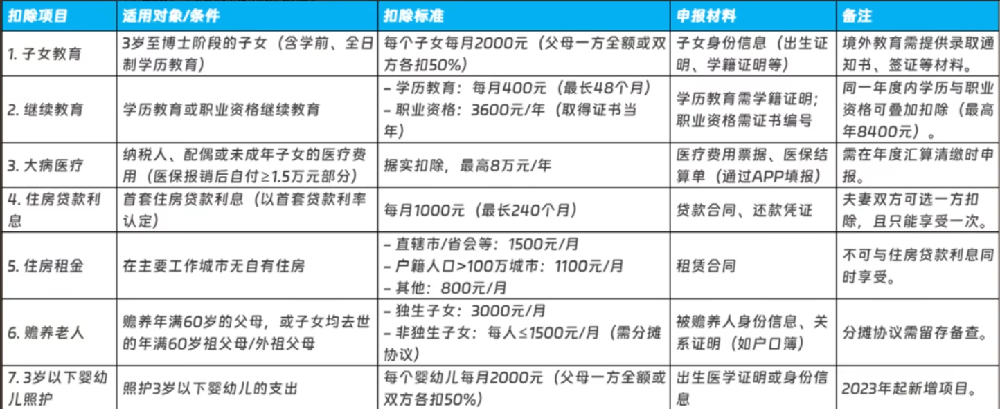
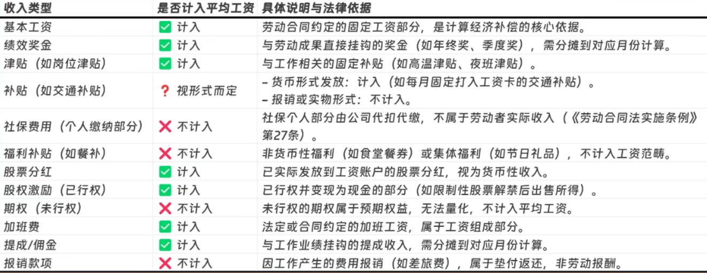

# 目标

```zsh
# 作息习惯养成
7:30:闹钟响->睁眼->起身->下床
21:30:闹钟响->关闭电子产品->关灯->观呼吸(化解其他,清空,过渡到睡眠)(或运动)
22:00:闹钟响->上床->闭眼->呼吸->睡觉

# 30-5
一坐下就计时
只在特定时间做特定的事情,过期不候
减少3,增加2和1(的单位)

# 设计赚钱(其他继续)
设计(从ps开始,从淘宝兼职开始),软件,渗透,嵌入式,硬件
```


# 精粹

```zsh
# --------- 0----------#
# 能量源-地图
能量源(原初物质的运动)vs地图(原初物质运动的表象化):创伤(欲求不满,苦中作乐,乐此不疲)vs处理创伤的方式,爱vs爱的方式
单位:主要的(大量时间)+细节的(不需要化太多时间)(单位的联合,更大的单位)(最小单位:原初物质+主体,一定要简单)(爱欲,健康,时间,技术,金钱,个人,组织,国家,社会)(自动->手动)
轻重缓急:将一切单位化,增加对自己好的单位(感觉好的,感觉更符合新版本的),减少对自己不好的单位(感觉不好的,感觉不符合新版本的)
方向:敌(飘在天上:思想+行为,走向孤立)vs友(脚踏实地:思想+行为,走向团结)(识别敌友:然后100%友,0%敌)(要么是敌,要么是友,没有第三种可能)(敌:强大弱小,友:强大弱小,自己:强大弱小)
目标:主要+细节,任务-路径(搭配):步骤->命令->行动链条(OKR:大目标-关键结果-具体行动)
看全局,找聚焦:可以聚焦在任何一点上,建立仪式,第一个动作开始做完全程
主体与原初物质(一开始就是不分离的),信仰原初物质,主体的使命是版本迭代(原初物质不灭,主体不灭)
精粹化扬弃(保留了一些东西,毁弃了一些东西):版本迭代(最小可行,不断迭代)
所有东西都要广撒网,慢慢试,最后留下来固定下来那个最适合我的(没有遇到的就是不存在的,固定下来的才是游戏本身)
预告:实现

# 主线游戏
只有一个游戏0,其他123都是辅助
0:本体(运动),1:基础,2:主要,3:扩展(时间分配也是这样)
快速:行动的越快,压力越小,得到的帮助越多
以结果目的为导向,以怎么做为导向:按需学习是什么,为什么
成果区<能力区<成长区<死亡区
符号越严格,越接近物质
符号具有发展性,预测性,但是真实需要原初物质的运动来固定下来(原初物质的运动展现为符号,而者符号有发展性,所以就是去猜其如何发展,因为原初物质是自己运动自己的)

# --------- 1 ----------#
# 建立仪式
做第一个动作,剩下的自动完成
最重要的是第一个抓手,必须简单

# 目标
从整体到局部
目标:65kg(调理脾胃,科学的吃,针对性的练)
没大病,小病可以靠自身免疫力恢复

# 饮食
吃饭: 关闭电子，听音乐，20min
营养基本营养-个别加餐规律三餐：固定时间点
干湿分离：尽量多吃干的食物，吃完再喝水多吃碳水
多加餐平衡且多样化每天选择食物的颜色五彩缤纷
吃饭后1-2小时再运动运动后40min再进食天然食材
8小时饮食法
剩菜即时放冰箱
洗菜洗干净，生熟分开食物多样化，适量
吃饭前先吃完蔬菜，然后每一口饭都拌着肉吃
基础：早中晚，加餐：两顿
每周一次全素食
定时吃完，定时补货
多吃膳食纤维多的食物
适度节食
天然食材：避免精加工

# 力量训练
10分钟倒计时->(30个深蹲,30个拉伸,30个踮脚,30个俯卧撑,30个划船,30个臀桥)

# 有氧运动
2,4,6:20:00,拿好手机->穿好鞋子->出门->散步&自行车

# 休息
站起来->倒杯水->上个厕所
穴位按摩->体态训练->提肛->肌肉拉伸->关节活动

# 清理环境
0

# 清洁
早清洁:排泄->刷牙(不低于2min)->洗脸
站起来->拿扫把->扫地
除了清洁:手禁止碰脖子以上的部位
洗澡:洗脸->洗头发->洗身子->洗脚

# 饮食
不要饥一顿饱一顿，细嚼慢咽（每口咀嚼 32 次）
不要改变饮食或过度节食易导致代谢紊乱
避免精加工 
不吃外卖，只吃正餐
不吃零食
不吃太咸的东西
不吃太烫的东西
不吃让自己不舒服的食物
不吃放量和没有熟透的食物
过期了不要吃
少吃红肉和加工肉类
不吃食用含有亚硝酸盐的食物
避免过硬，过冰，过烫
杜绝：夜宵，高油高盐食物拒绝熬夜
注意不要被鱼刺卡住
拒绝含糖饮料
不吃冰淇淋
蛋糕/面包(精白米面,精加工)不吃
纯糖,纯碳水不吃

# 运动
保养不要牵拉发际线
帽子遮挡太阳对头皮的伤害
防晒:不晒，硬防晒
不用力抓头皮
不掰关节
不挖鼻孔
适度运动
注意保暖
不要骨折生锈铁定
不要被猫狗抓伤（深，直接去医院打疫苗）
不用湿手碰电源不要中毒
不要烫伤
避免任何外伤,远离危险的环境,保持在合适的环境
避免过度健身
不要随意加重量
当身体不舒服时一定要休息
出现任何疼痛感一定要停止训练
好好热身,好好拉伸

# 避免高危因素
预防,治疗慢性感染:注射疫苗

# 避免高危行为
抽烟,喝酒,熬夜

# 不要破坏和细菌的内共生(不用抗生素,别太干净)
保护身体不受致病菌的侵害
合成身体所需物质
锻炼免疫系统

# 增强免疫力(最底层的,自愈就靠免疫力)
疫苗
不严重感染性疾病可以锻炼免疫系统

# 仪式
告别熬夜
注意保暖
少吃冰凉的食物,辛辣油腻,高热量垃圾食品
规律饮食,少食多餐,避免饥一顿饱一顿
固定吃饭时间
一日三餐->4-6餐(每餐7分饱)
坚持运动
释放压力:冥想,散步

# --------- 2 ----------#
#黑客
# 从上到下,逐渐互相配合,学习有用的,最终形成黑客
# 每一个都先以做到最小但是能赚钱的程度
# 遇到什么新的加什么
设计,软件,渗透,嵌入式,硬件(一个个过渡,因为时间有限,所以最终锁定在一个上面,其他都是辅助;直到一个阶段完成之前,前一个阶段的都保留着)

# 事业
手机用来收集信息,电脑用来生产
AI优先,其次文字,然后其他
储存:U盘(存系统),迅雷(存软件),github(存文件)
win(主)+linux(arch)(辅)(本地:windows-terminal+远程:mobaxterm)
win(主)(开发编辑:vscode),linux(辅)(编辑:vim)
大量信息->笔记(靶场是用来练习的,做完后记下笔记即可)
兼职(一个平台;淘宝等)->上班(一个单位;招聘软件等)->创业(一个公司,确定好业务,固定下来;自媒体等)[大量输入,有用的留下,没用的去掉][最小可用,逐层精粹化,版本迭代,固定下来]
赚钱:人的需求,建模,满足,深度->金钱或其他奖赏

# --------- 3 ----------#
每天做一点就够了,太多不行的,需要经历
{历史(文艺[政治-法律-经济-社会学-人类学-生物-化学-物理])}哲学
```


# 理财

```zsh
每一个物品的价格写上

# 收入(每月)

# 支出(每月)
固定支出:
伙食
租房
交通

其他支出:
工具

# 储蓄(每月)
定期储蓄:指数基金
活期储蓄:打新,货币基金
主动:劳动
```


## 经济


### **宏观经济**

```zsh
# 宏观经济学
总量上的经济运行
政府干预,看到见的手

# 宏观调控

总供给:企业生产的消费品+人民储蓄+政府税收+进口
总需求:人民消费+人民投资+政府支出+出口(货币)
总供给=总需求,经济才能平衡(货)
一旦不平衡,政府就要进行宏观调控
哪些措施不是针对总供给的,就会是针对总需求的

# 场景
过冷:市场上的货币太少了(通货紧缩,钱比货值钱,钱少货多,不愿意拿钱消费,企业破产,失业率上升)
过热:市场上的货币太多了(通货膨胀,货比钱值钱,钱多货少,物价普遍持续上涨的经济现象)


# 财政政策

政府收入:税收,发行国债,向央行借货币(容易通货膨胀)
政府支出:优先经常性支出(政府人员工资,国防预算),然后建设性支出(基础建设)
财政支出>财政收入=财政赤字
财政支出<财政收入=财政盈余

# 财政赤字两条红线
财政赤字不能超过GDP的3%,超过了就会产生财政风险
财政赤字不能超过财政总支出的15%,不能借债太多

# 国债
国债最好用来进行建设性支出,如果用于经常性支出那么可能会有还不上的风险

# 减税
增加投资和消费,刺激经济

# 加大支出
乘数效应:政府投资产生的效益>政府投资的成本,修一条路,人们在两旁开饭馆,加油站... 

# 财政危机
严重赤字,无法还债,政府关门,无政府状态让,社会混乱


# 货币政策

# 货币的本质是信用
银行:供给货币
储户把货币存进银行,银行把货币贷给有需要的人
银行:准备金(应付储户取货币)(放在各国的中央银行:央行)(商业银行按照一定比例存入央行)
印钞厂:钞票
循环存贷:通过信用活动创造货币;准备金率越高,创造的货币就越少
如果贷出去的货币没有存回银行,这样的货币叫做通货外流

# 中央银行
一国银行体系的总枢纽,政府管理商业银行的机构
制定货币政策,保证币值的稳定
结算中心:跨行汇款
最终贷款者:商业银行没货币了向央行带贷款
政府的银行:给政府提供计容服务
管理金融体系
保管国家的黄金和外汇储备

# 三大工具
法定准备金率(过冷:降低准备金率,把货币投入市场,过热:提高准备金率,把货币收回银行)
贴现率:商业银行向央行借款的利率,央行贴现率的高低会影响商业银行贷款的利率,从而影响贷款人的意愿,市场上的货币量就会得到控制
公开市场业务:央行在公开市场进行操作,买进或卖出债券(过冷:央行收购国债,把货币投入市场;过热:央行卖出国债,把货币放进银行)


# 对外经济政策

# 汇率


# 关税

# 启示
当中央银行大量印钞时,买入股票,黄金和大宗商品	
```


### **微观经济**

```zsh
# 主题
经济学是研究选择而非金钱的学科

# 前提
资源是有限的,我们必须要懂得取舍
稀缺:需求总量>现存资源

# 微观经济学
个人,家庭,企业面对稀缺资源时,会如何选择

# 目标
在面对稀缺资源时,如何做出恰如其分的选择

# 每时每刻的二分(成本和收益)(算账)(选择更好的那个)(外:不存在的糟粕-内:精粹结构的材料)


# 机会成本
# 概念:选择,收益:得到的东西,成本:付出的东西;损失:收益-成本<0;利润:收益-成本>0
选择一样东西意味着放弃其他的东西
考虑成本和收益,选择收益>成本的,如果会造成损失那么直接不选
一件东西没有成本,只有选择才有成本
没有客观成本,只存在主观成本,只存在对于某人来说的成本
资产:爱欲,健康,时间,思考,技术,金钱,物品
这些资产可以互相兑换,在不同的情况下,这些资产的权重不同,也就是不同情况下不同的资产的价值不同
比如:年轻的时候时间成本很低,要用时间成本换其他,但是当你上年纪后没时间成本就很高了,要用其他东西省时间
通常来说爱欲是最贵的,物品时最便宜的,要非常仔细的管理自己的爱欲,因为爱欲可以换其他的一切,物品可以说没有价值,因为物品的价值是具体的社会现实赋予的
权重:爱欲>健康>时间>思考>技术>金钱>物品
资产总量:爱欲+健康+时间+思考+技术+金钱+物品,这些都可以同时作为收益和成本,每一个选择只要收益>成本即可
总收益>0代表着还活着,当总成本=0时即是死亡
机会成本的概念有些绕,总之你每时每刻都在做出选择,以上的资产每时每刻都在作为收益和成本,你要意识到这个选择的收益和成本分别是什么,当收益>成本时就做,当成本>收益时就不做

# 边际效益

边际就是一个单位
边际收益:一个单位的收益
边际成本:一个单位的成本
边际资产:一个单位的资产(爱欲,健康,时间,思考,技术,金钱,物品)
都是主观的,随着不同的情况而改变,当不断付出一个单位的资产,是收益更大还是成本更大,要看情况而定
当边际收益>边际成本时,做
当边际成本>边际收益时,不做

活水思维>死水思维
边际思维>整体思维

把无意识中的东西意识化,然后物质化,结构出来,扩大规模,一份产品,无限售买;边际成本->0,边际收益->无限

总结:只要边际收益>边际成本,就值得持续做下去,直到边际收益位0或者边际成本>边际收益

# 激励机制
# 结构会改变行为,或者说行为就是结构的改变
正向激励:鼓励做某事
反向激励:不让做某事
控制人的手段:用能够增加资产的方式激励某人,用会减少资产的方式来反向激励
视野状况:短期,长期;资产:爱欲,健康,时间,思考,技术,金钱,物品;成长空间:能否越来越深,能否越来越多
根据不同的人用不同的方法,视野狭窄的人:小恩小惠;有视野的人:画大饼
名声,大饼(幻想)都是吸引人来的因素,但是是否靠谱,要看底层物质结构是否可持续,是否是好结构

# 扩大视野
# 个人->世界
为了得到一些东西而理性的选择,因为你必须活着才能得到你想要的东西
但是有时候为了消灭一些东西,可能会付出一切
比如:先烈付出生命,把希望交给还活着的人,最终得到了一个把侵略者赶跑的新中国
如果每个人的视野都局限在个人,并且十分理性,是做不出来这种事情的
什么时候保全个人,什么时候着眼世界,什么时候谨慎选择,什么时候付出一切,这些都需要视情况而定
驾驭理性与理性的极致两种状态,因为理性的极致就是疯狂,请把自己锻炼到能够驾驭疯狂的程度


# 及时止损
当已经发生损失的时候
小便宜往往会带来大损失

# 风险
风险:可能会遭遇的损失
```


## 保险

```zsh
# 社保
最好找工作让公司交,不行就灵活就业(都职工),一旦开始交就不要停,一只交到退休

# 商保
意外险
百万医疗险

# 五险一金

# 看病,养老,生育,住房,工作的社会福利
医疗保险 养老保险 生育保险 工伤保险 失业保险 住房公积金

# 缴纳规则
找到一个能够提供五险一金的公司
用人单位再劳动关系存续期间,包括实习期,必须位劳动者缴纳五险一金
费用:公司承担+个人承担

# 缴纳比例
工伤   公司缴纳：员工参保工资×(0.2%~1.9%)  规定范围:政府可调
生育   公司缴纳：员工参保工资×(0.45%~1%)   规定范围:政府可调
养老   公司缴纳(员工参保工资×16%)+个人缴纳(员工参保工资×8%) 规定比例:不可调整
医疗   公司缴纳(员工参保工资×8%)+个人缴纳(员工参保工资×2%)  规定比例:不可调整
失业   公司缴纳(员工参保工资×0.5%)+个人缴纳(员工参保工资×0.5%)  规定比例:不可调整
公积金 公司缴纳(员工参保工资×5%~12%)+个人缴纳(员工参保工资×5%~12%)  规定范围:企业可调

# 注意事项
是否全额(税前工资)缴纳五险一金?
参保工资的设定（缴费基数）
并不按照全额工资去给你参保，而且是通过拆分工资结构等等手段，只将其中的一部分作为参保工资

公积金的缴纳比例是多少?
公积金缴纳比例
仅仅按照公积金规定范围5%的最低比例进行缴纳

# 使用

# 社保使用

# 医保

# 确认医保身份
微信:国家医保小程序

# 医保是什么
看病能打折
城乡居民基本医疗保险:
缴纳要求：每年个人自行缴纳
面向对象：无正式工作或未就业的城乡居民。大学生的学生医保也属于此类
核心作用：门诊、住院费用按照当地医保规定进行一定比例的报销
报销规则：
门诊、住院的报销均有起付线和封顶线
年度总报销金额也有封顶线，年度累计额度超出部分无法报销

城镇职工基本医疗保险:
缴纳要求：公司每月强制缴纳
面向对象：规企事业单位的在职职工
核心作用：门诊、住院费用按照当地医保规定进行一定比例的报销
报销规则：
门诊、住院的报销均有起付线和封顶线，年度总报销金额也有封顶线，年度累计额度超出部分无法报销。且起付线、封顶线和年度累计金额均高于居民医保
个人账户:
来源：每月工资扣减+部分公司缴纳
用途：用于支付医保范围内需要个人支付部分的费用。还可用于药店买药及商业保险

# 使用医保
门诊挂号报销:
缴费选择医保支付(刷医保卡或电子医保码)
居民医保:自动扣除报销部分,自行缴纳非报销部分
职工医保:自动扣除报销部分,若个人账户充足,则自动扣除非报销部分,若个人账户不足,则自行缴纳非报销部分
无法报销:有的医院无法挂号报销,线上挂号无法报销,挂号费没有达到起付线
门诊检查+买药报销:同理
医院住院报销:同理
有时,只能在定点医院报销

# 灵活使用
买药:医保定点药店,医保药品专区
家庭共济:个人账户用于家人买药治病,前提被共济者也要参加医保
医保理疗:按摩

# 异地医保
优先选择
先备案,后就医:
异地备案：在外地看病前向当地社保局进行申请
异地备案->医保卡可在外地使用->医保异地直接报销

异地备案:
要点一:备案类型能选长期尽量【跨省异地长期居住人员】中的选项选。尽量避开临时就医人员选项
要点二:自助开通开始日期一定要选在入院之前(不要选在费用结算之前），结束日期可尽可能的选的长一点

应急选择
先看病,再报销:
异地看病->自行垫付全额费用->准备报销材料->参保地进行报销

线下手工报销:
拨打当地社保局电话，沟通报销材料完整性，需要就医地开具的证明材料补充完整

注意:
选择支持异地医保的医院和药店
一个参保地只能申请一个异地就医城市,如需更换需要先取消原有城市


# 养老

# 使用场景
养老保险累计满I5年，且男性一般为63岁，女性一般为55岁，就可以领取养老金

# 使用方式
带好身份证、户口簿、退休证，以及近期免冠一寸照到
当地社保局进行申请
填写《养老保险待遇申领表》并提交材料等待审核
审核通过，养老保险金按月打入您的银行账户


# 生育

# 使用场景
参加生育保险，并符合国家计划生育的政策，在指定医疗机构进行分婉或产前检查
定点医疗机构的查询途径：当地社保局公众号、官网、小程序APP，或直接搬打当地社保局电话12333

# 使用方式“怀孕先登记，生后领福利"
怀孕早期=携带身份证、结婚证、生育服务证等材料,到社保局办理生育登记
分婉后提交生育保险申请：提交材料一般包括身份证结婚证、生育服务证、新生儿出生医学证明、医疗费用发票等材料，到当地社保局提交申请

# 工伤
# 使用场景
工作期间发生意外伤害或者职业病

# 实际作用
报销因工伤产生的医疗费用，并且根据工伤情况不同，得伤残补助及残津贴，工期间停工不停

# 使用方式
1、工伤的认定
公司申报时间：工伤发生后的一月内
个人申报时间：工伤发生后的一年内

2、工伤保险的报销(医疗报销,伤残补助)
需要我们自己去参保地的社保局进行申请(12333)


# 失业

# 使用场景
1、参加失业保险，并且已履行费义务满1年。
2、非因本人意愿中断就业：
- 劳动合同期满或用人单位主体资格消亡终止劳动合同
- 用人单位因生产经营发生严重困难、客观条件发生重大变化
- 用人单位因劳动者违纪、违反规章制度等原因，或虽无过错但不能胜任工作而解除劳动合同
- 用人单位与劳动者协商一致，用人单位提出解除劳动合同
- 因用人单位贝薪贝保等违法行为导致劳动者主动解除劳动合同
- 法律、法规、规章规定的其他情形
3、完成失业登记办理。

# 使用方式
1、先完成失业登记办理
2、提交失业金申请，各地申请秉道不同，搬打当地社保局电话获取申请途径
失业金一般为当地最低工资标准的80%
领取时长：
缴费时间满1年不满5年的，最长可领取1亿个月的失业保险金。
缴费时间满5年不满10年的，最长可领取18个月的失业保险金。
缴费时间满10年以上的，最长可领取24个月的失业保险金。

# 注意事项
在领取失业金期间，可以继续享有医疗保险
一旦找到工作，即使报备，停止领取失业金，骗保会有处罚


# 公积金

# 使用场景
买房、还房贷需求可申请公积金提取有些地区自建房、租房、房尾装修等，只要合当地公积金规定，均可以申请提取

# 使用方法
支付宝搜索公积金→进入小程序→选择城市→公积金提取→租房提取的入口一各种信息填写和人脸识别→等待提取的公积金到账了

# 公积金贷款
公积金贷款：可用于购买、建造、翻建房尾。
要申请公积金贷款，一般要求连续存公积金6个月以上
个人信用记录良好


# 灵活就业

自费职工医保+职工养老:约1223元

# 如何缴纳
去社保局办参保登记
然后支付宝灵活就业登记


# 商业保险
社保只能满足基本的需求,抵抗小损失,以及基本兜底
如果遇到大损失,还是要靠商业保险

# 意外险
保障意外导致的身故、伤残及医疗费用，杠杆率极高	          全年龄段人群
成年人意外险尽量高保额。

# 百万医疗险
报销大额医疗费用，覆盖医保报销缺口（如进口药、ICU 费用）	全年龄段人群
百万医疗:是否能保证续保,免赔额,覆盖范围

# 重疾险
确诊约定疾病一次性赔付，弥补收入损失、康复费用及家庭支出   经济支柱、儿童
重疾险保额是关键，保额足够才能抵御风险。
一次性支付

# 定期寿险
被保险人离世后赔付保额，保障家庭债务清偿与生活延续	     家庭经济支柱
```


### 金融

```zsh
# 交易
信用,货币;服务,金融资产,商品
交易组成市场
市场形成经济体

# 政府和央行
政府:国债,税收,财政支出(收钱花钱)
央行:利率,发行货币(冷热调控)

# 杠杆
不加杠杆也可以,小风险或无风险增加资产;加杠杆是为了加速,在短时间内加速发展,同时白随着更大的风险
长度:借了多少钱+利率,多少倍(凭空有了多少钱,之后要还多少钱)(宝:可能更多,可能失去一切)
支点:低风险(可控)的资产或能力(把宝压在上面)
用途:只能用来扩大生产力(收入>支出)(更多宝,或一无所有,或负债累累)
投资:把一切压在自己的实力上,实力:可控的(劳动,技术:工具的熟练使用,能够给自己带来源源不断收入的体系结构),不可控(自己确定掌握的知识用来预测接下来的趋势,因为就算很确定也仍然有不确定性),运气
投机:不能把一切压在不清楚的原理,不了解信息,只是靠着情绪驱动,靠着运气,赌博,风险很大不可控

# 时间
向未来借钱,未来要还钱;为未来存钱,未来会有钱
对未来进行估值:不同的时间的不同的资产的权重不同
消耗品的权重<资产的权重
消耗品都很便宜:饮食,衣服,颜值,时间,劳动...
要用消耗品换资产:用时间换取凝结的时间(用来省时间),用劳动换取凝结的劳动
随着时间的推移,老的时候:时间和劳动的权重就很高了

# 风险
低风险收益波动小,高风险收益波动大
流动性:资产变成钱的速度或者变成钱的能力(宝:不断带来收益,再不济能够卖出去换一笔钱;炸弹:不断带来损失,但是还丢不掉)
资产的分类:
优质资产:生产力(劳动能力),与源头接近的,动态的,可控的东西,风险低的,自我
劣质资产:古董(只有在稳定的社会的拍卖会上在能够流动),静态的,不可控的,风险高的,他者

# 信贷
贷款人:现在支出,未来确定的一笔收入
借贷人:现在收入,未来确定的一笔支出
不管是借贷还是贷款,你都一定要保证收入>支出即可

# 金融机构
金融机构:银行,证券,基金,保险公司
如果我们向银行存钱:我们是贷款人(让银行连本带息还钱)
如果银行向我们贷款:我们是借贷人(银行让我们连本带息还钱)

# 启示
不要让债务的增长速度超过收入
不要让收入的增长速度超过生产力
尽一切努力提高生产力:金融要服务于实体经济
闲钱买消耗品,本金买资产
保护源头,深入源头,开发源头,而不是用上面的东西掩埋它
```


# 外物

```zsh
# 对于主体来说,一切都是外物;是主体开辟出来的,可以被主体操控的;是原初物质运动的表象化

# 工具(单个外物)
手机:8元保卡+19元流量卡
电脑

# 关系
# 结构洞
认识结构洞类型的人,自己成为结构洞类型的人
# 亲密,利益(强联系,弱联系)
弱联系:利益,找工作

# 环境(外物合集)
关系组成的环境:组织,国家
自然环境
```


# 赋能

```zsh
# 产业
# 行业
# 企业
```


# 职场


### 竞业协议

```zsh
# 竞业协议是什么
目的:保护公司商业秘密和竞争优势
公司要求员工在离职后的一段时间内,不能去竞争对手那里工作,不能自己创业做与原公司相同或相似的业务

# 竞业协议启动
公司有权利启动或不启动竞业协议,如要启动竞业协议需要告知劳动者
劳动者需要旅行竞业协议的内容,如果公司没有按时支付补偿,竞业协议也不会失效
收集证据,催公司,起诉,结果下来了才会无效

# 如何做
如果认为自己会很快离职:就不要签署竞业协议
重点关注:时间长度,职业领域,地理范围
与公司讨价还价
保存竞业协议内容,工作留痕
最差结果:聘请律师打官司
总之:竞业协议是敌强我弱,应该以减少少损失为目标
```


### 退税

```zsh
# 缴税
纳税所得额:年收入-60000-专项免税额
应缴纳税额:纳税所得额x税率

应纳税所得额(元)		税率
不超过36000		   3%
超过36000至144000     10%
超过144000至300000    20%
超过300000至420000    25%
超过420000至660000    30%
超过660000至960000    35%
超过960000			45%

# 退税流程
选好计税方式:全部并入综合所得计税,单独计税(那个钱多用哪个)
填好专项附加扣除项
填好其他免税扣除项

# 注意
每年3-6月份
注意申报年份
25年申请的是24年的退税，那选择申报年份的时候也要选择2024年
住房二选一制度
住房贷款和住房租金扣除只能二选一大城市工作通常填租房比房贷更划算

# 高阶玩法
1.跨年调剂玩法
2024年没考下的证书，2025年1月考过→仍可算2024年继续教育扣除！
2024年看病，2025年3月才结算→可补扣到2024年！

2.夫妻战术
房贷扣除和子女教育：让收入高的一方100%扣除，省税更多

3.灵活利用补充扣除项目
办理个人养老金：每年最高存入12，000元，全额税前扣除。资金可用于购买
储蓄存款、商业养老保险等产品，长期收益免税。
税优健康险：购买带有“税优识别码”的商业健康险，每年最高扣除2,400元

# 补税(要补必须补)
1、补税金额超过400元：如果补税金额超过400元，纳税人需要进行补税。
2、综合所得收入全年不超过12万元：如果综合所得收入全年不超过12万元,可以免于办理年度汇算。
```


### 专项扣除




### 裁员

```zsh
# 裁员赔偿
合法裁员:有经济补偿
公司需符合法定裁员条件，并严格履行法定裁员程序
立即离职赔偿N+1
一个月后离职赔偿N

非法裁员:有经济补偿
无法提供法定程序证明；孕期、产期、哺乳期、医疗及工伤期裁员；拒绝续签无固定期限合同
赔偿2N*平均工资

无赔偿裁员:无经济补偿
谨言慎行，避免旷工泄露公司数据，裁员期间公司紧盯

工作年限即为赔偿方案中的"N”，以半年作为一个计数周期6（N则为0.5的整数倍）(工作几年不几个月,半年补0.5个月)
赔偿标准即为：N+1或2N×裁员前12个月平均工资
前12个月平均工资：基本工资、年终奖、奖金、津贴等货币性收入，但公司缴纳的那部分社保费用不计入在内，餐补、交通补助等福利性补贴则需要根据发放形式，视情况而定

高收入劳动者裁员补偿规定
补偿基数（前12个月平均薪资）：要求不高于当地当地社平薪资3倍
当地社平薪资IW元,员工平均薪资5W元
补偿基数按照10000×3=3W元

封顶年限N（当平均薪资超过3倍当地社平薪资）
当工作年限超过12年，补偿年限N≤12
非法裁员2N倍赔偿金中N也有12年的封顶限制

# 领失业金
领取前提：
失业前用人单位和个人累计缴纳失业保险满1年及以上；
缴费不足1年但此前有未领取的失业保险期限。
办理流程：失业登记->失业金申领
离职日后约10个工作日公司完成社保减员才能进行失业登记
发放时间：每月15日左右发放，部分地区可能在月末30日左右到账
领取时长:1~5年，最长领12个月;5~10年，最长18个月;10年以上，最长24个月。
白嫖医保

# 社保续交
要续缴的:生育保险,养老保险,医保
申请失业金:可以白嫖医保

医保
断缴风险：断交后职工医保在次月会被暂停（医保个人账户里钱的依然可以继续使用）
断缴两个月，需要重新连续缴纳6个月才能恢复医保待遇
两个月内找到工作;灵活就业身份自行参保

养老
养老保险的缴费年限是累计计算的
只要在达到法定退休年龄时累计缴费年限达到最低要求（通常是15年）,就可以申请领取养老金。
最好不要中断
```


### 前12个月平均工资




### 灵活就业

```zsh
# 灵活就业补贴
# 灵活就业登记
# 灵活就业社保
自费职工医保+职工养老:约1223元
最好找个班上,不行就灵活就业,可以晚点交社保,但是一旦开始交社保了,就不要断,交到退休为止
职工养老+居民医保+商业医保:百万医疗+重疾险
```

