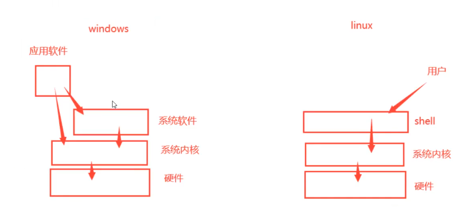

# shell


Shell：蛋壳的意思，是linux中比较重要的一个概念，所有的命令其实都称之为shell命令。
看图解：shell就是内核的一个外壳，用户通过shell来控制内核进而驱动硬件做事情，这是它名字的由来。Linux下，没有shell的话，就不能控制这个计算机了，因为内核是用户不能直接控制的。




## zsh

```zsh
# 安装zsh
sudo pacman -S zsh

echo $SHELL # 查看当前shell
chsh -s $(which zsh)  # 修改默认 shell

# 安装nerd-font
yay -S ttf-agave-nerd

# 安装oh-my-zsh
sudo pacman -S oh-my-zsh-git
whereis oh-my-zsh # 找到oh-my-zsh文件夹
# /usr/share/oh-my-zsh
# 复制zshrc到~/.zhsrc

# 安装命令提示插件
cd /usr/share/oh-my-zsh/plugins
git clone git@github.com:zsh-users/zsh-autosuggestions.git
git clone git@github.com:zsh-users/zsh-syntax-highlighting.git

# 配置
plugins=(git zsh-autosuggestions zsh-syntax-highlighting)

# 使得配置文件生效
source ~/.zshrc
```


## 指令

```zsh
# 查看当前shell
echo $SHELL

# 查看主机信息
hostnamectl
# 修改主机名
hostnamectl set-hostname xxx

# echo 是 Write-Output 的别名（Alias），用于输出文本或变量内容到标准输出（stdout）
# 输出字符串
echo "Hello, World!"
# 输出到文件
echo "Hello" > output.txt       # 覆盖写入
echo "World" >> output.txt      # 追加写入
# 标准正确输出和标准错误输出
head 1.txt 1>>2.txt 2>>3.txt
# 清空一个文件
>1.txt

# 输入
cat < 1.txt
# 标准输入
cat << 0 > 1.txt

# 查找 可执行文件（在 $PATH 环境变量中的命令）的完整路径
which python
# 查找命令的 二进制文件、源码文件和手册页 的位置。
whereis python
# 显示 所有可能的匹配路径（包括别名、函数、可执行文件）。
where python

# 查看别名
alias
# 取消别名
unalias ls
# 添加别名
alias rm='rm -i'

# 显示命令类型
type cd

# 命令历史 (history) .zsh_history
history | grep "apt install"  # 查找安装过的软件
# 清楚历史指令
history -c
# 查看history能够存储的数
echo $HISTSIZE

# 清屏 (clear)
clear  # 或使用快捷键Ctrl+L
```


## 快捷键

```zsh
Ctrl+a #光标跳转至正在输入的命令行的首部
ctrl+e #光标跳转至正在输入的命令行的尾部
ctr1+c #终止前台运行的程序，比如ping指令
ctr1+d #在shel1中，ctrl-d表示推出当前she11。
ctr1+z #将任务暂停，挂至后台，执行fg命令继续运行
ctrl+1 #清屏，和clear命令等效。
ctr1+k #删除从光标到行末的所有字符
ctr1+u #删除从光标到行首的所有字符
ctr1+r #搜索历史命令，利用关键字搜索
ctr1+w #光标往前删除一个参数，以空格为分割。
```


# 发行版


## arch


## kali


# 命令


## pacman&yay

### -S

```bash
# 强行刷新一遍再更新
sudo pacman -Syyu
yay -Syyu

# 安装软件
sudo pacman -S 软件名
yay -S 软件名

# 搜索
sudo pacman -Ss 软件名
yay -Ss 软件名

# 清理缓存
sudo pacman -Sc
yay -Sc
```

### -R

```bash
# 删除软件及其依赖，和全局配置文件
sudo pacman -Rns
yay -Rns

# 删除不再需要的依赖
sudo pacman -Rns $(pacman -Qdtq)
yay -Rns $(pacman -Qdtq)
```

### -Q

```bash
# 查询所有安装的软件
sudo pacman -Q
yay -Q

# 查询安装了多少个软件
sudo pacman -Q | wc -l
yay -Q | wc -l

# 查询自己安装的软件
sudo pacman -Qe
yay -Qe

# 查询自己安装了多少个软件
sudo pacman -Qe | wc -l
yay -Qe | wc -l

# 整理自己安装的软件
sudo pacman -Qeq
yay -Qeq

# 查询具体软件
sudo pacman -Qs 软件名
yay -Qs 软件名

# 查询不再需要的软件依赖
sudo pacman -Qdt
yay -Qdt
```


## apt

