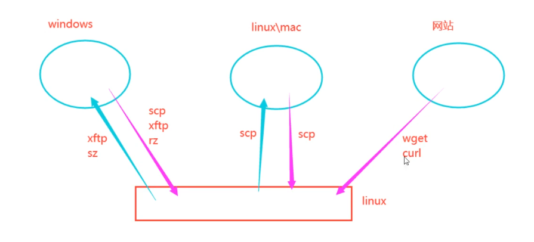

## 文件传输




```zsh
# 下载文件 (wget)
wget https://example.com/file.zip

# 更强大的下载工具 (curl)
curl -o 本地存放路径 文件网址
curl -o file.zip https://example.com/file.zip
```


### scp传输

**两个linux系统**

```zsh
#主要用于linux和linux服务器之间传输文件，Scp要求接受数据的一方要开启了ssh服务端才行，如果你电脑是苹果电脑mac系统，也可以使用scp来传输，mac默认ssh服务端是没有开启的，可以自行开启，客户端是可以直接使用的。windows往1inux上面发送文件也可以用scp，但是只能单向的，因为windows上没有ssh服务端。
#把本地文件推送到远程服务端
#格式：scp本地文件路径远程主机用户@远程主机ip地址：远程主机某个目录
scp typora-setup-x64.exe root@10.0.0.128:/tmp
#把远端服务文件拉取到本地
#格式：Scp远程主机用户@远程主机ip地址：远程主机某个文件路径本地路径
scp root@10.0.0.128:/tmp/typora-setup-x64.exe
```

win10及以上版本是有scp指令的，win和win之间是不能使用scp互相传文件的，因为windows上默认是没有ssh的服务端的，只有客户端。

```zsh
#windows使用scp给1inux上传文件的时候，文件路径和文件名中不允许出现中文和空格。
#格式和上面一样
scp typora-setup-x64.exe root@10.0.0.128:/tmp
```


### rz和sz

```zsh
#上传和下载
rz #上传
sZ #下载

#需要先安装lrzsz软件包，这个用的比较多
pacman -S lrzsz

#上传的例子
rz -E

#下载的例子
sz /root/test3.tar.gz#windows上自行选择存储目录
```


## 网络

```zsh
# 无线网连接
nmtui
iwctl

# 检查网络连接 (ping)
ping google.com

# 重启网络连接
systemctl restart network

# 显示网络接口信息 (ifconfig)
ip a  # 新版替代ifconfig的命令

# 显示网络连接 (netstat)
ss -tulnp  # 替代netstat的现代命令

# 追踪网络路由 (traceroute)
traceroute google.com
mtr google.com  # 更先进的替代品
```

