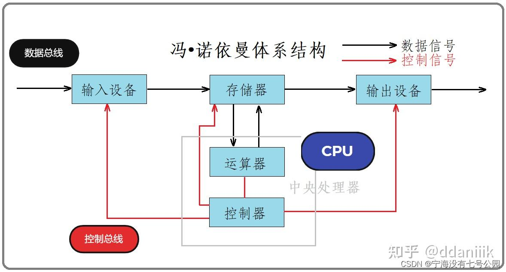

冯诺依曼体系结构是由数学家约翰·冯·诺依曼在1945年提出的计算机设计概念，它描述了现代计算机的基本组成和工作原理。这种架构至今仍是绝大多数计算机的设计基础。

### 原则

#### 采用二进制逻辑

冯诺依曼体系采用二进制（0和1）作为信息表示的基础，完美匹配电子器件的开关特性。这种设计简化了运算和逻辑电路实现，使布尔代数直接应用于硬件设计。所有数据（数字、字符）和指令都编码为二进制形式，在存储器中统一存储，在总线中传输，并被CPU处理。现代计算机延续这一特性，从机器码到量子比特的物理实现都基于二进制原理。

#### 程序存储执行

该体系革命性地提出"存储程序"概念，将程序指令与数据共同存放在存储器中。CPU通过指令指针顺序读取指令，经解码器解析后，由控制器协调运算器执行操作。这种设计使计算机摆脱了物理重连的束缚，实现了软件定义的通用计算。现代操作系统、编译器等复杂软件都建立在此基础之上，同时这也带来了可执行文件格式、动态链接等关键技术。

#### 计算机的五个组成部分

1. **输入设备**
   - 功能：将外部信息转换为机器可读形式
   - 现代示例：键盘、鼠标、触摸屏、传感器
2. **输出设备**
   - 功能：将处理结果转换为人类可感知形式
   - 现代示例：显示器、打印机、扬声器
3. **存储器**
   - 层次结构：
     - 高速缓存（L1/L2/L3）
     - 主存（RAM）
     - 外存（硬盘/SSD）
   - 特点：速度与容量成反比
4. **运算器（ALU）**
   - 功能：
     - 算术运算（加减乘除）
     - 逻辑运算（与或非）
     - 移位比较等操作
   - 现代发展：向量指令集（SIMD）、AI加速单元
5. **控制器**
   - 功能：
     - 指令取指、解码
     - 协调各部件工作
     - 处理中断和异常
   - 现代CPU：多级流水线、乱序执行、分支预测