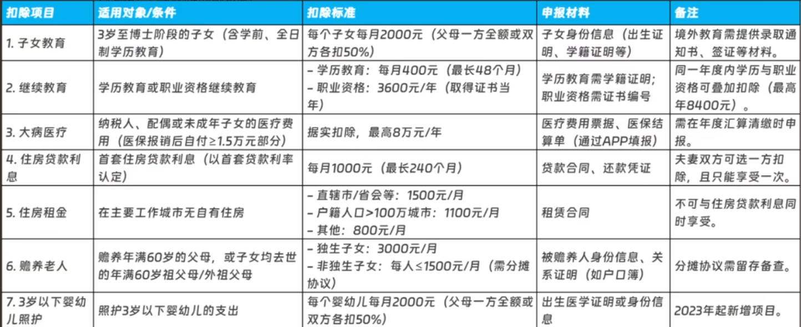
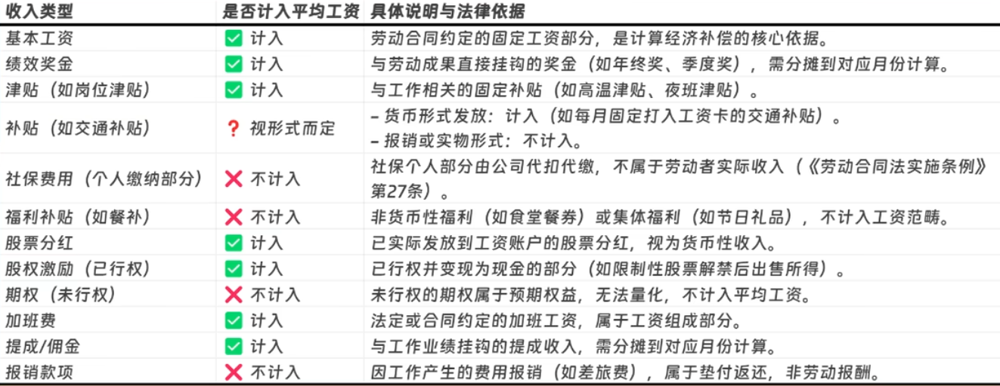

# 黑客


```zsh
# 黑客
设计
软件
渗透:社工
嵌入式
硬件
```


# 职场


### **竞业协议**

```zsh
# 竞业协议是什么
目的:保护公司商业秘密和竞争优势
公司要求员工在离职后的一段时间内,不能去竞争对手那里工作,不能自己创业做与原公司相同或相似的业务

# 竞业协议启动
公司有权利启动或不启动竞业协议,如要启动竞业协议需要告知劳动者
劳动者需要旅行竞业协议的内容,如果公司没有按时支付补偿,竞业协议也不会失效
收集证据,催公司,起诉,结果下来了才会无效

# 如何做
如果认为自己会很快离职:就不要签署竞业协议
重点关注:时间长度,职业领域,地理范围
与公司讨价还价
保存竞业协议内容,工作留痕
最差结果:聘请律师打官司
总之:竞业协议是敌强我弱,应该以减少少损失为目标
```


### **退税**

```zsh
# 缴税
纳税所得额:年收入-60000-专项免税额
应缴纳税额:纳税所得额x税率

应纳税所得额(元)		税率
不超过36000		   3%
超过36000至144000     10%
超过144000至300000    20%
超过300000至420000    25%
超过420000至660000    30%
超过660000至960000    35%
超过960000			45%

# 退税流程
选好计税方式:全部并入综合所得计税,单独计税(那个钱多用哪个)
填好专项附加扣除项
填好其他免税扣除项

# 注意
每年3-6月份
注意申报年份
25年申请的是24年的退税，那选择申报年份的时候也要选择2024年
住房二选一制度
住房贷款和住房租金扣除只能二选一大城市工作通常填租房比房贷更划算

# 高阶玩法
1.跨年调剂玩法
2024年没考下的证书，2025年1月考过→仍可算2024年继续教育扣除！
2024年看病，2025年3月才结算→可补扣到2024年！

2.夫妻战术
房贷扣除和子女教育：让收入高的一方100%扣除，省税更多

3.灵活利用补充扣除项目
办理个人养老金：每年最高存入12，000元，全额税前扣除。资金可用于购买
储蓄存款、商业养老保险等产品，长期收益免税。
税优健康险：购买带有“税优识别码”的商业健康险，每年最高扣除2,400元

# 补税(要补必须补)
1、补税金额超过400元：如果补税金额超过400元，纳税人需要进行补税。
2、综合所得收入全年不超过12万元：如果综合所得收入全年不超过12万元,可以免于办理年度汇算。
```


### **专项扣除**




### **裁员**

```zsh
# 裁员赔偿
合法裁员:有经济补偿
公司需符合法定裁员条件，并严格履行法定裁员程序
立即离职赔偿N+1
一个月后离职赔偿N

非法裁员:有经济补偿
无法提供法定程序证明；孕期、产期、哺乳期、医疗及工伤期裁员；拒绝续签无固定期限合同
赔偿2N*平均工资

无赔偿裁员:无经济补偿
谨言慎行，避免旷工泄露公司数据，裁员期间公司紧盯

工作年限即为赔偿方案中的"N”，以半年作为一个计数周期6（N则为0.5的整数倍）(工作几年不几个月,半年补0.5个月)
赔偿标准即为：N+1或2N×裁员前12个月平均工资
前12个月平均工资：基本工资、年终奖、奖金、津贴等货币性收入，但公司缴纳的那部分社保费用不计入在内，餐补、交通补助等福利性补贴则需要根据发放形式，视情况而定

高收入劳动者裁员补偿规定
补偿基数（前12个月平均薪资）：要求不高于当地当地社平薪资3倍
当地社平薪资IW元,员工平均薪资5W元
补偿基数按照10000×3=3W元

封顶年限N（当平均薪资超过3倍当地社平薪资）
当工作年限超过12年，补偿年限N≤12
非法裁员2N倍赔偿金中N也有12年的封顶限制

# 领失业金
领取前提：
失业前用人单位和个人累计缴纳失业保险满1年及以上；
缴费不足1年但此前有未领取的失业保险期限。
办理流程：失业登记->失业金申领
离职日后约10个工作日公司完成社保减员才能进行失业登记
发放时间：每月15日左右发放，部分地区可能在月末30日左右到账
领取时长:1~5年，最长领12个月;5~10年，最长18个月;10年以上，最长24个月。
白嫖医保

# 社保续交
要续缴的:生育保险,养老保险,医保
申请失业金:可以白嫖医保

医保
断缴风险：断交后职工医保在次月会被暂停（医保个人账户里钱的依然可以继续使用）
断缴两个月，需要重新连续缴纳6个月才能恢复医保待遇
两个月内找到工作;灵活就业身份自行参保

养老
养老保险的缴费年限是累计计算的
只要在达到法定退休年龄时累计缴费年限达到最低要求（通常是15年）,就可以申请领取养老金。
最好不要中断
```


### **前12个月平均工资**




### **灵活就业**

```zsh
# 灵活就业补贴
# 灵活就业登记
# 灵活就业社保
自费职工医保+职工养老:约1223元
最好找个班上,不行就灵活就业,可以晚点交社保,但是一旦开始交社保了,就不要断,交到退休为止
职工养老+居民医保+商业医保:百万医疗+重疾险
```
