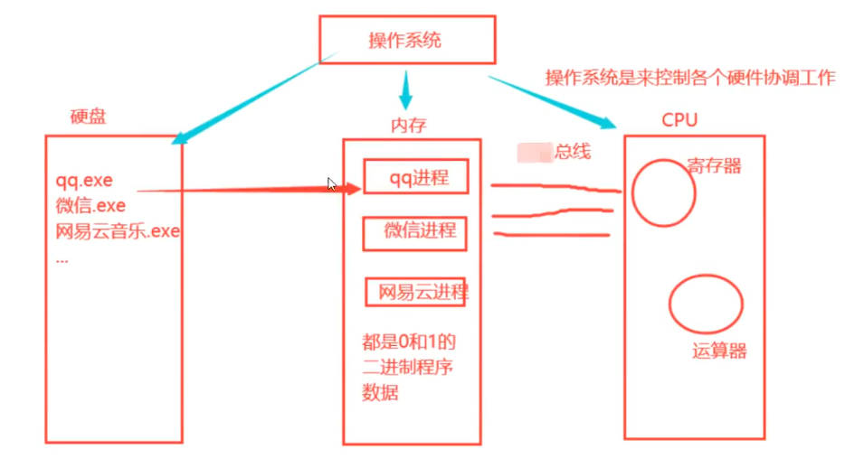
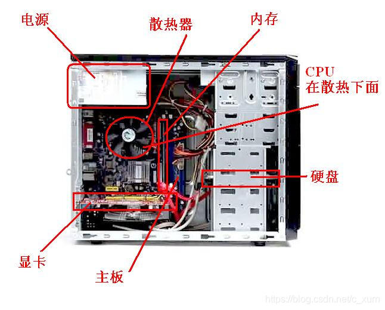
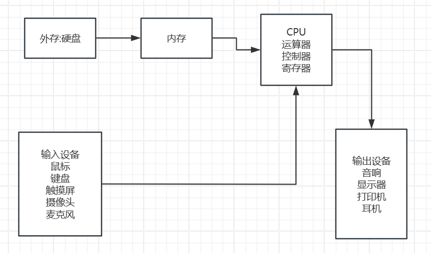
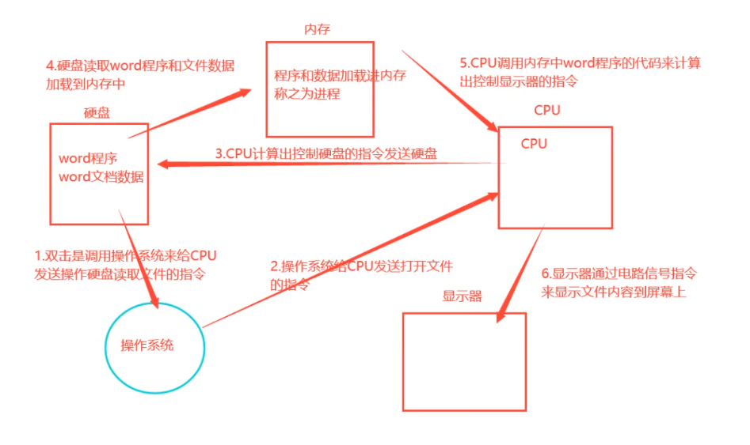
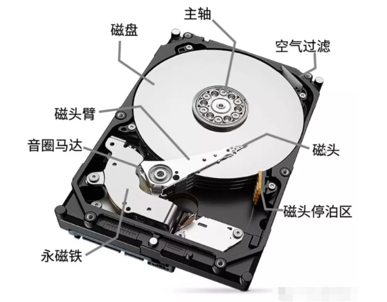
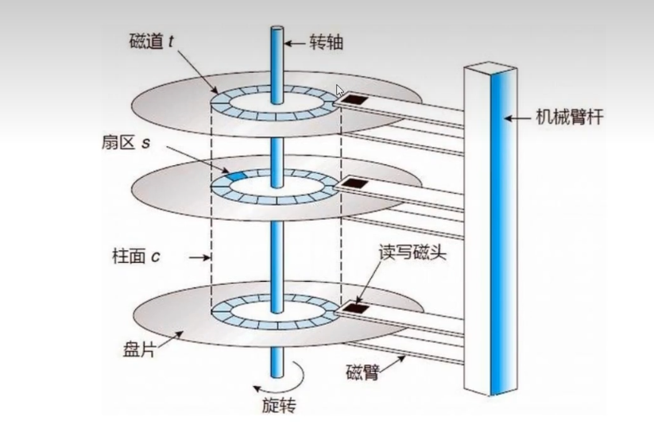

# 冯诺依曼体系


冯诺依曼体系结构是由数学家约翰·冯·诺依曼在1945年提出的计算机设计概念，它描述了现代计算机的基本组成和工作原理。这种架构至今仍是绝大多数计算机的设计基础。


### 原则


#### 采用二进制逻辑

冯诺依曼体系采用二进制（0和1）作为信息表示的基础，完美匹配电子器件的开关特性。这种设计简化了运算和逻辑电路实现，使布尔代数直接应用于硬件设计。所有数据（数字、字符）和指令都编码为二进制形式，在存储器中统一存储，在总线中传输，并被CPU处理。现代计算机延续这一特性，从机器码到量子比特的物理实现都基于二进制原理。


#### 程序存储执行

该体系革命性地提出"存储程序"概念，将程序指令与数据共同存放在存储器中。CPU通过指令指针顺序读取指令，经解码器解析后，由控制器协调运算器执行操作。这种设计使计算机摆脱了物理重连的束缚，实现了软件定义的通用计算。现代操作系统、编译器等复杂软件都建立在此基础之上，同时这也带来了可执行文件格式、动态链接等关键技术。


#### 计算机的五个组成部分


1. **输入设备**
   - 功能：将外部信息转换为机器可读形式
   - 现代示例：键盘、鼠标、触摸屏、传感器
2. **输出设备**
   - 功能：将处理结果转换为人类可感知形式
   - 现代示例：显示器、打印机、扬声器
3. **存储器**
   - 层次结构：
     - 高速缓存（L1/L2/L3）
     - 主存（RAM）
     - 外存（硬盘/SSD）
   - 特点：速度与容量成反比
4. **运算器（ALU）**
   - 功能：
     - 算术运算（加减乘除）
     - 逻辑运算（与或非）
     - 移位比较等操作
   - 现代发展：向量指令集（SIMD）、AI加速单元
5. **控制器**
   - 功能：
     - 指令取指、解码
     - 协调各部件工作
     - 处理中断和异常
   - 现代CPU：多级流水线、乱序执行、分支预测


# 计算机分类

```txt
按照性能分类:
1、巨型机：也叫超算，即超级计算机，采用大规模并行处理的体系结构，是运算速度最快、体积最大、价格最昂贵的主机，主要用于尖端科学研究领域，比如灾难预测、天气预报、军事等等。中国有银河II、神威的太湖之光等，太湖之光有40个计算机仓，每个机舱包含1024颗理器，共40960个神威CPU。

2、大型机：是指运算速度快、处理能力强、存储容量大、功能完善的计算机，多采用对称多处理器结构，有数十个处理器。比如IBMz15大型机。

3、小型机：是一种供部门使用的计算机，规模较小、结构简单、成本较低、操作简便、维护容易，能满足部门的要求，可供中小企事业单位使用。比如IBM的小型机，这个小机的小是相对于巨型机和大型机对比来说的，实际上也不是很小昂。

4、微型计算机：又称为个人电脑或微型计算机。这类计算机面向个人、家庭、学校等，应用十分广泛。它由微处理器、半导体存储器和输入输出接口等芯片组成，因此其体积更小、价格更低、通用性更强、可靠性更高、使用更加方便。比如台式机、笔记本、智能手机等

按照功能分类：

服务器：它并不代表计算机的一种类型，小型机、微机都可以作为服务器来使用。如果硬要说的话pc服务器属于微型计算机。比如de11的R740服务器。

工作站：20世纪70年代后期出现的一种新塑的计算机系统，配有大屏幕显示器和大容量存储器，有较强的网络通信能力，主要适用于CAD/CAM和办公自动化等领域，如美国sUN公司的sUN-3、sUN-4，还有联想的ThinkStation，还有戴尔的一些工作站，还有苹果的macstudio工作站等等，现在在视频剪辑领域会有一些人在使用，不适用于玩游戏，适用于办公。

信息设备：它们是便携式设备，旨在执行一组有限的任务，如基本计算、播放多媒体、浏览互联网等。它们通常被称为移动设备。它们的内存和灵活性非常有限，通常按“原样”运行。

嵌入式计算机：它们是用于其他机器以满足有限需求的计算设备。它们遵循非易失性存储器的指令，不需要执行重启或重置。此类设备中使用的处理单元仅满足这些基本要求，并且与个人计算机中使用的处理单元不同－更为人所知的是工作站。
```


### 服务器


再看内部，服务器一般有两颗CPU，有的甚至有4个CPU，是专用CPU，和个人电脑的CPU不同，也不是按照什么辽、i9来分的，服务器的CPU性能更高、更贵，比如Intel的至强CPU、AMD的锐龙CPU等，有些服务器可以有18个内存插槽，如果每个内存条为16G，那么18*16=288G运行内存，有些最新的服务器甚至能够支持1TB的运行内存。服务器使用的是ECC内存和我们个人使用的普通电脑的内存不同，ECC内存条有纠错功能，它添置ECC错误校验技术，经过错误校验、纠正，可以有效的保证服务器系统的稳定性和可靠性。而普通内存条不配备校正错误技术，因此字检测到错误时，并不能确定错误位置，也无法修正错误。

我们普通电脑都是单路的，一个电源接口，服务器一般都是双路电源，两个电源接口，一个接国家电网的电路，另一个接备用电源的电路，这样如果国家电网停电了，另外一个接口的电源能够立马接上使用，让服务器可以一直运行。服务器都是按照长期稳定运行来设计的。服务器一般有更高的性能、更高的稳定性、功耗大、噪音大，好多公司都会把服务器放到专门的IDC机房去管理，机房里面说话的时候要声音很大，要不听不到。


# CPU

中央处理器（centralprocessingunit，简称CPU）作为计算机系统的运算和控制核心，是信息处理、程序运行的最终执行单元。


### CPU架构


不同的CPU有不同的制作规范,这些制作规范就是所谓的架构:制作元件的材质,个数,处理指令的流程,指令集的偏重...


**x86**

复杂指令集:一条指令就可以完成一个复杂的动作

功耗高,性能高

台式机,笔记本

Intel,AMD


**ARM**

精简指令集:多条指令才能完成一个复杂动作

功耗低,性能相对较低

手机

华为麒麟,三星猎户座


**RISC-V**

新兴架构,开源免费,前景巨大,无需授权

阿里:玄铁910


**软件运行平台:操作系统+CPU**

如:win+x86(intel,amd),mac+m1cpu,linux+arm

一个应用软件只能在一个软件运行平台运行,除非它制作了多个版本


### CPU性能参数

#### 主频/超频/睿频


```txt
CPU主频：主频越高，功耗越高，也就是能力越强，但是耗电越高，热量也越大，我的主频是2I30GHz，Hz是频率单位，赫兹，GHz是千兆赫
千兆赫，缩写为GHz，是等于十亿赫兹（1,000，000,000Hz)的交流（AC)或电磁（EM)波频率的单位。可以理解为1秒钟可以进行23亿次运算。
GHz是CPU的处理频率，换言之，即CPU的电波处理速度。现今大多CPU是多核的，如双核、4核、8核、16核等。若为此况，则CPU的实际频率等于主频乘以核值再乘以0.8左右。譬如，4核1.5GHz的CPU的实际处理速度为：4X1.5X0.8=4.8（GHz）。该数值愈大，则CPU的运行速度就愈快，性能便愈强。可以看看某些cPU的对比，比如Inte1酷睿i7的各代性能对比：https://detail.zol.com.cn/series/28/125/param_26802_0_1.html

Inte1酷睿i710700：标准版，多用于台式机

Inte1酷睿i71070oK：带超频，多用于台式机。Inte1的cPU型号，尾号带K的，表示可以超频，比如我们刚才看cPU参数，主频为2.30GHz，表示推荐使用的主频大小，带K的话，可以通过控制主板的一些参数，让CPU的主频增大，比如可以让他工作到2.40、2.50GHz等，甚至更高，带K的也是卖的最贵的。

Inte1酷睿i710700F：不带核显。CPU里面集成显卡，以前cPU和显卡是分开的，近几年有了这种集成显卡的出现，我们管这种集成显卡也叫做核显，因为集成在CPU核心中了，带F的表示不带核显，减少了制作工艺，更便宜了。建议大家买带核显的，更好一些，大家可以自行查一下核显和独显的区别。Inte1系列是不带F的都带核显，AMD系列是带有字母G的表示带核显，没有字母G的都不带核显。大家可以看到我的是带核显的。

Inte1酷睿i710750H：主频低一些。多用于笔记本。因为笔记本的体积小，散热空间少，需要主频低一些。
Inte1酷睿i710510U：主频更低，多用于笔记本。主打低功耗，待机时间更长，计算能力相对差一些，但是对于普通人来说，感知差不多。当我们把电脑的CPU性能跑满的时候，比如玩大型游戏的时候，CPU主频高就顺畅一些，CPU主频低就可能会感受到卡顿，有时候可能会看到打开的软件比较多的时候，鼠标开始转圈圈，再点击屏幕变白，再点击可能死机、蓝屏，这也是受到CPU主频的参数的影响。
Inte1酷睿i71068G7：带G的以前是没有的，最近几年才出现的，多用于笔记本。表示带有Inte1的锐炬核显，比普通的核显好一个档次。G7是现在比较高的核显版本，还有G1、G4等低版本的。

通过主频性能来排行：带K的>标准版>带F的>用于笔记本的，买电脑要看各种参数，找到最合适的，不是性能最好就最适合你。

最高睿频：早期的CPU是支持超频的，玩家可以自己调整主板上的电压设置，来升压，控制超频，如果超频的过程中不小心把电压升多了，CPU会直接烧毁，那就报废了。所以以前玩超频的人都是一点点的提高，担心超多了，后来官方说，你们别自己超了，我帮你们超，当我们CPU过载时，官方自动帮我们超频，CPU最高超频到5GHZ，这就是睿频。
```

#### 核心数量和线程数量

```shell
# 查看核心数和线程数
Get-CimInstance Win32_Processor | Select-Object Name, NumberOfCores, NumberOfLogicalProcessors3
```


**核心**

核心数,表示CPU内置的处理器个数,核心越多,性能越强


一颗CPU有多少个内核表示能够同时处理多少个任务,但是由于CPU的运算非常强大,于是操作系统可以操作不同的程序不断来回的运用它的资源,比如说一个核心的资源,就可以运行来回运行多个程序,因为计算速度很快所以看上去就像是同时在运行一样,即多任务,并发执行,伪同时,核心数量越多意味着并行执行(真同时)的任务越多


**线程**

进程:运行在内存中给你的程序,线程:在一个进程中会有多个小任务,这些小任务就叫做线程

每个进程有多个线程,超线程:每个CPU核心可以同时处理多个线程

一颗CPU有多个核心,一个核心有多个线程处理单元,这种功能技术叫做超线程


#### 三级缓存


性能越好的CPU，三级缓存越大，缓存的意思就是CPU在计算过程中产生的中间结果数据、后续需要参与计算的数据等等需要临时存放到某个地方，这个地方就是缓存。

三级缓存（包括L1一级缓存、L2二级缓存、L3三级缓存）都是集成在CPU内的缓存，它们的作用都是作为CPU与主内存之间的高速数据缓冲区，L1最靠近CPU核心；L2其次；L3再次。运行速度方面：L1最快、L2次快、L3最慢；容量大小方面：L1最小、L2较大、L3最大。CPU会先在最快的L1中寻找需要的数据，找不到再去找次快的L2，还找不到再去找L3，L3都没有那就只能去内存找了。

缓存和内存都是会在断电之后，数据消失。任务管理器-->性能可以看到缓存大小。


#### 热设计功耗

TDP的英文全称是"ThermalDesignPower"”，中文直译是"散热设计功耗"。主要是提供给计算机系统厂商，散热片/风扇厂商，以及机箱厂商等等进行系统设计时使用的。热设计功耗的含义是当芯片达到最大负荷的时候【单位为瓦（W））热量释放的指标，是电脑的冷却系统必须有能力驱散热量的最大限度，但不是芯片释放热量的功率。

可以看到，我上面截图中的这个参数的值为95W，如果我们的电脑只是用来做一些简单的办公工作，那么就可以选择功耗低的，因为待机时间长，一般笔记本都会选择功耗低一些的。如果想要兼顾性能和便携的话，你就选择CPU型号中带H字母的，属于标压U，比如Intel酷睿i710750H，如果你想追求超长续航，性能要求不高，只要不是特别卡即可，那么就选择CPU型号中带U字母的，比如lntel酷睿i710510U，低频U，功耗低。

由于CPU的核心电压与核心电流时刻都处于变化之中，这样CPU的实际功耗（其值：功率P=电流Ix电压U）也会不断变化，因此TDP值并不等同于CPU的实际功耗，更没有算术关系。

举例来说，PentiumE2160TDP为65W，而实际运行中的平均功耗仅19W。


# 内存


### 内存说明

内存，是作为CPU和硬盘之间交互数据时的缓冲区，提高CPU的使用效率，本身是存储设备，有个特点就是内存中的数据断电会丢失，硬盘中的数据不会断电消失。运行起来的程序和程序中临时产生的数据都会先保存在内存中。

手机上我们不叫内存，叫做运行内存，好多人说手机内存其实它说的是手机磁盘的存储容量，

比如我们可能听过什么8+256，8表示的是8G运行内存，256G说的是存储，也就是硬盘容量


我们有看到有个机带RAM，这就是内存了，我的内存是32GB大小，内存这个东西到底可以有多大呢？有大小边界吗？内存的大小主要受限于这几个因子：操作系统、总线、CPU，我们可以看到，我上面图中系统类型位64位操作系统，基于x64的处理器，这个x64是x86_64位的简写形式，说的是这个电脑的CPU是x86架构的，具备64位处理能力的。而我们安装软件，也就是程序员开发的软件也是分32位和64位的。比如QQ、微信、网易云音乐等等。我们自己现在安装一些常用软件的时候，基本看不到这个位数的体现了，因为我们现在的电脑系统大多数都是64位的了，而不管是32位的软件还是64位的软件都是支持安装在64位的系统上运行的。但是如果你的系统是32位的，那么是无法安装运行64位的软件的，这又是为什么呢？接下来我们讲解一下，看图：




CPU是64位的表示CPU寄存器存储的数据和CPU一次性计算的数据大小为64位的二进制数据，既然CPU能够一次性操作64位的数据，那么数据总线和操作系统也应该按照64位来进行设计，数据总线是CPU去内存中获取数据的电路线，64位地址总线表示的是数据总线一次性传输数据的大小为64位的，而操作操作系统作为各个硬件的控制程序，它应该也要支持64位数据的控制。那么也就是说操作系统能够在内存中找到64位的数据，这个我们叫做系统在内存中的寻址空间，然后数据总线将64位的数据传输给CPU，CPU正好也可以一次性加工处理64位的数据，这样CPU的使用效率就很高。

操作系统的寻址空间直接决定着所能够支持的最大内存是多少，并且决定着这个系统上可以安装的软件是64位的还是23位的，我们拿64位操作系统来举例，计算机底层存储、加工处理的数据都是二进制数据，0和1，是因为通过0和1这样的二进制方便对应控制电路的低电压和高电压，只要是运行起来进入到内存中的程序都已经是二进制的数据。
32位操作系统所能支持的最大内存为2的32次方。
64位操作系统所能支持的最大内存为2的64次方。


### 查看内存参数

**鲁大师**


如果要更换内存最好参数是一样的

是否可拆卸:一般显示一个或两个插槽,如果超过了两个插槽可能就不可拆卸


### 内存颗粒

内存颗粒：其实就是内存中的芯片，内存的存储能力就靠它。4G的内存，如果有8个内存颗粒，那么每个内存颗粒的空间大小为4*1024/8=512MB。


### 双通道技术

当我们有两根内存时，就可以使用到双通道技术，一块数据可以分两部分写入到两个内存中，速度更快，效率更高


# 工作流程

### 软硬件工作流程








操作系统是用来控制硬件的软件,由输入设备输入信号,操作系统发送给CPU相应指令,再由CPU计算处理调用其他硬件活动,如:调用硬盘的程序数据到内存形成进程,再调用显示屏将内容输送到显示屏显示

CPU是核心

运算速度:CPU>内存>硬盘


操作系统:通用软件

应用:专用软件


# 显卡

### 显卡说明


显卡是个人计算机基础的组成部分之一，将计算机系统需要的显示信息进行转换加工处理并且驱动显示器，并向显示器提供逐行或隔行扫描信号，控制显示器的正确显示，是连接显示器和个人计算机主板的重要组件，

显卡又称显示卡（Videocard)，是计算机中一个重要的组成部分，承担输出显示图形的任务，对喜欢玩游戏和从事专业图形设计的人来说，显卡非常重要。主流显卡的显示芯片主要由NVIDIAI（英伟达）和AMD（超威半导体）两大厂商制造，通常将采用NVIDIA显示芯片的显卡称为N卡，而将采用AMD显示芯片的显卡称为A卡。现在Inte1也开始做显卡了，比如笔记本的有个锐炬显卡就是Inte1的、还有arc显卡等。英伟达之前也想进军CPU领域，之前想收购ARM，但是没有收购成功。

显卡是插在主板上的扩展槽里的（一般是PCI-E插槽，此前还有AGP、PCI、ISA等插槽）。它主要负责把主机向显示器发出的显示信号转化为一般电气信号，使得显示器能明白个人计算机在让它做什么。显卡主要由显卡主板、显示芯片、显示存储器、散热器（散热片、风扇）等部分组成。

显卡的主要芯片叫“显示芯片”（Videochipset，也叫GPU或VPU，图形处理器或视觉处理器），是显卡的主要处理单元。显卡上也有和计算机存储器相似的存储器，称为“显示存储器”，简称显存。


### 显卡系列

200系列：gt210、gt220...gtx280
300系列：gt310、gt320...
900系列：gt940、gtx950、gtx960..
1000系列：gt1030、1050...1080、1080ti，ti我们有时候叫做泰坦（titan），就是加强版的意思。
RTX2000系列：2060、2070、2080...之前是gtx系列，到了2000系列之后叫RTX了，支持光追技术，让游戏的画面更加逼真。
RTX3000系列：3050、3060...3090ti

一般笔记本的显卡型号后面都会带一个M，比如GTX980M，带M的表示这是移动端使用的显卡型号，由于笔记本要考虑散热问题，所有性能比台式机的都要低一些，比如GTX980M和台式机的GTX970性能差不多。


### 显存参数

```txt
显存：
显存，也被叫做顿缓存，它的作用是用来存储显卡芯片处理过或者即将提取的渲染数据。如同计算机的内存一样，显存是用来存储要处理的图形信息的部件。我们做图像处理、观看视频等一秒24帧（一帧可以理解为一个图片或者说一个静止的画面，通常用fps（FramesPerSecond）表示）的频率才能用肉眼看上去比较流畅，但其实现在很多电影一般都不低于每秒30帧，玩游戏的时候也会问多少帧，有的显示器每秒钟最多显示60帧就打满了，高性能一些的可能能够达fps90、120等，但是如果只是显卡fps高也不一定就不卡，还要看显示器能支持多大的fps，比如显卡支持90fps，但是显示器只支持60fps，那么就会丢失30帧，看上去画面就卡。比如我的显示器是1080p，显示器所谓的1080P显示是指达到1920x1080的分辨率的显示，是数字电影成像技术和计算机技术的完美融合。还有2k显示器，分辨率2560*1440，4k的分辨率为4096*2160，还有非标准的分辨率也当作4k，比如3840*1920。分辨率越高的图片，图片的大小越大，占用的空间也会越大，这就是为什么显存的大小一直在增大，有4G、8G、12G、24G等等，那么你玩游戏比如需要fps为90，那么也就是说每秒钟要显示90张图片，这些图片数据要缓存一下的，分辨率要求越高，那么就需要更大的显存空间。买显卡的时候，自己要先把想买的显卡详细型号查一下，别被忽悠了。显存决定最大支持的分辨率。

显存频率：显存频率是指默认情况下，该显存在显卡上工作时的处理数据的频率，以MHz（兆赫兹）为单位。显存频率一定程度上反应着该显存的速度，频率越高，处理速度越快。

显存位宽：位宽就是内存或显存一次能传输的数据量。简单地讲就是一次能传递的数据宽度，就像公路的车道宽度，双向四车道、双向六车道，当然车道越多一次能通过的汽车就越大，所以位宽越大，一次性能奥的数据就越多，对显卡来说对性能的提高很明显。64位、128位、192位、256位、512位等。

显存带宽=显存频率X显存位宽/8，那么在显存频率相当的情况下，显存位宽将决定显存带宽的大小。同样显存频率为500MHz的128位和256位显存，那么它俩的显存带宽将分别为：128位=500MHz*128/8=8GiB/s，而256位=500MHz*256/8=16GiB/s，是128位的2倍，可见显存位宽在显存数据中的重要性。

CUDA核心：显卡内部的处理器，这个数量越多，处理能力越强，显卡越好，4864个
显卡接口：VGA、HDMI、DVI、DP
```


# 硬盘

### 机械硬盘(HDD)

**工作原理**

机械硬盘在工作的时候，磁头会悬浮于磁盘面上方几纳米的距离。磁盘面上有很多的小格子，小格子内有很多的小磁粒。这些磁盘上的磁粒有一定的极性，当磁粒极性朝下的时候记为0，磁粒极性朝上的时候记为1，这样磁头就可以通过识别磁盘磁粒的极性读取数据了。而磁头也可以利用其变化的磁场改变磁盘磁粒的极性，这样就做到写入和改写磁盘数据了。



**内部结构:主要由马达,磁盘,磁头臂,磁头组成**



磁盘是密封的，里面一般都是填充氮气，有氮气的，有氮气的，氨气的密度更低，磁盘旋转的阻力更小，磁头可以悬停在盘面上更近的距离，于是就可以在相同的体积的盘腔内，安装更多的盘片和磁头，实现更大的磁盘容量。降低存储成本。磁盘虽然是全密封结构，但是还是难免会有氮气泄漏的问题，氮气盘的质保一般是5年，对于厂家来说，只要5年内，氮气没有漏光就可以。氮气泄漏后，空气会进入，空气进入后，气体的密度增加，影响磁盘的正常运行，氮气泄漏到一定程度后，磁盘会进入写保护的状态，同时磁盘告警，这个时候，只能将磁盘的数据读取出来，抓紧时间进行数据备份。


**机械硬盘参数**

```txt
转速：硬盘转速以每分钟多少转来表示，单位表示为RPM
比如：7200RPM，那么就是一分钟使盘的转轴可以旋转7200转
7200转的一般是给台式机安装用的，5400转的一般是给笔记本准备的，因为硬盘转速越快，声音越大，所以笔记本为了静音，会用转速相对低的硬盘，而台式机一般不考虑这个，因为台式机的CPU风扇、显卡风扇等都会响，不差硬盘这点声音。服务器的专用硬盘一般是10000转、15000转的。

大小分类：台式机上硬盘为3.5寸，笔记本上是2.5寸

接口分类：IDE接口、SATA接口、SCSI接口、SAS接口、M.2接口，IDE接口比较老，现在主流硬盘接口为SATA3.O接口，SAS接口主要用在服务器上，普通电脑没有SAS接口，M.2是现在比较新的接口，传输速度比SATA快很多，SATA接口的传输速度极限也超不过700M/S，M.2接口的速度轻松达到上千M/s，以后M.2接口会成为趋势。IDE接口的只有机械硬盘，SATA接口有机械硬盘、也有固态硬盘，而且IDE接口的硬盘只有3.5寸的，SATA的是2.5和3.5寸的都有，我们买什么样的硬盘也要看主板上有什么样的接口。M.2接口的只有固态硬盘。

硬盘传输速度：100M-300M不等，极限的时候一般也超不过300M，而现在固态硬盘轻轻松松就能达到300M的速度，那么其实你会发现，以前没有固态硬盘的时候你不管买再好的CPU、内存、显卡等，有时候速度，比如开机速度还是提不上去，那就是因为机械硬盘本身的速度就比较低。有了固态硬盘之后，加载速度提升了太多了。
```


### 固态硬盘(SSD)

固态硬盘：SolidStateDisk或So简称SSD原理是电子存贮，将电子通过禁起来来完成数据的存储，里面用到
的是和手机中闪存一样的材质。比机械硬盘更稳定耐用，也更薄，但是更贵。


# 主板与电源

### 主板


生成主板的厂商有很多，主板要和CPU接口类型一致，不然CPU不能用，所以每当Intel发布一款新的CPU之后，很多下游主板厂商都会抢着生产对应的主板。主板也分档次：高端、中端、低端。比如Z690等Z系列的属于高端、B660等B系列的属于中端、H610等H系列的属于低端的，这些是Intel划分出来的，然后各个厂商按照这个档次来进行生产。越高端的板子可以使用的功能越多，同功能的性能越好，扩展性也好，比如插槽多、网卡支持的带宽高、最大支持的内存容量也大等等，我们一般都会选择中端B系列，性价比相对好一些。

```txt
intel：对应的主板厂商：华硕、技嘉、七彩虹、微星、铭瑄、盈通、昂达等等
AMD：对应的主板厂商：华硕、技嘉、七彩虹、微星、铭瑄、盈通、昂达等等
结实耐用的话首选华硕，但是相对贵，如果考虑性价比，就用其他几个的
```

CPU插槽：插槽是按照CPU的针脚来的，也分很多代，intel基本上两代换一个插槽，比如LGA1700是针对12代处理器的，LGA1200是针对10和11代处理的。如果我们的电脑出版坏了，CPU挺不错，那么就可以换一个主板即可，但是主板也是要针对CPU的版本来。

支持的内存类型：主板支持什么样的内存类型，你买对应内存时，也要对应好类型，内存类型目前主要有DDR3、DDR4、DDR5三种。

主板支持的内存容量主要是看CPU和主板插槽的数量。

主板支持的显卡数量，比如支持插入两块显卡，那么比一块显卡的效率就高一些，大概能提升60%，两个显卡配合使用，我们称之为交火(CrossFire)。不是说随便两个显卡就能交火，这个要看显卡是否支持。双显卡适合打大型游戏的朋友。


### 电源

电源：这个主要看CPU的功耗和显卡的功耗，其他的部件功耗比较低，CPU功耗+显卡功耗<电源瓦数

用鲁大师的功耗计算器来查看即可