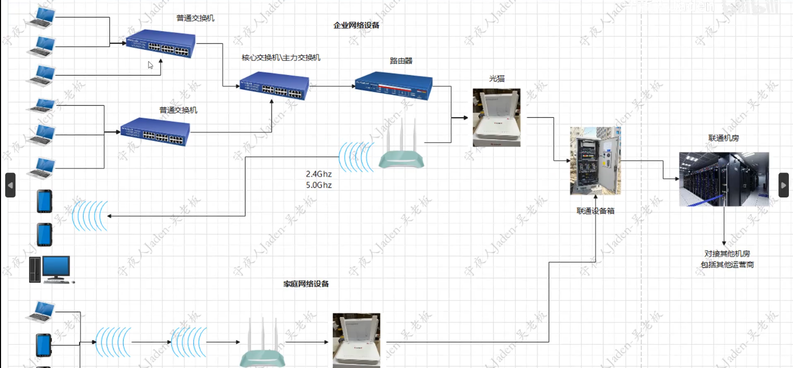
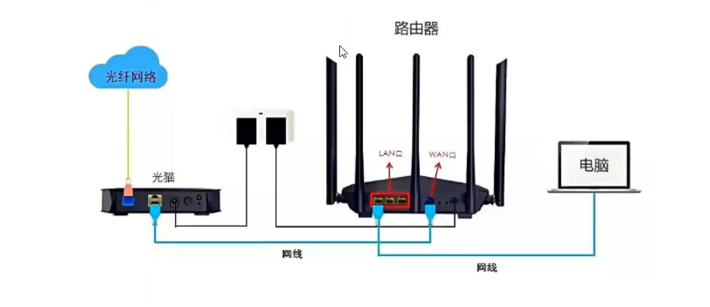

# 端口

在计算机网络中，**端口（Port）** 是一个逻辑概念，用于标识一台计算机上运行的特定服务或应用程序。端口与IP地址结合使用，可以唯一标识网络中的某个服务。

### 关键概念：
1. **端口号**：16位整数（0-65535）
   - 0-1023：知名端口（Well-known ports），如 HTTP(80)、HTTPS(443)、SSH(22)
   - 1024-49151：注册端口（Registered ports）
   - 49152-65535：动态/私有端口（Ephemeral ports）

2. **常见协议端口**：
   - 20/21: FTP
   - 22: SSH
   - 25: SMTP
   - 53: DNS
   - 80: HTTP
   - 443: HTTPS
   - 3306: MySQL

3. **端口类型**：
   - **TCP**：面向连接，可靠传输（如网页浏览）
   - **UDP**：无连接，快速但不可靠（如视频流）

4. **端口作用**

把服务器比作房子,而端口可比作门;
窃贼想要在没经过房子主人允许进入房子,就需要破门而入;
窃贼在破门之前,得先了解到房子开了几扇门,门后是什么东西,也就是踩点;
踩点得到的信息越多对于窃贼顺利的窃取有价值的东西至关重要。

### Linux 相关操作：
1. 查看监听中的端口：
```bash
ss -tulnp  # 推荐（现代替代netstat）
# 或
netstat -tulnp
```

2. 检查端口是否开放：
```bash
nc -zv 127.0.0.1 22  # 测试本地SSH端口
telnet example.com 80
```

3. 开放端口（需防火墙允许）：
```bash
sudo ufw allow 22/tcp  # Ubuntu
# Arch Linux通常使用iptables/nftables：
sudo iptables -A INPUT -p tcp --dport 22 -j ACCEPT
```

4. 端口转发示例：
```bash
ssh -L 8080:localhost:80 user@example.com  # 本地8080转发到远程80
```


# 网络设备


## 设备连接




**带宽运营商**

运营商是指提供网络服务的供应商，如华为、中兴、诺基亚、爱立信等这些通信设备的生产厂家叫生产商，而中国移动、中国联通、中国电信、中国广电这些公司叫运营商。

带宽:买了相应速度的带宽,必须要保证网络连接设备的带宽都能够支持才可以

```
带宽 指的是 网络通道的最大数据传输速率，通常以 比特每秒（bps, bits per second） 为单位。

1 Mbps = 1,000,000 bps（注意：计算机存储单位中的 **1 MB = 8 Mb**，因为 1 Byte = 8 bits）

带宽 ≠ 实际网速，因为实际传输速度受网络拥塞、协议开销、信号衰减等因素影响。
```


## 网卡

网卡的功能就是用来接收网络信号的,根据接收的介质不同分为有线网卡和无线网卡

**有线网卡:双绞线**


**无线网卡:无线电波**


wifi信号:

2.4Ghz:频率低,网速慢,波长长,范围远

5.0Ghz:频率高,网速快,波长短,范围近


网卡将接收到的信号交给操作系统,之后由操作系统进行硬件的调控

多数笔记本都是有两种网卡:有线网卡,无线网卡,手机内置无线网卡

每个网卡会分配一个唯一的mac地址


## 光猫




光猫是一种调制解调器，是光调制信号转化为电信号，如果入户线是光纤的，那么需要光猫来将光信号转换为电信号，然后的功能，但是一般不太好用，所以一般都是建议光猫和路由器一起来使用，各同其职。如果入户线不是光纤，那么只要有个路由


## 交换机 (Switch)


### 基本概念

集线器,广播风暴,划分广播域:IP地址段

交换机是工作在OSI模型第二层(数据链路层)的网络设备，主要功能是根据MAC地址转发数据帧。

交换机IP地址段,不是这个段的走路由器

DNS:域名和IP地址一一对应

ARP协议:收集每个电脑的mac地址

DHCP:动态分配IP地址

ARP缓存表:ip地址和mac地址的对应关系

路由器功能:划分子网也就是划分网段

私网IP:终端的IP,不同私网的IP可能相同

公网IP:路由器的IP,上网的IP

路由跳转:计算最优跳转路径

私网IP通信:在路由器内部跳转

NAT:私网IP转成公网IP

端口:0-65535

端口:承载各种不同服务的

端口映射:提供服务的有端口号,用来找到对方的程序,自己要开一个端口号用来运行它提供的程序


### 工作原理

- **MAC地址学习**：交换机通过记录每个端口连接的设备的MAC地址建立MAC地址表
- **帧转发**：根据目标MAC地址将数据帧转发到特定端口
- **广播处理**：对未知目标MAC地址的帧进行广播

### 主要类型

- **非管理型交换机**：即插即用，无配置界面
- **管理型交换机**：可配置VLAN、QoS等高级功能
- **PoE交换机**：支持通过网线供电(Power over Ethernet)

### 常用命令(Linux相关)

```bash
# 查看ARP表(包含MAC地址信息)
ip neigh

# 查看网络接口信息
ip link

# 使用ethtool查看网卡信息
sudo ethtool eth0
```


## 路由器 (Router)


### 基本概念

路由器是工作在OSI模型第三层(网络层)的设备，负责在不同网络之间转发数据包。

### 工作原理

- **路由表查询**：根据目标IP地址查询路由表决定转发路径
- **NAT(网络地址转换)**：将私有IP转换为公有IP
- **连接不同网络**：连接LAN和WAN，实现跨网络通信

### 主要功能

- 静态路由和动态路由(RIP, OSPF, BGP等)
- 访问控制(ACL)
- DHCP服务
- VPN支持

### 常用命令(Linux相关)

```bash
# 查看路由表
ip route
# 或
route -n

# 追踪路由路径
traceroute example.com
# 或
tracepath example.com

# 添加静态路由
sudo ip route add 192.168.1.0/24 via 192.168.0.1
```


## 防火墙 (Firewall)

### 基本概念

防火墙是网络安全设备，用于控制网络流量进出，保护内部网络免受外部威胁。

### 工作原理

- **包过滤**：基于IP、端口、协议等过滤数据包
- **状态检测**：跟踪连接状态，只允许合法连接
- **应用层过滤**：深度包检测(DPI)识别应用层协议

### 主要类型

- **网络层防火墙**：基于IP和端口过滤
- **应用层防火墙**：理解应用协议(HTTP, FTP等)
- **下一代防火墙(NGFW)**：集成入侵防御、恶意软件检测等

### Linux防火墙工具

#### iptables (传统)

```bash
# 查看规则
sudo iptables -L -n -v

# 允许SSH访问
sudo iptables -A INPUT -p tcp --dport 22 -j ACCEPT

# 默认拒绝所有输入
sudo iptables -P INPUT DROP
```

#### nftables (新一代)

```bash
# 查看规则
sudo nft list ruleset

# 添加简单规则
sudo nft add rule inet filter input tcp dport 22 accept
```

#### firewalld (高级管理)

```bash
# 查看活动区域
sudo firewall-cmd --get-active-zones

# 允许服务
sudo firewall-cmd --add-service=http --permanent
sudo firewall-cmd --reload
```


## 三者的协同工作

1. **数据流路径**：设备 → 交换机 → 路由器 → 防火墙 → 互联网

2. **分工**：

   - 交换机负责局域网内设备通信
   - 路由器负责不同网络间通信
   - 防火墙负责安全策略实施

3. **典型部署**：

   ```
   [内部设备] ↔ [交换机] ↔ [路由器] ↔ [防火墙] ↔ [互联网]
   ```


## 网络问题

```
设备带宽：各个设备之间进行网络数据传输，那么如果电脑网卡是千兆网卡，而路由器是百兆路由器，那么上网的最高速度也就是百兆，千兆网卡就浪费了。
通信介质：电磁波、光纤等。
多操作系统：各种操作系统信号兼容问题。
目标：信号发送和信号接收，要解决目标问题。
目标程序：qq对qq，微信对微信等等，需要用网络的程序很多，还要解决多个软件同时使用网络的问题。
保密：传输信号保密问题。
```


网络其实有这么多的问题需要解决，才能正常上网，所以网络需要更多的设计，解决这些问题都需要大家各种协商来解决，因此设定很多的规范，大家都遵守这个规范，我们称之为叫做协议，大家都遵守这个协议就能正常交互数据。
协议其实就是大家协商一致的规则。
网络上有很多很多协议，有些协议是全世界都遵守的，叫做通用协议，有些协议是内部通信自行设计的，叫做私有协议。


# 网络分类

### 网络基础概念

网络(Network)是将多台计算机或设备连接在一起，使它们能够相互通信和共享资源的系统。


### 基本定义

网络是由节点(计算机、服务器、路由器等)和连接这些节点的通信链路组成的系统，允许数据和资源在不同设备间传输。


### **网络类型**

**一、网络架构分类（按覆盖范围与用途）**


 **1. 个域网（PAN）**

- **范围**：个人设备间（<10米）
- **场景**：手机与耳机、智能家居中枢
- **技术**：蓝牙、ZigBee（低功耗物联网）


**2. 局域网（LAN）**

- **范围**：单一建筑或园区（家庭、办公室）
- **特点**：高带宽、低延迟、私有管理
- **子类**：
- **有线LAN**：依赖以太网（Ethernet）
- **无线LAN（WLAN）**：依赖Wi-Fi（IEEE 802.11标准）


**3. 城域网（MAN）**

- **范围**：城市级覆盖（数十公里）
- **用途**：连接多个局域网，提供城域宽带
- **技术**：光纤骨干网、微波传输（如5G基站回传）


**4. 广域网（WAN）**

- **范围**：跨地区或国家（数百至数千公里）
- **特点**：依赖运营商基础设施，延迟较高
- **技术**：
- **传统**：租用专线、MPLS、SDH
- **新兴**：SD-WAN（软件定义广域网）


**5. 互联网（Internet/因特网）**

- **定义**：由 **ISP（互联网服务商）** 和 **自治系统（AS）** 组成的全球性网络，基于TCP/IP协议互联。
- **核心组件**：
- **骨干网**：海底光缆、卫星链路
- **IXP（互联网交换点）**：流量交换枢纽（如伦敦LINX）


**二、核心传输技术** 


**1. 以太网（Ethernet）**

- **定位**：**有线局域网（LAN）** 的事实标准
- **协议**：IEEE 802.3
- **技术演进**：
- **速率**：10 Mbps → 100 Mbps（快速以太网） → 1/10/100 Gbps
- **介质**：同轴电缆 → 双绞线（Cat5e/6/7） → 光纤（单模/多模）
- **关键设备**：交换机（二层转发）、路由器（三层路由）


**2. Wi-Fi（无线局域网技术）**

- **定位**：无线LAN的通用标准（IEEE 802.11）
- **技术演进**：
- **802.11a/b/g/n**：54 Mbps → 600 Mbps（MIMO技术）
- **802.11ac（Wi-Fi 5）**：6.9 Gbps（5 GHz频段）
- **802.11ax（Wi-Fi 6/6E）**：9.6 Gbps，支持6 GHz频段
- **设备**：无线路由器、AP（接入点）


**3. 其他传输技术**

- **广域网技术**：
- **光纤**：DWDM（密集波分复用）、OTN（光传输网）
- **蜂窝网络**：4G LTE、5G NR（Sub-6 GHz与毫米波）
- **短距无线**：NFC、UWB（超宽带）

**

**三、互联网上的应用层服务** 


**1. 万维网（WWW）**

- **本质**：基于HTTP/HTTPS的超文本系统
- **三要素**：
- **URL**：统一资源定位符（如[https://example.com](https://example.com/)）
- **HTML**：页面内容结构
- **HTTP**：客户端-服务器通信协议
- **与其他互联网服务的区别**：
- **互联网 ≠ 万维网**：互联网包含万维网、电子邮件（SMTP）、文件传输（FTP）、P2P等多样化服务。
- **万维网 ≠ 网站**：网站是WWW中的具体内容集合。


**2. 其他服务（与WWW并列）**

- **电子邮件**：SMTP（发信）、POP3/IMAP（收信）
- **文件传输**：FTP、SFTP、BitTorrent（P2P）
- **实时通信**：WebRTC（视频通话）、WebSocket


**四、专用网络类型** 


**1. 内联网（Intranet）**

- **定义**：采用互联网技术（TCP/IP、HTTP）的私有网络
- **用途**：企业内部信息共享（如OA系统）


**2. 外联网（Extranet）**

- **定义**：内联网的扩展，允许外部授权访问（如供应商）
- **安全技术**：VPN（IPsec、SSL）、零信任网络（ZTN）


### 网络组件

- **IP地址**：设备的唯一标识符(如192.168.1.1)
- **路由器**：在不同网络间转发数据
- **交换机**：在同一网络内转发数据
- **协议**：通信规则(如TCP/IP、HTTP)


# 网络连接

在 Arch Linux 下配置网络连接有多种方式，我将为你详细介绍几种常见的网络连接模式及其配置方法。请根据你的使用场景选择适合的方式：


### 有线网络 (Ethernet)


#### 使用 dhcpcd (默认)

```bash
sudo systemctl enable --now dhcpcd.service
```

这会启用 DHCP 自动获取 IP 地址。


#### 使用 NetworkManager (推荐)

```bash
sudo pacman -S networkmanager
sudo systemctl enable --now NetworkManager
```

安装后可以使用：

- 命令行工具 `nmtui` (文本界面)
- 图形界面 `nm-connection-editor`


### 无线网络 (Wi-Fi)


#### 使用 NetworkManager (推荐)

```bash
sudo pacman -S networkmanager
sudo systemctl enable --now NetworkManager
```

然后：

```bash
nmtui  # 文本界面配置
# 或
nmcli device wifi list  # 查看可用网络
nmcli device wifi connect "SSID" password "密码"  # 连接网络
```


#### 使用 wpa_supplicant (手动配置)

```bash
sudo pacman -S wpa_supplicant
wpa_passphrase "SSID" "密码" | sudo tee /etc/wpa_supplicant/wpa_supplicant.conf
sudo systemctl enable --now wpa_supplicant@wlan0
```


### 静态 IP 配置

编辑 `/etc/systemd/network/20-wired.network`：

```
[Match]
Name=enp*

[Network]
Address=192.168.1.100/24
Gateway=192.168.1.1
DNS=8.8.8.8
```

然后启用服务：

```bash
sudo systemctl enable --now systemd-networkd
```


### PPPoE 拨号 (ADSL)

```bash
sudo pacman -S rp-pppoe
sudo pppoe-setup  # 按照提示配置
sudo systemctl enable --now pppoe@provider
```


### 移动网络 (USB 调制解调器/手机热点)

使用 NetworkManager：

```bash
nmcli connection add type gsm ifname "*" apn "运营商APN" user "用户名" password "密码"
nmcli connection up gsm
```


### 网络桥接


### **概念**

桥接是指将两个或多个网络接口（如 `eth0` 和 `eth1`）连接在一起，使它们处于同一个**二层广播域（LAN）**，就像用交换机连接多个设备一样。


### **工作原理**

- 桥接设备（如 `br0`）会转发 **MAC 层（数据链路层）** 的流量。
- 所有桥接的接口共享同一个 IP 子网，就像它们直接插在同一个交换机上。
- 桥接不修改数据包，只是透明地转发。

创建桥接接口：

```bash
sudo pacman -S bridge-utils
sudo brctl addbr br0
sudo brctl addif br0 eth0
sudo ip link set br0 up
```


### 网络共享 (NAT)


### **概念**

NAT 是一种**地址转换技术**，用于将私有 IP（如 `192.168.1.100`）映射到公网 IP（如 `203.0.113.45`），使得多个设备可以共享一个公网 IP 访问互联网。


### **工作原理**

- **SNAT（Source NAT）**：修改数据包的**源 IP**（内部 → 外部）。
- **DNAT（Destination NAT）**：修改数据包的**目标 IP**（外部 → 内部）。
- **MASQUERADE**：动态 SNAT（适用于动态 IP，如家庭宽带）。

启用 IP 转发：

```bash
sudo sysctl -w net.ipv4.ip_forward=1
```

设置 iptables NAT：

```bash
sudo iptables -t nat -A POSTROUTING -o eth0 -j MASQUERADE
sudo iptables -A FORWARD -i eth1 -o eth0 -j ACCEPT
```


# IP


## IP地址基础概念

IP地址(Internet Protocol Address)是分配给网络设备的数字标签，用于在网络中唯一标识设备并实现通信。

### IP地址的组成

一个IPv4地址由32位二进制数组成，通常表示为4个十进制数（每个0-255），用点分隔：

```
192.168.1.1
```

## IP地址分类

### 1. IPv4地址

IPv4使用32位地址，约43亿个地址，目前已接近耗尽。

**IPv4地址结构**：

- 网络部分：标识网络
- 主机部分：标识网络中的设备

**IPv4地址类别**：

| 类别 | 范围                        | 用途                    |
| ---- | --------------------------- | ----------------------- |
| A    | 1.0.0.0 - 126.255.255.255   | 大型网络(政府/大企业)   |
| B    | 128.0.0.0 - 191.255.255.255 | 中型网络(大学/中型企业) |
| C    | 192.0.0.0 - 223.255.255.255 | 小型网络(SOHO/家庭)     |
| D    | 224.0.0.0 - 239.255.255.255 | 组播地址                |
| E    | 240.0.0.0 - 255.255.255.255 | 保留地址                |

### 2. IPv6地址

IPv6使用128位地址，解决了IPv4地址耗尽问题。

**IPv6地址表示**：

- 8组4位十六进制数，用冒号分隔
- 示例：`2001:0db8:85a3:0000:0000:8a2e:0370:7334`
- 可以简写：`2001:db8:85a3::8a2e:370:7334`

## 特殊IP地址

### 私有IP地址范围

这些地址在互联网上不可路由，用于内部网络：

- `10.0.0.0/8` (10.0.0.0 - 10.255.255.255)
- `172.16.0.0/12` (172.16.0.0 - 172.31.255.255)
- `192.168.0.0/16` (192.168.0.0 - 192.168.255.255)

### 其他特殊地址

- `127.0.0.1`：本地回环地址(本机)
- `0.0.0.0`：所有可用网络接口
- `255.255.255.255`：有限广播地址
- `169.254.0.0/16`：链路本地地址(当DHCP失败时自动分配)

## 子网划分与CIDR

### 子网掩码

用于区分IP地址中的网络部分和主机部分：

- `255.255.255.0` = `/24`
- `255.255.0.0` = `/16`
- `255.0.0.0` = `/8`

### CIDR表示法

无类别域间路由(CIDR)表示法：

- `192.168.1.0/24`：表示前24位是网络地址
- `10.0.0.0/8`：表示前8位是网络地址

## IP地址分配方式

1. **静态IP**：手动配置，固定不变
2. **动态IP**：通过DHCP自动分配
3. **APIPA**：当DHCP失败时自动分配(169.254.x.x)

## Arch Linux中的IP管理

### 查看IP信息

```bash
ip addr show  # 显示所有网络接口信息
ip -4 addr   # 仅显示IPv4地址
ip -6 addr   # 仅显示IPv6地址
```

### 配置临时IP地址

```bash
sudo ip addr add 192.168.1.100/24 dev eth0
```

### 永久配置IP地址

编辑网络配置文件：

```bash
sudo vim /etc/netctl/your-profile
```

或使用NetworkManager：

```bash
nmcli connection modify "Your Connection" ipv4.addresses "192.168.1.100/24"
nmcli connection up "Your Connection"
```

## IP路由

### 查看路由表

```bash
ip route show
# 或
route -n
```

### 添加路由

```bash
sudo ip route add 10.0.0.0/8 via 192.168.1.1 dev eth0
```

## 网络诊断工具

1. 测试连通性：

```bash
ping -c 4 google.com
```

2. 追踪路由：

```bash
traceroute google.com
# 或
mtr google.com
```

3. 检查DNS解析：

```bash
dig +short google.com
# 或
host google.com
```

4. 扫描网络：

```bash
nmap -sn 192.168.1.0/24  # 发现活动主机
nmap -sV 192.168.1.1    # 扫描服务版本
```


# TCP&UDP


TCP(Transmission Control Protocol，传输控制协议)是互联网核心协议之一，作为面向连接的、可靠的、基于字节流的传输层通信协议，TCP为应用层提供了稳定可靠的数据传输服务。

---

### **1. TCP（传输控制协议）**

**特点**：  

- **面向连接**：通信前需通过"三次握手"建立连接，结束时通过"四次挥手"断开连接。  
- **可靠传输**：通过确认应答（ACK）、超时重传、流量控制、拥塞控制等机制确保数据不丢失、不重复、按序到达。  
- **有序性**：数据包按发送顺序重组。  
- **流控制**：通过滑动窗口机制动态调整发送速率，避免接收方过载。  

**典型应用场景**：  

- 需要高可靠性的服务：  
  - **网页浏览**（HTTP/HTTPS）  
  - **文件传输**（FTP、SFTP）  
  - **电子邮件**（SMTP、IMAP）  
  - **远程登录**（SSH、RDP）  

**缺点**：  

- 建立连接和保证可靠性的机制会引入额外开销（延迟、带宽占用）。  

---

### **2. UDP（用户数据报协议）**

**特点**：  

- **无连接**：直接发送数据包，无需预先建立连接。  
- **不可靠传输**：不保证数据到达、不保证顺序、不重传丢失的包。  
- **轻量高效**：无复杂控制机制，头部仅8字节（TCP至少20字节）。  
- **支持广播/多播**：可同时向多个目标发送数据。  

**典型应用场景**：  

- 对实时性要求高于可靠性的服务：  
  - **视频/语音通话**（Zoom、WebRTC）  
  - **在线游戏**（实时位置同步）  
  - **DNS查询**（快速响应比可靠性更重要）  
  - **IoT传感器数据**（如温度传感器的周期性上报）  

**缺点**：  

- 可能丢包或乱序，需应用层自行处理（如通过前向纠错或时间戳）。  

---

### **核心区别对比**

| 特性     | TCP                  | UDP                  |
| -------- | -------------------- | -------------------- |
| 连接方式 | 面向连接（三次握手） | 无连接               |
| 可靠性   | 可靠（确认、重传）   | 不可靠               |
| 数据顺序 | 保证按序到达         | 不保证顺序           |
| 流量控制 | 有（滑动窗口）       | 无                   |
| 传输效率 | 较低（头部开销大）   | 较高（头部精简）     |
| 适用场景 | 文件传输、网页浏览   | 实时视频、语音、游戏 |

---

### **Linux中的协议选择**

在编程中，开发者需显式指定协议类型：  

```bash
# 查看服务使用的协议（如SSH默认用TCP）
grep ssh /etc/services

# 手动测试UDP端口（TCP默认工具如telnet不适用）
nc -u -zv example.com 53  # 测试DNS（UDP）
```

### 三次握手

TCP 通过三次握手建立可靠的双向连接，确保通信双方都能正常收发数据。

---

#### **1. 三次握手流程**

假设客户端（Client）想要与服务器（Server）建立连接：

| 步骤 | 方向            | 报文类型  | 关键字段                       | 作用说明                                                     |
| ---- | --------------- | --------- | ------------------------------ | ------------------------------------------------------------ |
| 1    | Client → Server | `SYN`     | `SYN=1, seq=x`                 | 客户端随机生成初始序列号（`x`），发起连接请求。              |
| 2    | Server → Client | `SYN+ACK` | `SYN=1, ACK=1, seq=y, ack=x+1` | 服务器确认客户端的`SYN`（`ack=x+1`），并发送自己的初始序列号（`y`）。 |
| 3    | Client → Server | `ACK`     | `ACK=1, seq=x+1, ack=y+1`      | 客户端确认服务器的`SYN`，连接正式建立。                      |

**可视化流程**：

```
Client                            Server
  |                                |
  |-------- SYN (seq=x) ----------->|
  |                                |
  |<-- SYN+ACK (seq=y, ack=x+1) ---|
  |                                |
  |------- ACK (ack=y+1) --------->|
  |                                |
  |         [连接建立]              |
```

---

#### **2. 关键机制解析**

- **序列号（Sequence Number）**：  
  - 初始序列号（ISN）是随机生成的，防止历史报文被误用（安全考虑）。  
  - 后续数据包的序列号按字节流递增（如`seq=x+1`表示已发送`x`字节）。  

- **确认号（Acknowledgment Number）**：  
  - `ack=x+1` 表示"已收到序列号`x`的数据，期待下次收到`x+1`"。  

- **为什么需要三次？**  
  - **两次不够**：如果只有两次握手，服务器无法确认客户端是否收到了自己的`SYN+ACK`（可能因丢包导致服务器单方面维持无用连接）。  
  - **四次冗余**：三次已能确保双向通信能力，四次会增加不必要的开销。

---

#### **3. 抓包分析（Wireshark示例）**

用 `tcpdump` 抓取握手过程（以SSH连接为例）：

```bash
sudo tcpdump -i any tcp port 22 -nn -vv
```

**输出示例**：

```
# 1. Client发送SYN
IP 192.168.1.100.54321 > 192.168.1.1.22: Flags [S], seq 123456789, win 64240

# 2. Server回复SYN+ACK
IP 192.168.1.1.22 > 192.168.1.100.54321: Flags [S.], seq 987654321, ack 123456790, win 65535

# 3. Client发送ACK
IP 192.168.1.100.54321 > 192.168.1.1.22: Flags [.], ack 987654322, win 64240
```

---

#### **4. 握手失败场景**

- **SYN Flood攻击**：攻击者伪造大量`SYN`包但不完成握手，耗尽服务器资源。  
  **防御**：启用 `SYN Cookies`（Linux内核参数 `net.ipv4.tcp_syncookies=1`）。  

- **端口未监听**：服务器直接回复`RST`（复位）包拒绝连接。  

- **网络延迟**：客户端未收到`SYN+ACK`时会超时重传`SYN`（默认重试5次，间隔1s/2s/4s/8s/16s）。

---

#### **5. 相关Linux命令**

- 查看TCP连接状态：  

  ```bash
  ss -t -a  # 或 `netstat -tulnp`
  ```

- 调整握手参数（内核优化）：  

  ```bash
  sysctl -w net.ipv4.tcp_syn_retries=3  # 减少SYN重试次数
  sysctl -w net.ipv4.tcp_synack_retries=3
  ```

---

#### **6. 扩展问题**

- **为什么初始序列号是随机的？**  
  防止伪造IP和端口的主机预测序列号（历史安全问题，如IP欺骗攻击）。  

- **握手后如何传输数据？**  
  后续数据包的`seq`和`ack`会基于握手阶段的初始值递增（如客户端发送的第一个数据包`seq=x+1`）。  

### **TCP 四次挥手（Four-Way Handshake）详解**

TCP 通过四次挥手（Four-Way Handshake）**安全关闭连接**，确保双方数据完整传输，避免资源泄漏。以下是详细流程和底层机制：

---

## **1. 四次挥手流程**

假设 **客户端（Client）** 主动关闭连接，**服务器（Server）** 被动关闭：

| 步骤 | 方向            | 报文类型 | 关键字段                | 作用说明                                                     |
| ---- | --------------- | -------- | ----------------------- | ------------------------------------------------------------ |
| 1    | Client → Server | `FIN`    | `FIN=1, seq=u`          | 客户端发送 `FIN`，表示不再发送数据，但仍可接收数据。         |
| 2    | Server → Client | `ACK`    | `ACK=1, ack=u+1`        | 服务器确认 `FIN`，但可能仍有数据要发送（进入 `CLOSE_WAIT` 状态）。 |
| 3    | Server → Client | `FIN`    | `FIN=1, seq=v, ack=u+1` | 服务器发送 `FIN`，表示数据已发送完毕，准备关闭连接（进入 `LAST_ACK` 状态）。 |
| 4    | Client → Server | `ACK`    | `ACK=1, ack=v+1`        | 客户端确认 `FIN`，进入 `TIME_WAIT` 状态，等待 2MSL 后彻底关闭。 |

**可视化流程**：

```
Client                            Server
  |                                |
  |-------- FIN (seq=u) ----------->| (Client → FIN_WAIT_1)
  |                                |
  |<------- ACK (ack=u+1) ---------| (Server → CLOSE_WAIT)
  |                                |
  |<------- FIN (seq=v) -----------| (Server → LAST_ACK)
  |                                |
  |-------- ACK (ack=v+1) -------->| (Client → TIME_WAIT)
  |                                |
  |         [连接关闭]              |
```

---

## **2. 关键机制解析**

### **(1) 为什么需要四次挥手？**

- **TCP 是全双工的**，即双方可以独立发送和接收数据：
  - 客户端发送 `FIN` 表示 **不再发送数据**，但仍可接收数据。
  - 服务器可能仍有数据要发送，所以先回复 `ACK`，等数据发完再发送 `FIN`。
  - 如果服务器没有数据要发送，可以合并 `ACK` 和 `FIN`（变成三次挥手，但标准是四次）。

### **(2) `TIME_WAIT` 状态的作用**

- 客户端在发送最后一个 `ACK` 后进入 `TIME_WAIT`，等待 **2MSL（Maximum Segment Lifetime，报文最大生存时间，默认 60s）**：
  - **确保最后一个 `ACK` 到达服务器**（如果丢失，服务器会重传 `FIN`）。
  - **防止旧连接的延迟报文干扰新连接**（相同四元组的新连接不会被旧数据混淆）。

### **(3) 异常情况**

- **服务器未收到 `ACK`**：
  - 服务器会重传 `FIN`，客户端在 `TIME_WAIT` 期间可以重新发送 `ACK`。
- **客户端崩溃**：
  - 服务器会一直处于 `LAST_ACK` 状态，直到超时后关闭连接（`tcp_fin_timeout` 控制）。

---

## **3. 抓包分析（Wireshark / tcpdump）**

用 `tcpdump` 抓取挥手过程（以关闭 SSH 连接为例）：

```bash
sudo tcpdump -i any tcp port 22 -nn -vv
```

**输出示例**：

```
# 1. Client发送FIN
IP 192.168.1.100.54321 > 192.168.1.1.22: Flags [F], seq 123456790, win 64240

# 2. Server回复ACK
IP 192.168.1.1.22 > 192.168.1.100.54321: Flags [.], ack 123456791, win 65535

# 3. Server发送FIN
IP 192.168.1.1.22 > 192.168.1.100.54321: Flags [F.], seq 987654322, ack 123456791, win 65535

# 4. Client回复ACK
IP 192.168.1.100.54321 > 192.168.1.1.22: Flags [.], ack 987654323, win 64240
```

---

## **4. 相关 Linux 命令**

### **(1) 查看 TCP 连接状态**

```bash
ss -t -a  # 或 `netstat -tulnp`
```

**示例输出**：

```
State      Recv-Q Send-Q Local Address:Port  Peer Address:Port  
FIN_WAIT1  0      0      192.168.1.100:54321 192.168.1.1:22     
CLOSE_WAIT 0      0      192.168.1.1:22      192.168.1.100:54321
TIME_WAIT  0      0      192.168.1.100:54321 192.168.1.1:22
```

### **(2) 调整 TCP 挥手参数**

```bash
# 减少 TIME_WAIT 时间（默认 60s）
sysctl -w net.ipv4.tcp_fin_timeout=30

# 允许重用 TIME_WAIT 状态的端口（适用于高并发服务器）
sysctl -w net.ipv4.tcp_tw_reuse=1
sysctl -w net.ipv4.tcp_tw_recycle=1  #（谨慎使用，可能影响 NAT 环境）
```

---

## **5. 常见问题**

### **(1) 为什么 `TIME_WAIT` 要等 2MSL？**

- **确保最后一个 `ACK` 到达服务器**（如果丢失，服务器会重传 `FIN`）。
- **防止旧连接的延迟报文干扰新连接**（相同四元组的新连接不会被旧数据混淆）。

### **(2) 服务器出现大量 `CLOSE_WAIT` 状态？**

- **原因**：应用程序没有正确关闭 Socket（如未调用 `close()`）。
- **解决方案**：检查代码逻辑，确保资源释放。

### **(3) 可以合并 `ACK` 和 `FIN` 吗？**

- **可以**，但标准实现是四次挥手。某些优化场景（如 HTTP/1.1 Keep-Alive）可能会合并。


# 域名


## 域名(Domain Name)

简称域名、网域,是由一串用点分隔的名字组成的Internet上某一台计算机或计算机组的名称,用于在数据传输时标识计算机的电子方位(有时也指地理位置)。

### 域名结构

一个完整的域名由多个部分组成，从右到左层级递减：

```
三级域名.二级域名.顶级域名
```

例如：`mail.google.com`

- `.com` 是顶级域名(TLD)
- `google` 是二级域名
- `mail` 是三级域名

### 顶级域名分类

#### 通用顶级域名(gTLD)

- `.com` - 商业机构
- `.org` - 非盈利组织
- `.net` - 网络服务机构
- `.edu` - 教育机构
- `.gov` - 政府机构
- `.mil` - 军事机构
- 新增的gTLD: `.app`, `.blog`, `.shop` 等

#### 国家代码顶级域名(ccTLD)

- `.cn` - 中国
- `.us` - 美国
- `.uk` - 英国
- `.jp` - 日本
- `.de` - 德国
- `.ru` - 俄罗斯

#### 基础设施顶级域名

- `.arpa` - 用于互联网基础设施

### 二级域名分类

二级域名通常由组织或个人注册使用，如：

- `google.com` (公司)
- `wikipedia.org` (组织)
- `mit.edu` (教育机构)

## DNS

是互联网的一项服务。它作为将域名和IP地址相互映射的一个分布式数据库,能够使人更方便地访问互联网。

### DNS工作原理

1. 用户在浏览器输入域名
2. 系统查询本地DNS缓存
3. 若无缓存，向配置的DNS服务器(如8.8.8.8)发起查询
4. DNS服务器从根域名服务器开始逐级查询
5. 最终返回对应的IP地址

### DNS记录类型

| 记录类型 | 描述           | 示例                                                     |
| -------- | -------------- | -------------------------------------------------------- |
| A        | IPv4地址记录   | `example.com A 93.184.216.34`                            |
| AAAA     | IPv6地址记录   | `example.com AAAA 2606:2800:220:1:248:1893:25c8:1946`    |
| CNAME    | 别名记录       | `www.example.com CNAME example.com`                      |
| MX       | 邮件交换记录   | `example.com MX 10 mail.example.com`                     |
| TXT      | 文本记录       | `example.com TXT "v=spf1 include:_spf.example.com ~all"` |
| NS       | 域名服务器记录 | `example.com NS ns1.example.com`                         |
| SOA      | 起始授权记录   | 包含域名的管理信息                                       |


# 主机


在计算机网络中，**host（主机）** 是指连接到网络并能够与其他设备通信的计算机或设备。它可以是一台服务器、个人电脑、智能手机、路由器，甚至是物联网设备（如智能家居设备）。  

## **host 的主要概念**

1. **IP 地址**：每个主机在网络中都有一个唯一的 IP 地址（如 `192.168.1.100` 或 `2001:db8::1`），用于标识和通信。
2. **主机名（hostname）**：主机的名称（如 `mycomputer`），可以通过 `/etc/hostname` 文件查看或修改。
3. **域名（FQDN）**：如果主机在 DNS 中注册，可能有一个完整的域名（如 `server.example.com`）。
4. **网络角色**：
   - **客户端（Client）**：请求服务的主机（如浏览器访问网站）。
   - **服务器（Server）**：提供服务的主机（如 Web 服务器、邮件服务器）。

---

## host分类

### **1. 按功能角色分类**

#### **(1) 客户端（Client）**

- **作用**：向服务器请求服务（如浏览网页、下载文件）。
- **例子**：
  - 个人电脑（Windows/macOS/Linux）
  - 智能手机（Android/iOS）
  - 浏览器（Chrome/Firefox）

#### **(2) 服务器（Server）**

- **作用**：提供服务（如网站托管、数据库存储）。
- **例子**：
  - **Web 服务器**（Nginx, Apache）
  - **数据库服务器**（MySQL, PostgreSQL）
  - **邮件服务器**（Postfix, Exchange）
  - **文件服务器**（Samba, NFS）

#### **(3) 对等主机（Peer）**

- **作用**：既是客户端又是服务器（如 P2P 网络）。
- **例子**：
  - BitTorrent 节点
  - IPFS（分布式存储网络）

---

### **2. 按网络位置分类**

#### **(1) 本地主机（Localhost）**

- **IP**：`127.0.0.1`（IPv4）或 `::1`（IPv6）
- **作用**：指当前计算机自身，用于本地测试（如 `curl http://localhost`）。

#### **(2) 局域网主机（LAN Host）**

- **IP 范围**：`192.168.x.x`、`10.x.x.x`、`172.16.x.x`（私有 IP）
- **作用**：同一局域网内的设备（如家庭 Wi-Fi 下的电脑、NAS）。

#### **(3) 公网主机（Internet Host）**

- **IP**：公共 IP（如 `8.8.8.8`）
- **作用**：可通过互联网访问（如 Google 服务器、Cloudflare DNS）。

#### **(4) 虚拟主机（Virtual Host）**

- **作用**：一台物理服务器托管多个虚拟主机（如 Docker 容器、KVM 虚拟机）。
- **例子**：
  - `web1.example.com` 和 `web2.example.com` 运行在同一台服务器上。

---

### **3. 按操作系统分类**

| 类型             | 例子                       |
| ---------------- | -------------------------- |
| **Linux 主机**   | Ubuntu, Arch Linux, CentOS |
| **Windows 主机** | Windows 10, Windows Server |
| **macOS 主机**   | MacBook, iMac              |
| **嵌入式主机**   | 路由器（OpenWRT）、树莓派  |

---

### **4. 按访问权限分类**

#### **(1) 受信任主机（Trusted Host）**

- **作用**：被允许访问特定服务（如 SSH 白名单）。
- **例子**：
  - 公司内网的主机可以访问内部数据库。

#### **(2) 不受信任主机（Untrusted Host）**

- **作用**：可能来自外部网络，需防火墙保护。
- **例子**：
  - 公共 Wi-Fi 下的设备可能被限制访问某些服务。

#### **(3) 匿名主机（Anonymous Host）**

- **作用**：隐藏真实身份（如 Tor 网络节点）。
- **例子**：
  - 通过 Tor 浏览器访问网站，IP 被隐藏。

---

### **5. 按用途分类**

| 类型         | 例子                               |
| ------------ | ---------------------------------- |
| **个人主机** | 家用 PC、笔记本电脑                |
| **企业主机** | 公司服务器、数据库                 |
| **云主机**   | AWS EC2、Google Cloud VM           |
| **IoT 主机** | 智能家居设备（如摄像头、智能灯泡） |

---

## **在 Linux 中查看 host 相关信息**

### **1. 查看主机名**

```bash
hostname
# 或
cat /etc/hostname
```

### **2. 查看 IP 地址**

```bash
ip a
# 或
hostname -I
```

### **3. 查看 DNS 解析（host 命令）**

```bash
host example.com  # 查询域名的 IP
host 8.8.8.8      # 反向查询 IP 对应的域名
```

### **4. 修改主机名（需要 root 权限）**

```bash
sudo hostnamectl set-hostname newname
```

然后编辑 `/etc/hosts` 文件，确保 `127.0.0.1` 和 `::1` 指向新主机名：

```bash
127.0.0.1   localhost newname
::1         localhost newname
```

---

## **host 文件（/etc/hosts）**

`/etc/hosts` 是一个本地 DNS 解析文件，用于手动映射主机名和 IP 地址。  
例如：

```bash
127.0.0.1   localhost
::1         localhost
192.168.1.10 my-server
```

这样，访问 `my-server` 时系统会直接解析到 `192.168.1.10`，而不需要 DNS 查询。


# OSI


大家制定协议的时候，基本都是遵循的osi七层模型来设计的。


每一层都设计出了很多种协议，来完成特定的工作和数据传输，其实简单理解协议的话，其实就是不同协议需要加工不同的数据格式。


## 应用层

**功能**：提供特定应用程序服务

**协议示例**：

- HTTP/HTTPS (网页)
- DNS (域名解析)
- SSH (安全登录)
- SMTP (邮件发送)
- FTP (文件传输)

**相关命令**：

```bash
# HTTP请求
curl -v https://example.com
wget https://example.com

# DNS查询
dig example.com
nslookup example.com

# 邮件测试
swaks --to user@example.com

# SSH连接
ssh username@host

# 端口测试(应用层)
nc -zv example.com 80
telnet example.com 80
```


## 传输层

**功能**：端到端通信，流量控制

**协议**：

- TCP (可靠传输)
- UDP (高效传输)


**TCP协议**


**UDP协议**


**相关命令**：

```bash
# 查看TCP/UDP连接
ss -tulnp       # 显示所有连接
ss -t -a        # 显示TCP连接
ss -u -a        # 显示UDP连接

# 端口扫描
nmap -sT example.com  # TCP扫描
nmap -sU example.com  # UDP扫描

# 网络测试
nc -l 8080            # 监听端口
nc example.com 80     # TCP连接测试

# 带宽测试
iperf3 -c server_ip   # 需要服务端
```


## 网络层

**功能**：寻址和路由

**协议**：

- IPv4/IPv6
- ICMP (ping)
- ARP (地址解析)

**相关命令**：

```bash
# IP地址配置
ip addr show          # 显示所有IP
ip addr add 192.168.1.100/24 dev eth0  # 添加IP

# 路由管理
ip route show         # 显示路由表
ip route add default via 192.168.1.1

# 网络测试
ping example.com
ping6 ipv6.example.com

# 路径追踪
traceroute example.com
tracepath example.com

# ARP缓存
ip neigh show         # 显示ARP表
arp -a
```


## 数据链路层

**功能:**成帧、错误检测、MAC寻址、介质访问控制。

**协议:**

- Ethernet(以太网协议)
- Wi-Fi
- PPP
- HDLC
- VLAN

每块网卡（有线、无线、蓝牙等）每块网卡出厂时都被烧制上一个世界唯一的mac地址，长度为48位2进制，通常由12位16进制数表示（前六位是厂商编号，后六位是流水线号），通过mac地址就可以查询到它对应的厂商。这个mac地址是入网许可证，没有mac地址，就不能上网。看我的无线网卡的mac地址：


数据链路层的由来：单纯的电信号0和1没有任何意义，必须规定电信号多少位一组，每组什么意思

数据链路层的功能：定义了电信号的分组方式


**以太网协议(Ethernet)**

早期的时候各个公司都有自己的分组方式，后来形成了统一的标准，即以太网协议

- 一组电信号构成一个数据包，叫做帧

- 每一数据帧分成：报头head和数据data两部分

head(固定18个字节):

- 发送者/源地址，6个字节(mac地址)
- 接收者/目标地址，6个字节(mac地址)
- 数据类型，6个字节

data(最短46个字节,最长1500个字节):

- 数据包的具体内容


**相关命令:**

```zsh
# 查看mac地址
ip link show eth0 | grep ether

# 查看 ARP 表（IP ↔ MAC 映射）
ip neigh

# 修改 MAC 地址（临时）
sudo ip link set dev eth0 address 00:11:22:33:44:55
```


## 物理层

**功能:**解决信号转换的问题，基本都是数字信号，二进制数据控制的电路信号、电磁信号：电信号、光纤（光信号：光纤网卡可以将电信号转换为光信号）、电磁波。这个基本不需要我们关注，设备厂商就帮我们解决了。

**协议:**

- Ethernet (802.3)
- Wi-Fi (802.11)
- USB
- HDMI


**相关命令:**

```zsh
# 查看网络接口状态
ip link show

# 查看网卡详细信息（如速度、双工模式）
ethtool eth0

# 启用/禁用网卡（物理层开关）
ip link set eth0 down  # 禁用网卡
ip link set eth0 up    # 启用网卡
```


# SSH

```zsh
# 开启ssh
sudo systemctl enable --now sshd

# 允许root远程登录
sudo nano /etc/ssh/sshd_config

# 添加
PermitRootLogin yes

# 重启ssh服务
sudo systemctl restart sshd

# 使用ssh
ssh -p 2222 username@hostname 
```


# HTTP&HTTPS


## HTTP (超文本传输协议)

HTTP (HyperText Transfer Protocol) 是用于在网络上传输超文本的标准协议。

**特点：**

- 明文传输：所有数据都是未加密的
- 默认端口：80
- 无状态协议：每个请求独立，服务器不保留之前请求的信息
- 简单快速：通信速度快

**安全问题：**

- 信息窃听：第三方可以截获传输内容
- 信息篡改：传输内容可能被修改
- 身份伪装：无法验证通信双方的真实身份

## HTTPS (安全超文本传输协议)

HTTPS (HTTP Secure) 是 HTTP 的安全版本，通过 SSL/TLS 协议提供加密。

**特点：**

- 加密传输：所有数据都经过加密
- 默认端口：443
- 身份验证：通过证书验证网站身份
- 数据完整性：防止数据在传输中被篡改

**工作原理：**

1. 客户端发起 HTTPS 请求
2. 服务器返回包含公钥的数字证书
3. 客户端验证证书有效性
4. 双方协商生成会话密钥
5. 使用会话密钥加密通信内容

## 主要区别

| 特性   | HTTP       | HTTPS          |
| ------ | ---------- | -------------- |
| 安全性 | 不安全     | 安全           |
| 协议   | 应用层协议 | HTTP + SSL/TLS |
| 端口   | 80         | 443            |
| 加密   | 无         | 有             |
| 证书   | 不需要     | 需要CA证书     |
| SEO    | 无优势     | 有排名优势     |

## 在Arch Linux上检查网站协议

你可以使用以下命令检查网站的协议：

```bash
# 使用curl检查
curl -I http://example.com
curl -I https://example.com

# 使用openssl检查HTTPS证书
openssl s_client -connect example.com:443 -servername example.com | openssl x509 -noout -dates
```

## SSL/TLS 详解

SSL (Secure Sockets Layer) 和 TLS (Transport Layer Security) 是用于在计算机网络中提供安全通信的加密协议。

### 发展历史

- **SSL 1.0**: 从未公开发布
- **SSL 2.0**: 1995年发布，已弃用(有严重漏洞)
- **SSL 3.0**: 1996年发布，现已弃用(POODLE攻击)
- **TLS 1.0**: 1999年发布(SSL 3.0的升级)
- **TLS 1.1**: 2006年发布
- **TLS 1.2**: 2008年发布
- **TLS 1.3**: 2018年发布(最新标准)

### 核心功能

1. **加密**：防止数据被窃听
2. **身份验证**：验证通信双方身份
3. **完整性**：确保数据未被篡改

### 工作原理

#### 握手过程(TLS 1.2为例)

1. **Client Hello**：客户端发送支持的加密算法列表和随机数
2. **Server Hello**：服务器选择加密算法并返回随机数
3. **证书验证**：服务器发送证书(包含公钥)
4. **密钥交换**：客户端生成预主密钥，用服务器公钥加密后发送
5. **会话密钥生成**：双方用随机数和预主密钥生成会话密钥
6. **加密通信**：使用会话密钥加密后续通信

#### TLS 1.3改进

- 简化握手过程(1-RTT或0-RTT)
- 移除不安全的加密算法
- 更安全的密钥交换机制

### 关键概念

#### 证书体系

- **CA (Certificate Authority)**：证书颁发机构(如Let's Encrypt, DigiCert)
- **证书链**：从根证书到终端证书的信任链
- **自签名证书**：未由CA签名的证书(仅适合测试)

#### 加密算法

- **对称加密**：AES, ChaCha20 (用于加密数据)
- **非对称加密**：RSA, ECC (用于密钥交换)
- **哈希算法**：SHA-256, SHA-384 (用于完整性校验)

### 在Arch Linux上的相关工具

#### 检查TLS信息

```bash
# 检查服务器支持的协议版本
openssl s_client -connect example.com:443 -tlsextdebug 2>&1 | grep "Protocol"

# 检查证书详细信息
openssl s_client -connect example.com:443 -showcerts | openssl x509 -noout -text

# 测试TLS 1.3支持(需要OpenSSL 1.1.1+)
openssl s_client -connect example.com:443 -tls1_3
```

#### 常用软件包

```bash
# OpenSSL (基础加密库)
sudo pacman -S openssl

# Let's Encrypt客户端
sudo pacman -S certbot

# 网络诊断工具
sudo pacman -S wireshark-qt tshark
```

