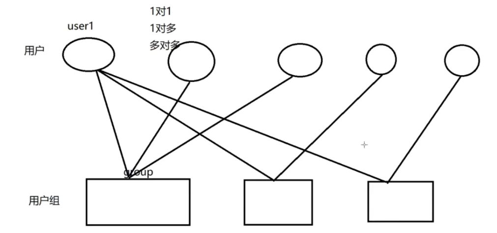

# FHS文件系统

```zsh
# 基本概念
1. 一切都是文件：Linux将设备、进程、网络连接等都表示为文件
2. 区分大小写：文件名和路径区分大小写
3. 没有驱动器字母：不像Windows使用C:、D:等，Linux使用挂载点

# 文件系统类型
1. ext4：最常用的Linux文件系统，稳定可靠
2. Btrfs：具有高级功能的现代文件系统(快照、压缩等)
3. XFS：高性能文件系统，适合大文件
4. ZFS：高级文件系统，具有强大的数据完整性功能
5. tmpfs：内存中的临时文件系统
6. vfat/FAT32：兼容Windows的简单文件系统

# 标准目录结构
/
├── bin -> usr/bin          # 基本用户命令二进制文件(符号链接到/usr/bin)
├── boot                    # 引导加载程序和内核文件
├── dev                     # 设备文件
├── etc                     # 系统配置文件
├── home                    # 用户主目录
├── lib -> usr/lib          # 基本共享库(符号链接到/usr/lib)
├── lib64 -> usr/lib64      # 64位共享库(符号链接到/usr/lib64)
├── mnt                     # 临时挂载点
├── opt                     # 可选应用程序软件包
├── proc                    # 进程和内核信息虚拟文件系统
├── root                    # root用户的主目录
├── run                     # 运行时变量数据
├── sbin -> usr/sbin        # 系统管理命令(符号链接到/usr/sbin)
├── srv                     # 源代码存储
├── sys                     # 系统设备和内核信息虚拟文件系统
├── tmp                     # 临时文件,系统定时自动清除
├── usr                     # 用户程序和数据
│   ├── bin                 # 大多数用户命令
│   ├── include             # C头文件
│   ├── lib                 # 库文件
│   ├── local               # 本地安装的软件
│   ├── sbin                # 非必要的系统管理命令
│   └── share               # 架构无关数据
└── var                     # 可变数据文件
    ├── cache               # 应用程序缓存数据
    ├── lib                 # 状态信息
    ├── log                 # 日志文件
    ├── spool               # 等待处理的文件
    └── tmp                 # 系统重启间保留的临时文件

# 重要目录
1. /etc：系统配置文件
   - `/etc/fstab`：文件系统挂载信息
   - `/etc/passwd`：用户账户信息
   - `/etc/group`：用户组信息

2. /var：经常变化的文件
   - `/var/log`：系统日志
   - `/var/cache`：应用程序缓存

3. /proc：虚拟文件系统，提供进程和系统信息
   - `/proc/cpuinfo`：CPU信息
   - `/proc/meminfo`：内存信息
   - `/proc/[pid]`：特定进程信息

4. /dev：设备文件
   - `/dev/sda`：第一块硬盘
   - `/dev/sda1`：第一块硬盘的第一个分区
   - `/dev/null`：空设备，丢弃所有写入

# 相对路径
# 当前目录
.
# 上级目录
..
# 用户目录
~

# 绝对路径:从/开始
/home/andy/1.txt

# 颜色的含义
白色:普通文件（如文本文件、配置文件等）
蓝色:目录绿色可执行文件（具有 `+x` 权限）
青色/浅蓝:符号链接（快捷方式）
红色:压缩文件（如 `.zip`, `.tar.gz`, `.rar` 等）
紫色:图片或多媒体文件（如 `.jpg`, `.png`, `.mp3`, `.mp4`）
黄色:设备文件（如 `/dev/sda`, `/dev/tty`）
红色闪烁:损坏的符号链接（指向不存在的文件）
红色底:suid标记
黑底黄字:管道文件（FIFO）（如 `mkfifo` 创建的）
黑底绿字:Socket 文件（如 `/run` 下的某些文件）
```


# shell

Shell：蛋壳的意思，是linux中比较重要的一个概念，所有的命令其实都称之为shell命令。
看图解：shell就是内核的一个外壳，用户通过shell来控制内核进而驱动硬件做事情，这是它名字的由来。Linux下，没有shell的话，就不能控制这个计算机了，因为内核是用户不能直接控制的。


## zsh

```zsh
# 安装zsh
sudo pacman -S zsh

echo $SHELL # 查看当前shell
chsh -s $(which zsh)  # 修改默认 shell

# 安装nerd-font
yay -S ttf-agave-nerd

# 安装oh-my-zsh
sudo pacman -S oh-my-zsh-git
whereis oh-my-zsh # 找到oh-my-zsh文件夹
# /usr/share/oh-my-zsh
# 复制zshrc到~/.zhsrc

# 安装命令提示插件
cd /usr/share/oh-my-zsh/plugins
git clone git@github.com:zsh-users/zsh-autosuggestions.git
git clone git@github.com:zsh-users/zsh-syntax-highlighting.git

# 配置
plugins=(git zsh-autosuggestions zsh-syntax-highlighting)

# 使得配置文件生效
source ~/.zshrc
```


## 指令

```zsh
# 查看当前shell
echo $SHELL

# 查看主机信息
hostnamectl
# 修改主机名
hostnamectl set-hostname xxx

# echo 是 Write-Output 的别名（Alias），用于输出文本或变量内容到标准输出（stdout）
# 输出字符串
echo "Hello, World!"
# 输出到文件
echo "Hello" > output.txt       # 覆盖写入
echo "World" >> output.txt      # 追加写入
# 标准正确输出和标准错误输出
head 1.txt 1>>2.txt 2>>3.txt
# 清空一个文件
>1.txt

# 输入
cat < 1.txt
# 标准输入
cat << 0 > 1.txt

# 查找 可执行文件（在 $PATH 环境变量中的命令）的完整路径
which python
# 查找命令的 二进制文件、源码文件和手册页 的位置。
whereis python
# 显示 所有可能的匹配路径（包括别名、函数、可执行文件）。
where python

# 查看别名
alias
# 取消别名
unalias ls
# 添加别名
alias rm='rm -i'

# 显示命令类型
type cd

# 命令历史 (history) .zsh_history
history | grep "apt install"  # 查找安装过的软件
# 清楚历史指令
history -c
# 查看history能够存储的数
echo $HISTSIZE

# 清屏 (clear)
clear  # 或使用快捷键Ctrl+L
```


## 快捷键

```zsh
Ctrl+a #光标跳转至正在输入的命令行的首部
ctrl+e #光标跳转至正在输入的命令行的尾部
ctr1+c #终止前台运行的程序，比如ping指令
ctr1+d #在shel1中，ctrl-d表示推出当前she11。
ctr1+z #将任务暂停，挂至后台，执行fg命令继续运行
ctrl+1 #清屏，和clear命令等效。
ctr1+k #删除从光标到行末的所有字符
ctr1+u #删除从光标到行首的所有字符
ctr1+r #搜索历史命令，利用关键字搜索
ctr1+w #光标往前删除一个参数，以空格为分割。
```


# 发行版


## arch

### 安装

```bash
iwctl
station wlan0 connect xxx
输入密码
ping www.baidu.com

pacman -Sy archlinux-keyring
pacman -Sy archinstall
archinstall
```


### 换源

```python
'''
换国内镜像源
'''

# 打开配置文件
sudo nvim /etc/pacman.d/mirrorlist

#阿里源
Server = http://mirrors.aliyun.com/archlinux/$repo/os/$arch
#中科大源
Server = https://mirrors.ustc.edu.cn/archlinux/$repo/os/$arch
#清华源
Server = https://mirrors.tuna.tsinghua.edu.cn/archlinux/$repo/os/$arch

# 更新源
sudo pacman -Syyu

'''
添加非官方源
'''

# 打开配置文件
sudo nvim /etc/pacman.conf

[archlinuxcn]
SigLevel = Optional TrustedOnly
# 阿里源
Server = https://mirrors.aliyun.com/archlinuxcn/$arch
#中科大源
Server = https://mirrors.ustc.edu.cn/archlinuxcn/$arch
#清华源
Server = https://mirrors.tuna.tsinghua.edu.cn/archlinuxcn/$arch
    
# 导入 archlinuxcn key
sudo pacman -Sy archlinuxcn-keyring

# 安装yay  base-devel
sudo pacman -Sy yay base-devel

# blackarch
curl -O https://blackarch.org/strap.sh
chmod +x strap.sh
sudo ./strap.sh

sudo nvim /etc/pacman.conf

[blackarch]
Server = https://mirrors.aliyun.com/blackarch/$repo/os/$arch
```


### 环境

```zsh
yay -S nvm rustup

# rustup(默认工具链)
rustup default stable

# nvm
echo 'source /usr/share/nvm/init-nvm.sh' >> ~/.bashrc
source ~/.bashrc

# nvm的使用

# 安装最新版本
nvm install node

# 列出本地已安装版本
nvm ls

# 使用特定版本
nvm use 18.12.1

# 查看当前使用的 Node.js 版本
nvm current

# 查看node版本
node --version

# 查看npm版本
npm --version

# sdkman
curl -s "https://get.sdkman.io" | bash
source "$HOME/.sdkman/bin/sdkman-init.sh"

#sdk的使用

# 查看所有 JDK 版本
sdk list java  
# 查看 Gradle 版本
sdk list gradle
# 安装
sdk install java 版本
# 切换版本
sdk use java 11.0.20-amzn
# 删除
sdk uninstall java 11.0.20-amzn
# 	查看当前使用的版本
sdk current
```


### 软件

```zsh
# 安装的软件
yay -Qeq | tr '\n' ' '

# 常用工具
yay -S archlinuxcn-keyring base base-devel blackarch-keyring docker docker-compose git neovim oh-my-zsh-git openssh yay zsh

# 黑客工具
yay -S nmap aircrack-ng hydra
```


### 其他

#### 设置中文字体

**字体安装**

```bash
sudo pacman -S noto-fonts-cjk
```

**系统设置**

```bash
sudo vim /etc/locale.gen
# 把以下内容前的#去掉
zh_CN.UTF-8 UTF-8

sudo locale-gen
```


#### 安裝输入法

**安装**

```bash
sudo pacman -S fcitx5-im fcitx5-chinese-addons
# wayland 打开
```


**配置**

```bash
vim ~/.pam_environment

GTK_IM_MODULE=fcitx
QT_IM_MODULE=fcitx
XMODIFIERS=@im=fcitx
SDL_IM_MODULE=fcitx
```


### pacman&yay

### -S

```bash
# 强行刷新一遍再更新
sudo pacman -Syyu
yay -Syyu

# 安装软件
sudo pacman -S 软件名
yay -S 软件名

# 搜索
sudo pacman -Ss 软件名
yay -Ss 软件名

# 清理缓存
sudo pacman -Sc
yay -Sc
```

### -R

```bash
# 删除软件及其依赖，和全局配置文件
sudo pacman -Rns
yay -Rns

# 删除不再需要的依赖
sudo pacman -Rns $(pacman -Qdtq)
yay -Rns $(pacman -Qdtq)
```

### -Q

```bash
# 查询所有安装的软件
sudo pacman -Q
yay -Q

# 查询安装了多少个软件
sudo pacman -Q | wc -l
yay -Q | wc -l

# 查询自己安装的软件
sudo pacman -Qe
yay -Qe

# 查询自己安装了多少个软件
sudo pacman -Qe | wc -l
yay -Qe | wc -l

# 整理自己安装的软件
sudo pacman -Qeq
yay -Qeq

# 查询具体软件
sudo pacman -Qs 软件名
yay -Qs 软件名

# 查询不再需要的软件依赖
sudo pacman -Qdt
yay -Qdt
```


## kali

### 安装

#### 在 wsl2 中安装

**打开 terminal**

```
# 安装kali-linux
wsl --install kali-linux --web-download
# 切换默认系统为kali-linux
wsl --set-default kali-linux
# 启动
wsl -d kali-linux
# 退出
exit
```


**换源**

```
# 修改源
sudo vim /etc/apt/sources.list

# 把第一行注释掉
#阿里云
deb http://mirrors.aliyun.com/kali kali-rolling main non-free contrib
deb-src http://mirrors.aliyun.com/kali kali-rolling main non-free contrib

sudo apt update && sudo apt upgrade
```


**安装 gui**

kex：https://www.kali.org/news/win-kex-version-2-0/ 

```
# wslg(kex:kali的GUI)
sudo apt install kali-win-kex
# 打开图形界面（经典模式）
kex --win -s
# 无缝界面
kex --sl --s
```


### 在 docker 中安装


**打开 terminal**

```
# 启动
docker run -it kalilinux/kali-rolling /bin/bash

# 更新
apt update

# 修改源
nvim /etc/apt/sources.list

# 把第一行注释掉
#阿里云
deb http://mirrors.aliyun.com/kali kali-rolling main non-free contrib
deb-src http://mirrors.aliyun.com/kali kali-rolling main non-free contrib

apt update && apt upgrade

# 需要什么装什么
apt install xxx

# 列出镜像(关注ID)
docker ps -a

# 启动镜像
docker start ID

# 回到镜像
docker attach ID

# 保存
docker commit ID 名称
```


**安装软件包**

以下是 **Kali Linux 主要工具包（Metapackages）对比表**，按你的需求整理（**无 GUI、命令行渗透测试**）：

| 工具包名称                       | 包含内容                                                     | 适合场景                       | 安装命令                                          |
| -------------------------------- | ------------------------------------------------------------ | ------------------------------ | ------------------------------------------------- |
| kali-linux-core                  | 最基础系统 + 少量核心工具（nmap, netcat, curl 等）           | 仅需基础环境，手动安装其他工具 | sudo apt install kali-linux-core                  |
| kali-linux-headless              | 所有无 GUI 渗透工具（metasploit, sqlmap, hydra, john, aircrack-ng 等） | 推荐！纯命令行渗透测试全覆盖   | sudo apt install kali-linux-headless              |
| kali-tools-top10                 | Kali 官方十大工具（nmap, metasploit, sqlmap, hydra 等）      | 快速获取核心工具               | sudo apt install kali-tools-top10                 |
| kali-tools-information-gathering | 信息收集工具（dnsenum, sublist3r, theHarvester 等）          | 专注侦察阶段                   | sudo apt install kali-tools-information-gathering |
| kali-tools-web                   | Web 渗透工具（burpsuite（CLI 模式）, sqlmap, nikto 等）      | Web 应用测试                   | sudo apt install kali-tools-web                   |
| kali-tools-passwords             | 密码攻击工具（hashcat, john, hydra 等）                      | 破解哈希/密码                  | sudo apt install kali-tools-passwords             |
| kali-tools-exploitation          | 漏洞利用工具（metasploit, exploitdb 等）                     | 漏洞利用阶段                   | sudo apt install kali-tools-exploitation          |


**附加说明**

1. **** **kali-linux-headless** **是最佳平衡选择**，涵盖大部分命令行工具且无 GUI 冗余。
2. **按需组合**：例如同时安装 kali-tools-web + kali-tools-passwords 可精准控制工具范围。
3. **Windows 用户建议**： 

- **WSL 2 Kali**：wsl --install -d kali-linux + 安装上表工具包。
- **Docker Kali**：轻量级容器化方案，适合单次任务。


**工具包依赖关系**

- 所有工具包均基于 kali-linux-core，安装时会自动包含基础依赖。
- 使用前务必更新： sudo apt update && sudo apt upgrade -y 


### 在虚拟机中安装

**安装 vmware 或其他虚拟机**

**安装镜像**

[Get Kali | Kali Linux](https://www.kali.org/get-kali/#kali-virtual-machines)


### 配置


### **更换源，更新系统和软件**

```
# 修改源
sudo vim /etc/apt/sources.list

# 把第一行注释掉
#阿里云
deb http://mirrors.aliyun.com/kali kali-rolling main non-free contrib
deb-src http://mirrors.aliyun.com/kali kali-rolling main non-free contrib

sudo apt update && sudo apt upgrade
```


### **语言与输入法**

在 Kali Linux 英文环境下使用中文，可以通过以下步骤配置终端和系统支持中文显示及输入。


### **更新系统并安装中文语言包**

```
sudo apt update && sudo apt upgrade -y
sudo apt install locales fonts-noto-cjk -y  # 包含中文字体和基础语言包
```


### **生成中文区域配置**

```
sudo dpkg-reconfigure locales
```

- 用方向键找到以下选项（按空格键选中）：

```
zh_CN.UTF-8 UTF-8
en_US.UTF-8 UTF-8
```

- 按回车确认，然后选择 zh_CN.UTF-8 作为默认区域（可选，若想保留英文界面则跳过）


### **安装中文输入法（如Fcitx5）**

```
sudo apt install fcitx5 fcitx5-pinyin fcitx5-configtool -y
```

- 配置环境变量

```
# 设置 Fcitx5 输入法环境变量（永久生效）
echo 'export GTK_IM_MODULE=fcitx5' >> ~/.zshrc
echo 'export QT_IM_MODULE=fcitx5' >> ~/.zshrc
echo 'export XMODIFIERS=@im=fcitx5' >> ~/.zshrc

# 重新加载 Zsh 配置
source ~/.zshrc
```

- 启动输入法（需图形环境支持）：

```
fcitx5 &
# 或者设为开机自启动（推荐）
mkdir -p ~/.config/autostart/
cp /usr/share/applications/org.fcitx.Fcitx5.desktop ~/.config/autostart/
```

通过 fcitx5-configtool 添加拼音输入法。


### **验证中文显示**

```
echo "测试中文显示" | iconv -f utf8 -t gb2312 | iconv -f gb2312 -t utf8
ls 中文目录名  # 若有中文文件/目录可测试显示
```


### **字体图标大小**

**图标大小**


**状态栏** 


**系统字体** 


**终端字体** 


**输入法字体** 


### **锁屏时间**


### apt

### 更新并升级

```zsh
# 从配置的软件源下载最新的软件包列表,升级所有可升级的软件包
sudo apt update && sudo apt upgrade
# 完全升级系统
sudo apt full-upgrade
# 更激进的升级方式，会处理依赖关系变化
# 可能会删除一些软件包以解决依赖冲突
```


### 安装新软件包

```zsh
sudo apt install <package_name>
# 示例：安装 nmap
sudo apt install nmap

# 安装特定版本的软件包
sudo apt install <package_name>=<version>
# 示例：安装特定版本的 python3
sudo apt install python3=3.9.2-3

# 查看软件报可用的版本
apt policy <package_name>
# 示例：查看 python3 可用版本
apt policy python3

# 阻止特定软件包被自动升级
sudo apt-mark hold <package_name>
# 示例：保持当前内核版本
sudo apt-mark hold linux-image-$(uname -r)

# 允许特定软件包被自动升级
sudo apt-mark unhold <package_name>
```


### 卸载命令

```zsh
# 仅删除软件包（保留配置文件）
sudo apt remove 软件包名
# 彻底删除软件包（包括配置文件）
sudo apt remove --purge xxx
# 自动清理相关依赖
sudo apt autoremove
# 组合命令
sudo apt purge --auto-remove 软件包名

# 清理缓存
# 删除 /var/cache/apt/archives/ 中所有已下载的 .deb 包
sudo apt clean

# 只删除那些无法再从仓库下载的旧版本 .deb 包
sudo apt autoclean
```


### 其他

```zsh
# 在软件源中搜索包含关键字的软件包
apt search <keyword>
# 示例：搜索与 wifi 相关的工具
apt search wifi

# 显示软件包的详细信息
apt show <package_name>
# 示例：查看 metasploit 的详细信息
apt show metasploit-framework

# 列出所有已安装的软件包
apt list --installed
# 可以配合 grep 进行过滤
apt list --installed | grep python

# 尝试修复损坏的软件包依赖关系
sudo apt --fix-broken install

# 显示软件包的依赖关系
apt depends <package_name>
# 示例：查看 burpsuite 的依赖
apt depends burpsuite

# 显示哪些软件包依赖指定的软件包
apt rdepends <package_name>
# 示例：查看 python3 的反向依赖
apt rdepends python3
```


# 命令

## 文件和目录

**创建文件**

```zsh
touch xxx.txt

# 批量创建文件(1.txt..10.txt)
touch {1..10}.txt
# 创建隐藏文件
touch .xx.txt
# 指定目录
touch /home/andy/xx.txt
```


**查看文件**

```zsh
ls

# 指定文件类型
ls *.txt
# 查看隐藏文件
ls -a
# 查看详细信息
ls -l
```


**查看文件类型**

```zsh
file 213.zip
```


**移动文件/文件夹**

```zsh
# 将xx.txt移动到/home/user目录下
mv xx.txt /home/user

# 重命名
mv xx.txt xxx.txt

# 重命名文件夹
mv xx xxx
```


**删除文件/文件夹**

```zsh
# 没有回收站
rm 4.txt 5.txt

# 强制删除
rm -f xx.txt
rm -f {5..10}.txt

# 删除文件夹
rm -r xxx

# 强制删除文件夹
rm -rf xxx
```


**复制文件**

```zsh
# 将1.txt复制到2.txt
cp 1.xtx 2.txt
# 递归复制目录
cp -r andy test
```


**查看当前目录**

```
pwd
```

**创建文件夹**

```zsh
mkdir xxx
# 创建多个文件夹
mkdir xxx{01..10}
# 依次创建
mkdir -p 1/2/3/4/5
```

**切换文件夹**

```zsh
cd /var/www/html  # 切换到绝对路径
cd ..  # 返回到上一级目录
cd ~  # 返回到用户主目录
```


## 文件传输


```zsh
# 下载文件 (wget)
wget https://example.com/file.zip

# 更强大的下载工具 (curl)
curl -o 本地存放路径 文件网址
curl -o file.zip https://example.com/file.zip
```


### scp传输

**两个linux系统**

```zsh
#主要用于linux和linux服务器之间传输文件，Scp要求接受数据的一方要开启了ssh服务端才行，如果你电脑是苹果电脑mac系统，也可以使用scp来传输，mac默认ssh服务端是没有开启的，可以自行开启，客户端是可以直接使用的。windows往1inux上面发送文件也可以用scp，但是只能单向的，因为windows上没有ssh服务端。
#把本地文件推送到远程服务端
#格式：scp本地文件路径远程主机用户@远程主机ip地址：远程主机某个目录
scp typora-setup-x64.exe root@10.0.0.128:/tmp
#把远端服务文件拉取到本地
#格式：Scp远程主机用户@远程主机ip地址：远程主机某个文件路径本地路径
scp root@10.0.0.128:/tmp/typora-setup-x64.exe
```

win10及以上版本是有scp指令的，win和win之间是不能使用scp互相传文件的，因为windows上默认是没有ssh的服务端的，只有客户端。

```zsh
#windows使用scp给1inux上传文件的时候，文件路径和文件名中不允许出现中文和空格。
#格式和上面一样
scp typora-setup-x64.exe root@10.0.0.128:/tmp
```


### rz和sz

```zsh
#上传和下载
rz #上传
sZ #下载

#需要先安装lrzsz软件包，这个用的比较多
pacman -S lrzsz

#上传的例子
rz -E

#下载的例子
sz /root/test3.tar.gz#windows上自行选择存储目录
```


## 网络

```zsh
# 无线网连接
nmtui
iwctl

# 检查网络连接 (ping)
ping google.com

# 重启网络连接
systemctl restart network

# 显示网络接口信息 (ifconfig)
ip a  # 新版替代ifconfig的命令

# 显示网络连接 (netstat)
ss -tulnp  # 替代netstat的现代命令

# 追踪网络路由 (traceroute)
traceroute google.com
mtr google.com  # 更先进的替代品
```


### 运行级别

```zsh
# 运行级别0 关机
# 运行级别1 单用户，这个类似于windows安全模式，可以用于找回密码等操作。
# 运行级别2 不带网络的多用户，这种是不能联网的。
# 运行级别3 完整的多用户模式multi-user.target，我们平常使用的模式
# 运行级别4 保留
#运行级别5 桌面模式graphica1.target，桌面版系统就是这个模式，如果不想开机进入图形化界面，就需要修改运行级别，可以试一下
# 运行级别6 重启

# 切换运行级别
init
# 执行init6，就会重启，执行init0就会关机
# 查看运行级别
systemctl get-default
# 设置运行级别，设置之后一重启就改变了
systemctl set-default graphical.target # 设置默认运行级别为图形，注意没有安装图形化界面工具的话是不能切换为桌面版的
systemctl set-default multi-user.target # 设置默认运行级别为命令行
```


### 权限掩码

```zsh
# 查看掩码值
umask
# 这个值就决定着我们创建文件的初始权限
022
#可以看到，目录的初始权限为755，文件的初始权限为644。这些权限都是通过umask掩码计算得来的。
#文件权限计算：0666-0022=0644
#目录权限计算：0777-0022=0755

# 修改文件vim/etc/profile，找到umask来修改
root默认权限掩码022
普通用户默认权限掩码002
```


### 特殊权限

**suid**

suid，就是某个可执行文件有super超级管理员权限，这个文件普通用户也能用，含有suid的文件，可以让普通用户拥有该文件属主的执行权限，主要针对的是命令文件。比如：

```zsh
# suid令普通用户临时借用root用户的权限
chmod u+s /usr/sbin/passwd

```


**su和sudo**

```zsh
# 切换用户
su 用户 # 当前目录切换
su - 用户 # 切换到家目录
# 推出:exit

# sudo全称：superuserdo，它的作用是用来授权的。就是给普通用户高级权限用的。原因就是很多的操作，如果都需要root用户去做，太麻烦了，所以可以给普通用户做一些授权，普通用户操作就方便了。授权就用到了sudo，Sudo并不是一下子给用户很多权限，而是一个命令一个命令的授权。

# root用户才能修改这个配置。
1.配置/etc/sudoers
# 用户名所有终端=运行的用户身份命令ALL，ALL是所有指令，不能给所有的，不然权限太高了
jaden ALL=(ALL:ALL)		/bin/systemctl,/usr/bin/vim,/usr/sbin/reboot 
# 单独给指令权限，而且要写指令的绝对路径，逗号分割
# 修改完配置文件，保存退出之后，立马就生效了，不需要重启或者重新登录。
# 切换到普通用户，查看可以使用的授权命令
sudo -1
[jaden@localhost ~]S sudo -1
我们信任您已经从系统管理员那里了解了日常注意事项。
总结起来无外乎这三点：
#1）尊重别人的隐私。
#2）输入前要先考虑（后果和风险)。
#3）权力越大，责任越大。
```


### sudo提权

```zsh
vim # 命令模式执行：！/
	# 通过vim修改/etc/sudoers，授权ALL
	# 再通过vim进入一个文件
	# :输入指令，是可以直接输入系统指令的，前面加一个！即可，比如创建一个文件，！touch3.txt
	# 查看3.txt信息如下
	
[jaden@localhost ~]s 11
总用量0
-rw-r--r--1rootroot03月2717:053.txt#以root用户身份创建的文件
#如果在vim文件时，执行！/bin/bash，就进入到了root的命令终端，可以为所欲为。
#这就是sudo提权，但是sudo提权需要借助到可以执行系统指令的交互式的功能，比如vim。

示例2：
find
# sudo find . -exec bash \；#直接进入root的命令终端，这个指令退出root终端可能要退好几次才行，看find找到了几个文件，找到了3个文件，就输入三次exit才能退出。

示例3：
awk 
# sudo awk‘BEGIN {system("/bin/bash")}’ jaden.txt#直接进入到root命令终端，exit直接退出。

# 还有好多指令可以提权，比如cp命令也可以提权，将其他电脑上的/etc/shadow文件拷贝到这个系统中，密码就改掉了，再su切换到root即可等等，还有什么mv、vi、sed修改文件、chmod改重要文件权限等等这里就不多提了。大家可以试试，普通用户使用sudo来修改shadow文件的root用户的密码。
```


### 脏牛提权

```zsh
# dcow全称dirtycow，脏牛，原理：Linux内核的内存子系统在处理写入时复制（copy-on-write,Cow，组合起来是牛的意思）时产生了竞争条件。恶意用户可利用此漏洞，来获取高权限，对只读内存映射进行写访问，所以大家都管这个提权方式叫做脏牛提权。原理这一块大家不需要掌握，会监测是否存在这个漏洞即可。

# 利用工具
https://github.com/gbonacini/CVE-2016-5195

# git clone下来后
make
./dcow -s 
```


## 用户与权限

### 用户和用户组




### 用户管理

```zsh
# 创建一个用户
useradd test1
# 指定组创建用户
useradd test1 -g test1
# 删除一个用户,同时删除家目录的用户文件夹
userdel -r test1

# 设置密码
passwd test1

# 查看一个用户是否存在
id test1

# 查看用户状态
lchage -l test1

# 更改用户状态
usermod -L test1 # 禁用/锁定用户
usermod -U test1 # 解锁用户
usermod -g 组 用户 # 修改主组
usermod -G 组 用户 # 修改从属组

# /etc/passwd 存在哪些用户,多一个用户就多一行记录
# /etc/shadow 用户密码,加密

# 查看哪些用户连接
w

07:44:40 up 19 min,  1 user,  load average: 0.00, 0.00, 0.00
USER     TTY       LOGIN@   IDLE   JCPU   PCPU  WHAT
root     pts/1     07:25   19:13   0.11s  0.11s -zsh

# tty1:本地连接,pts/1:远程连接

# 切换用户 (su = substitute user)
su -  # 切换到root
su - username  # 切换到指定用户

```


### 用户组管理

```zsh
# /etc/group 查看有多少个用户组

# 添加组
groupadd test1

# 修改组
groupmod -n 新组名 旧组名 # 修改组名
```


### 权限管理

#### **文件权限**

```zsh
# 查看文件权限
ls -l /tmp/1.txt

-rw-r--r-- 1 root root 3.6K Jul 23 11:39 1.txt
# 第一段的第一个字符，表示文件类型-文件、d目录、1软链接（对应着windows快捷方式）、b块设备（ls/dev，可以看到硬盘sda等）
# 第一段第2-4字符，表示该文件所属用户的权限
# 第一段第5-7字符，表示该文件所属用户组的权限
# 第一段第8-10字符，表示其他用户对该文件的权限
# 第一个英文:用户 第二个英文:组
# 第11个字符是. 表示开启了selinux

r 4代表读权限read
w 2代表写权限write
x 1代表可执行权限executable
- 0空权限位，表示没有这个权限，9位权限不能少，没有的权限就用-代替。

权限值表
0 ---
1 --x
2 -w-
3 -wx
4 r--
5 r-x
6 rw-
7 rwx

ugo权限体系：
	rw-		r--  	r--
	user	group	other

# 更改文件权限 (chmod = change mode)
chmod 755 script.sh  # 设置权限为rwxr-xr-x
chmod +x exploit.py  # 添加可执行权限
chmod -x exploit.py  # 去掉可执行权限
chmod o-r 1.txt      # other去掉读权限
chmod g-x exploit.py # group去掉执行权限

# 更改文件所有者 (chown = change owner)
sudo chown root:root /etc/shadow  # 属主:属组

# 以root权限执行命令 (sudo = superuser do)
sudo apt update  # 以root权限运行

# 查看文件时间
stat 文件/文件夹
```


#### **目录权限**

```zsh
文件权限：rwx读写执行

目录的权限：rwx
r表示可以查看目录下有哪些文件
x表示可以cd切换到该目录
w表示可以在目录中创建、修改、删除文件等操作

为了安全操作：
文件权限默认：644权限、狠一点就给600权限
目录权限默认：755权限、狠一点就给700权限
```


### 可执行程序特殊目录(环境变量)

```zsh
# 查看环境变量
echo $PATH

# 将可执行文件添加到这些目录中,可以直接执行命令
```


## 查看与编辑

```zsh
# 正序查看
cat xxx.txt
# 显示行号
cat -n xxx.txt
# 倒序查看
tac xxx.txt
# 查看前10行
head xxx.txt
# 查看前五行
head -5 xxx.txt
# 查看后十行
tail xxx.txt
# 查看后五行
tail -5 xxx.txt
# 监控
tail -f /tmp/xxx.txt
```


## 编码与解码

```zsh
# base64
# 编码
echo "The password is IFukwKGsFW8MOq3IRFqrxE1hxTNEbUPR" | base64
# 解码
base64 -d data.txt
echo "VGhlIHBhc3N3b3JkIGlzIElGdWt3S0dzRlc4TU9xM0lSRnFyeEUxaHhUTkViVVBSCg==" | base64 -d

# --------------------

# xxd:十六进制转储工具
```


## 压缩与解压

```zsh
# 指定目录解压tar.gz文件
tar -xzf archive.tar.gz -C /home/andy/backup # -x 解压，-z gzip，-v 详细，-f 文件

# 创建tar.gz压缩包
tar -czf /home/jack/backup.tar.gz /home/andy/backup

# gzip压缩(不保留源文件)
gzip 1.txt

# gzip解压(不保留源文件)
gzip -d 1.txt.gz

# 解压zip文件
unzip file.zip

# 创建zip压缩包
zip -r backup.zip 1.txt 2.txt

# 压缩rar
rar a 压缩文件名.rar 文件或目录

# 解压rar
rar x 压缩文件.rar
```


## 系统

```zsh
# 查看cpu
lscpu

# 显示内存使用情况
free -h

#total=used +free +buffers+ cache
#total：所有可用内存
#used：已经使用的内存
#free：没有使用内存
#shared：仅为兼容设置，可以忽略
#buff：作为buffercache的内存，是块设备的读写缓冲区
#cache：作为pagecache的内存，文件系统的cache
#available－无需交换即可用于启动新应用程序的内存量估计值。

# 显示磁盘使用情况 (df = disk free)
df -h  # -h 人类可读格式
df -ih # -h 人类可读格式 -i 查看inode空间

# 系统优化
# 显示系统信息 (uname = unix name)
uname -a  # -a 显示所有信息

# 显示目录/文件占用空间 (du = disk usage)
du -sh ~/Downloads/  # -s 总计，-h 人类可读

# 显示系统运行时间和负载
uptime
```


## 进程

```zsh
# 显示进程信息 (ps = process status)
ps -ef

# pid：全称processid，是进程编号，每次启动某个程序，它的编号可能都不一样，这个是程序启动之后系统随机分配的。
# uid：全称userid，是进程所属用户，也就是哪个用户启动的，我们可以切换个用户执行一下sleep60，就可以看到效果
# CMD中看到括起来的，表示这些都是系统级别的进程，比如一些硬件驱动程序之类的，这些都不要动。不带口的都是用户级别的。
# ppid：全称parentprocessid，父进程，记录的是某个进程是由哪个进程创建出来的。可以通过pstree工具来查看从属关系。
# C：这个不用管。
# STIME：全称starttime，进程的启动时间。
# TTY：用来显示哪些是本地启动的，哪些是远程终端连接上来启动的。通过w指令可以看到哪些终端登录着主机。只要登录成功一个终端，那就多个终端。
# TIME：这个没啥用
# CMD：这个进程执行了什么指令。

# 查看进程的从属关系
pstree

# 查找进程 (pgrep = process grep)
pgrep -l sshd  # 查找sshd进程

# 结束进程 (kill)
kill 1234 # 结束一个进程
pkill top # 批量结束所有top进程
# kill -9，这个强大和危险的命令迫使进程在运行时突然终止，进程在结束后不能自我清理。危害是导致系统资源无法正常释放，一般不推荐使用，除非其他办法都无效。
kill -9 1234  # 强制结束PID为1234的进程

# 动态查看进程 (top)
top
htop  # 更友好的替代品

#08：34：27up20min：08：34：27表示top指令的执行时间，每3秒自动刷新一次，up20min：开机了20分钟，如果看到3：20，表示开机了3小时20分钟，看到10days表示10天了，1inux很稳定耐用，开机好多年都稳定运行着，不会卡顿。
#1user：表示当前只有一个用户在使用
#1oadaverage：0.00，0.01，0.05：平均负荷，指的是cPU的负载高不高，cPu负载高，那么平均负荷就比较大，如果这几个值很大的时候，服务器会变得很卡。如果发现服务器卡了，就是异常情况，就可以看看这个数据。这三个值表示：1分钟、5分钟、15分钟的负载情况，1oadaverage数据是每隔5秒钟检查一次活跃的进程数，然后按特定算法计算出的数值。如果这个数除以逻辑cPU的数量，结果高于5的时候就表明系统在超负荷运转了。
#Tasks：89tota1，2running，87sleeping，0stopped，0zombie：表示进程数量，总共89个，2个正在运行，87个在睡眠状态，当我们的cPU是1核的时候，是在所有进程之间来回切换执行，所以只有一个或者切换速度很快的时候显示2个。0stopped表示停止的进程，但是这里一般都是0，以为进程结束之后会自动从内存中释放。0zombie表示僵尸进程数量，僵尸进程是杀不死的，就是由于各种原因，系统无法自动释放的进程，僵户进程也消耗系统资源，一般ki11掉它的父进程可以杀掉僵尸进程，或者ki11-9来杀掉。但是ki11-9要慎用！！！它也容易产生僵户进程，ki11会将进程运行中的信息保存下来，进程不会出问题，ki11-9不会保存，强制结束进程的运行，容易出现僵尸进程。
#按数字1，可以查看cpu数量
#%Cpu(s)：0.0us，0.0sy，0.0ni，100.0id，0.0wa，0.0hi，0.0si，0.0st，关于cpu我们其他参数不用看，就看这个100.0id，id是idle的简写，表示100%空闲，因为我们现在cPU使用率很低，所以显示了100%空闲。我们只关注这个参数即可，看一下CPU忙不忙就行。
#KiB Mem: 2027872 total， 1779000 free， 135668 used,113204buff/cache，是内存（英文：memroy)的描述信息，total表示总内存量，free表示可用剩余量，userd表示已经使用的量，buff/cache表示用作缓存，是和磁盘进行读写时的缓存区域，这个参数不用管。
#KiB Swap:0total,o free,0used.1755332avai1Mem：Swap表示虚拟内存，这是硬盘分配给内存的一部分空间，为了当内存不足时，临时将硬盘当作内存使用。这个数值是可以自行调整的。一般自动就分配好了，所以我们不用管，实在是内存不够用的时候再加大这个虚拟内存。我现在看的是虚拟机上的虚拟内存，虚拟机不设置虚拟内存，所以显示为0。
```


## 特殊符号

```zsh
#:#注释
# ~ 家目录
# . 当前目录
# .. 上级目录
# / 根目录

# 查看环境变量
env
# 查看某个变量
echo $XXX
# 设置环境变量
export LANG=zh_CN.UTF-8

# echo 双引号:解析并且换行
echo "$LANG
dquote> nihao"
zh_CN.UTF-8
nihao

# echo 单引号:不解析换行 
echo '$LANG
nihao'
$LANG
nihao

# \/
\ 转义
/ 路径

# ！历史命令调用，在find命令中是取反的意思。
!46 # 第46条历史命令

# * 通配符
ls *.txt

# $ 调用变量 小心使用
aaa=adny
echo $aaa
adny

# ; 分割指令 分别执行
ls ; cat 1.txt

# || 短路 前面的命令执行对了,后面的命令就不再执行了;前面错了,后面执行
ls || cat 1.txt

# && 前面对了,后面也执行;前面的错了,后面也不执行了
ls && cat 1.txt

# & 后台执行
top &

# `` 嵌套命令
mkdir `echo andy` # 先执行 echo andy 指令 然后再mkdir

# 文件名是破折号-
# 相对路径
cat ./-
# 重定向
cat < -
# 绝对路径
cat /home/bandit1/-

# 以 -开头的文件 -file.txt
touch -- -file.txt
cat -- -file.txt  # `--` 表示“选项结束”

# 有空格的文件
cat "spaces in name"  # 用引号包裹

# 文件名含特殊符号（如*、$）
cat "*.txt"  # 引号禁用通配符
```


## 服务

```zsh
# 查看所有服务列表
systemctl list-unit-files
# 启动服务
systemctl start xxx
# 停止服务
systemctl stop xxx
# 重启服务
systemctl restart xxx
# 查看服务状态
systemctl status xxx
# 设置开机自启
systemctl enable xxx.service
# 停止开机自启
systemctl disable xxx.service
```


## 定时任务

**时间**

```zsh
# 时间命令
date
# 时间格式
date +%F\ %T # 2025-07-26 20:08:44
# 同步时间
systemctl restart chronyd
# 改时间
date -s '13:23:32'
```

**定期执行任务(执行命令)**

```zsh
# 安装
pacman -S cronie
# 启动
sudo systemctl enable --now cronie

# 使用
crontab -e # 编写指令
crontab -l # 看有多少添加的指令

# 定时任务的格式
* * *  *  *     cmd
分 时 日 月 周  命令

分：0-59
时：0-23
日：0-31
月：1-12
周：1-7

# 每5分钟执行一次
*/5 * * * *

# 每1小时的01分执行一次
01 */1 * * *

# 每半个小时执行一次，下面的意思是每小时的00分和30分各执行一次
00,30 */1 * * *

# 每天晚上8：00执行一次
00 20 * * *

# 每个月1号晚上8：00执行
00 20 1 * *

# 每年1月1号晚上8：00执行
00 20 1 1 *

# 每周1,3,5,晚上八点执行
00 20 * * 1,3,5

#几个符号的意思：
#*每分钟
#*/5每5分钟
#05第5分钟

#每秒钟执行的任务，需要单独写脚本，繁琐一些。
```


## 搜索和过滤

### 管道

管道符号：`|`，可以将前面指令的执行结果，作为后面指令的操作内容。

例如:将ip a 中输出的内容作为tail命令的操作内容

```zsh
ip a | tail -4
# 输出
3: docker0: <NO-CARRIER,BROADCAST,MULTICAST,UP> mtu 1500 qdisc noqueue state DOWN group default
    link/ether 02:c2:15:4d:be:4e brd ff:ff:ff:ff:ff:ff
    inet 172.17.0.1/16 brd 172.17.255.255 scope global docker0
       valid_lft forever preferred_lft forever
```


### 搜索

```zsh
# 查找文件 (find)
find / -name "*.conf" 2>/dev/null  # 查找所有.conf文件
find . -user bandit7 -group bandit6 -size 33c
```


### 过滤

#### gerp

```zsh
# 按行模糊过滤
grep "xxx" xxx.txt
# -w:过滤完整单词 -n:显示行号
grep -w -n  "apple" xxx.txt
# 管道过滤
cat xxx.txt | grep "sss"
# 正则表达式
grep -P "(\d{1,3}\.){3}\d{1,3}" xxx.txt

# grep参数

-n 显示行号
[root@localhost ~]# grep -n'tcp'test.txt
# vitest.txt+48，表示进入vi的时候，光标直接定位的48行起始位置。

-c 对结果行计数
[root@localhost~]# grep -c‘tcp'test.txt
14

-i 不区分大小写
[root@localhost ~]# grep -n'tcp′ test.txt -i

-V 反向搜索，取反
[root@localhost~]#grep-n‘udp'test.txt-V#将不含有udp的行全部过滤出来

-w 精准匹配
[root@localhost ~]#grep -w'tcp'test.txt

-o 只显示匹配的结果，前面的第一个示例中我们用过-o参数
[root@localhost ~]# grep -o -n'tcp'test.txt

-A1 同时打印搜索结果行的后一行，A是after的简写
[root@localhost ~]# grep -A2'ftp'test.txt
[root@localhost~]# grep -A 2'ftp′test.txt

-B3 同时打印搜索结果行的前三行，B是before的简写
[root@localhost~]# grep -B2'ftp'test.txt

-C2 同时打印搜索结果行的上下各两行
[root@localhost~]# grep -C2'ftp'test.txt

-E 扩展正则表达式
#正则我们下面会细讲，先简单了解一下。
[root@localhost~]# grep -E.tp'test.txt#，就是正则表达式，表示任意的一个字符
[root@localhost~]#grep-E‘ftp|ssh'test.txt#查找ftp或者ssh，|是或者的意思，可以用多个ftp|ssh|telnet..

-P 使用per1正则广
#per1语言中设计的正则表达式写法规则，很强大，很多领域都支持per1正则的语法结构。
[root@localhost ~]# grep-P"d+"test.txt#匹配所有的数字
[root@localhost~]#grep -P"\d{4,}"test.txt#匹配4位的数字
```


#### sed

```zsh
# 按行修改替换
用法：sed[-nri][动作]目标文件文件
选项与参数：
-n：使用安静（silent）模式。在一般sed的用法中，所有来自STDIN的数据一般都会被列出到终端上。但如果加上-n参数后，则只有经过sed特殊处理的那一行（或者动作）才会被列出来。
-r：Sed的动作支持的是延伸型正则表示法的语法。（默认是基础正则表示法语法）
-i：直接修改读取的文件内容，而不是输出到终端。

动作说明：[ni[，n2]]function
nl，n2一般表示为行号，【，n2]表示这个参数可选，可有可无。

function:
a：指定行后面插入一行
d：删除
1：指定行前面插入一行
p：打印，#一般和前面的-n参数一起用
s：替换需要I忽略大小写，全局替换需要g

# 文本替换
# 将文件中的 "apple" 替换为 "orange"（只替换每行第一个）
sed 's/apple/orange/' file.txt

# 全局替换（所有匹配）
sed 's/apple/orange/g' file.txt

# 忽略大小写替换
sed 's/apple/orange/gi' file.txt

# 替换并直接修改原文件（加 `-i`）
sed -i 's/apple/orange/g' file.txt

# 文本删除
# 删除第 3 行
sed '3d' file.txt

# 删除包含 "error" 的行
sed '/error/d' file.txt

# 删除 10-20 行
sed '10,20d' file.txt

# 删除空行
sed '/^$/d' file.txt

# 插入/追加
# 在第 3 行前插入一行
sed '3i\插入的内容' file.txt

# 在第 3 行后追加一行
sed '3a\追加的内容' file.txt

# 在匹配行后追加
sed '/pattern/a\追加的内容' file.txt

# 打印特定行
# 打印第 5 行
sed -n '5p' file.txt

# 打印 10-15 行
sed -n '10,15p' file.txt

# 打印包含 "hello" 的行
sed -n '/hello/p' file.txt

# 打印文件最后一行
sed -n '$p' file.txt

# 多命令组合
# 替换并删除空行
sed -e 's/apple/orange/g' -e '/^$/d' file.txt

# 或用分号分隔
sed 's/apple/orange/g; /^$/d' file.txt

# 使用正则表达式
# 替换所有数字为 "X"
sed 's/[0-9]/X/g' file.txt

# 删除行首空格
sed 's/^[ \t]*//' file.txt

# 替换 "foo" 开头的行
sed 's/^foo/bar/' file.txt
```


#### awk

```zsh
# 按列过滤
# 基本语法
awk '模式 {动作}' 文件名

# 打印列
# 打印第1列和第3列
awk '{print $1, $3}' file.txt
# 打印最后一列
awk '{print $NF}' file.txt

# 指定分隔符
# 使用逗号分隔（默认是空格/制表符）
awk -F',' '{print $2}' data.csv
# 使用正则表达式作为分隔符（如冒号或空格）
awk -F'[: ]' '{print $1, $3}' file.txt


# NR 当前行号	
awk 'NR==3 {print}' file
# NF 当前行的列数	
awk '{print NF}' file
# FS 输入字段分隔符（默认空格）	
awk 'BEGIN{FS=":"} {...}'
# OFS 输出字段分隔符（默认空格）	
awk 'BEGIN{OFS=";"} {...}'
# FILENAME 当前文件名	
awk '{print FILENAME}'

# 条件过滤
# 打印第2列大于100的行
awk '$2 > 100 {print $0}' file.txt
# 打印包含 "error" 的行
awk '/error/ {print}' file.txt
# 打印第3列等于 "apple" 的行
awk '$3 == "apple" {print $1, $2}' file.txt

# 正则表达式
# 打印以 "A" 开头的行
awk '/^A/ {print}' file.txt
# 打印第2列匹配数字的行
awk '$2 ~ /[0-9]+/ {print}' file.txt

# 多文件处理
# 处理多个文件，并打印文件名
awk '{print FILENAME, $0}' file1.txt file2.txt
```


```zsh
# 统计
wc
# 统计多少行
wc -l xxx.txt
# 统计多少字
wc -c xxx.txt
# 统计多少个文件
ls /bin | wc -l

# --------------------

# 生成数字序列
seq 1 100
# 生成等宽数字序列
seq -w 1 100

# --------------------

# 排序(从小到大,从数字到字符)
cat xxx.txt | sort
# 排序(从小到大,从字符到数字)
cat xxx.txt | sort -n

# --------------------

# 去重(连续)要结合这sort使用
cat xxx.txt | sort | uniq
# c:字符出现了几次
cat xxx.txt | sort | uniq -c

# --------------------

# tr:字符替换、删除或压缩重复字符
# -c 或 --complement: 使用 SET1 的补集
# -d 或 --delete: 删除 SET1 中的字符，不进行转换
# -s 或 --squeeze-repeats: 将 SET1 中连续重复的字符压缩为单个字符
# -t 或 --truncate-set1: 将 SET1 截断为与 SET2 相同的长度

# 将小写字母转换为大写
echo "hello world" | tr 'a-z' 'A-Z'
# 输出: HELLO WORLD

# 将大写字母转换为小写
echo "HELLO" | tr 'A-Z' 'a-z'
# 输出: hello

# 删除所有数字
echo "abc123def456" | tr -d '0-9'
# 输出: abcdef

# 删除所有空格
echo "a b c d" | tr -d ' '
# 输出: abcd

# 将冒号替换为空格
echo "a:b:c:d" | tr ':' ' '
# 输出: a b c d

# 将多个字符替换为单个字符
echo "hello   world" | tr -s ' ' ' '
# 输出: hello world (压缩多个空格为一个)

# 删除文件中的非打印字符
cat file.txt | tr -d '\000-\011\013\014\016-\037'

# --------------------
# strings:用于从二进制文件中提取可打印字符串的实用工具
# 查看二进制文件中的可打印字符串
strings /bin/ls

# 查看特定进程的内存
strings /proc/[PID]/mem
```


# 软件


## nvim

### 基础

`h`:左

`l`:右

`j`:下

`k`:上


### 模式切换


#### 普通模式(NORMAL)

`w`:按单词向后移动

`b`:按单词向前移动

`f+字符`:跳转到指定字符

`s+前缀`:跳转到指定前缀

`]`:next(跳转到下一个..)

`[`:prev(跳转到上一个..)

`shift+>>`:缩进

`shift+<<`:取消缩进

`gg`:文章开头

`shift+g`:文章末尾

`gc`:注释

`d`:删除

`diw`:删除整个单词

`ciw`:删除整个单词后进入插入模式

`cc`:删除整行进入插入模式

`dd`:删除整行

`u`:撤销

`ctrl+r`:撤销撤销

`y`:复制

`yy`:复制整行

`数字+yy`:复制对应行数

`x`:剪切

`p`:粘贴

`ctrl+u`:向上翻页

`ctrl+d`:向下翻页


### 插入模式

`i`:在光标前面插入

`a`:在光标后面插入


### 选中模式(v)

`vi(`:选中()中的所有内容

`vi{`:选中{}中的所有内容

`vi"`:选中""中的所有内容

`shift+v`:选中整行


### 命令模式(:)

`:w`:保存

`:q`:退出

`:wq`:保存并退出

`qa`:退出全部(询问你是否保存)

`q!`:强制退出(不保存)


### 文件操作(super:空格)

`super+e`:打开侧边栏

`ctrl+h/l`:移动焦点

`shift+h`:打开隐藏文件

`ctrl+/`:打开终端

`shfit+h/l`:切换tab

`super+b+d`:删除buffer(关闭tab)

`super+super`:fzf(查找文件)

`r`:改名字

`a`:创建文件(文件夹/)

`d`:删除文件


## ventoy

在 linux上使用终端安装和配置 Ventoy 的完整指南：


### **Ventoy安装**

```
wget https://github.com/ventoy/Ventoy/releases/download/v1.0.96/ventoy-1.0.96-linux.tar.gz
tar -xvf ventoy-1.0.96-linux.tar.gz
cd ventoy-1.0.96
```


### **识别USB设别**

```
# 查看U盘（一般为sdb,请改为你的设备名）
sudo fdisk -l /dev/sdb

# 查看U盘格式
lsblk -f
```

*注意*： 确认您的 USB 设备标识（如 /dev/sdb），*操作将格式化整个设备！*


### **卸除挂载**

```
sudo umount /dev/sdb*
```


### **安全安装（禁用安全启动支持）**

```
sudo sh Ventoy2Disk.sh -i -s /dev/sdb
```

📌 重要选项：

- -i 强制安装（覆盖旧版）
- -r SIZE_MB 保留空间（如 -r 4096 保留 4GB）
- -s 启用安全启动支持


### **添加 ISO**

```
# 复制 ISO 文件 (替换实际路径)
sudo cp ~/路径/系统镜像.iso /mnt/ventoy/
```


### **启动验证**

重启电脑选择 USB 启动，Ventoy 将自动扫描并列出所有 ISO 文件


### **更新Ventoy（保留ISO文件）**

```
sudo sh Ventoy2Disk.sh -u /dev/sdb
```


### **问题**

**关闭安全模式（一般打不开都是这个问题）**


**其他问题**

请参考：[**https://www.ventoy.net/cn/doc_news.html**](https://www.ventoy.net/cn/doc_news.html)

