# win10


## 激活

```shell
# 打开powershell
irm utools.run/win | iex
# 选择4激活->自动打开cmd
# 在cmd中
# 选择1直接激活windows，看需求可以选择别的
```


## 配置

```zsh
开始栏（个性化：图标，应用列表）->任务栏（图标，输入法：中文输入英文标点）->桌面（图标，壁纸）->文件管理器（快速访问）->弹窗（控制面板->系统安全->安全维护->更改账户控制设置->从不通知）->通知（关闭通知）->浏览器（图标，其他都同步即可）->多任务设置（alt+tab仅打开窗口）->删除无用软件（系统软件:只留下edge+中文（简体）本体体验包）->windows更新一下（然后暂停更新）
```


# wsl2


WSL2（Windows Subsystem for Linux 2）是微软开发的第二代Windows Linux子系统，它允许你在Windows 10/11中原生运行Linux环境。以下是关键点：


## 核心特点

- 完整Linux内核：基于微软定制的Linux 4.19内核
- 虚拟机架构：使用轻量级Hyper-V虚拟机（性能损失<1%）
- 100%系统调用兼容：可直接运行Docker等原生Linux应用


## 如何开启

win+s搜索：启用或关闭windows功能->Hyper-v&适用于linux的子系统&虚拟机平台

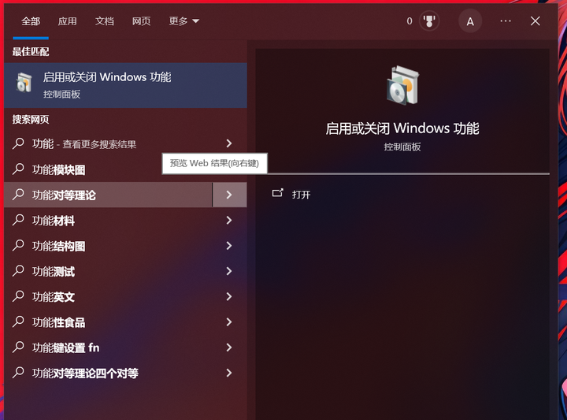


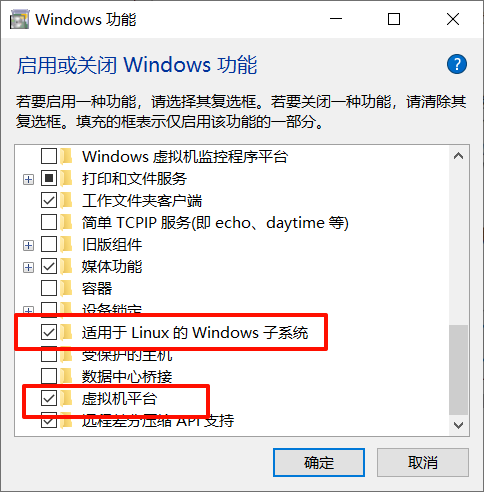

**然后重启**


## 如何使用

打开powershell

```shell
# 管理员权限:更新一下（很重要！）
wsl --update --web-download
# 将wsl的版本设定为2
wsl --set-default-version 2
# wsl版本
wsl --version
# 查看可安装的linux发行版
wsl --list --online
# 查看已安装的linux发行版
wsl --list -v

# 例子:安装archlinux
wsl --install archlinux --web-download
# 切换默认系统为archlinux
wsl --set-default archlinux

# 启动
wsl -d archlinux
# 退出
exit

# 删除系统
wsl --unregister archlinux

# 导出(备份)
wsl --export archlinux C:\Users\andy1\Downloads\archlinux.tar
# 导入(系统名字 保存路径 压缩包)
wsl --import archlinux D:/wsl archlinux.tar
```

---

可以安装这些linux发行版：

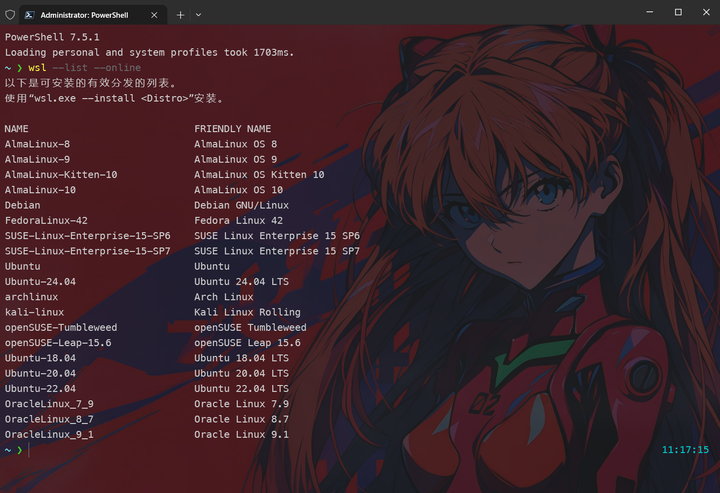


# Terminal&Shell


## 安装配置

```zsh
# 终端环境: windows-terminal+pwsh+oh-my-posh

# 安装terminal
scoop install windows-terminal

# 安装oh-my-posh
scoop install oh-my-posh

# 安装pwsh(powershell7)
scoop install pwsh

# 字体安装
oh-my-posh font install meslo

oh-my-posh 官网：https://ohmyposh.dev/docs

# 启动输入法：英文拼音-> 默认 shell：pwsh-> 启动居中 外观：字体（MesloLGL Nerd Font Mono）-> 配色（Dark+）-> 透明度（80%）-> 拖动条（隐藏）
```


## 打开编辑文件

```zsh
# 创建/编辑配置文件
notepad C:\Users\andy1\Documents\PowerShell\Microsoft.PowerShell_profile.ps1
```


## 编写配置文件

```zsh
Set-PSReadLineOption -BellStyle None            # 关闭提示音
Set-PSReadLineKeyHandler -Key Tab -Function MenuComplete  # 增强 Tab 补全

# --------------------------
# 别名/快捷命令
# --------------------------
# ====== Scoop 命令别名 ======
# 安装应用
function sin { scoop install $args }
# 卸载应用
function su { scoop uninstall $args }
# 更新所有应用
function sup { scoop update * }
# 搜索应用
function ss { scoop-search $args } 
# 查看应用信息
function sinfo { scoop info $args }
# 清理缓存
function scr { scoop cache rm * }
# 列出已安装应用
function sli { scoop list }
# 重置应用（修复损坏的安装）
function sre { scoop reset $args }
# 添加仓库
function sba { scoop bucket add $args }
# 列出仓库
function sbl { scoop bucket list }
# 删除仓库
function sbr { scoop bucket rm $args }
# 统计应用数量
function stotal { (scoop list | Measure-Object).Count }

# --------------------------
# 环境变量扩展
# --------------------------
$env:EDITOR = "nvim" # 默认编辑器

# --------------------------
# 安全防护
# --------------------------
$ConfirmPreference = "High"       # 高危操作需确认
Set-ExecutionPolicy RemoteSigned  # 仅允许签名的远程脚本

# --------------------------
# Oh My Posh
# --------------------------
# 启用 Oh My Posh
oh-my-posh init pwsh --config "$env:POSH_THEMES_PATH\powerlevel10k_lean.omp.json" | Invoke-Expression

# 设置终端字体（需手动在终端设置中选择）
```


## **成果**


# scoop


## scoop的安装

```shell
# 普通用户下，打开powershell
# 脚本执行策略更改，默认自动同意
Set-ExecutionPolicy RemoteSigned -scope CurrentUser -Force

# 执行安装命令（默认安装在用户目录下，如需更改请执行“自定义安装目录”命令）
iwr -useb scoop.201704.xyz | iex

# 更换scoop的repo地址
scoop config SCOOP_REPO "https://gitee.com/scoop-installer/scoop"
# 安装git
scoop install git
# 添加 bucket，默认拉取 sync 分支
scoop bucket add spc https://gitee.com/wlzwme/scoop-proxy-cn.git
# 只需要一个main一个spc大概就可以了

# 拉取新库地址
scoop update

# 导出软件&导入软件
scoop export > ~\scoop_apps.txt 
scoop import ~\scoop_apps.txt
```


## 常用命令

```shell
# 软件管理
scoop install <app> 安装软件
scoop uninstall <app> 卸载软件
scoop update <app> 更新特定软件
scoop update * 更新所有已安装软件
scoop list 列出已安装软件

# 更新pwsh
Get-Process pwsh
Stop-Process -Id 5904 -Force 
scoop update pwsh

# 搜索软件
# 使用 scoop-search(scoop搜索)
scoop install scoop-search
scoop-search git

# 系统维护
scoop update 更新 Scoop 自身
scoop status 检查更新状态
scoop checkup 检查系统问题
scoop cleanup <app> 清理旧版本
scoop cleanup * 清理所有旧版本
scoop reset <app> 重置软件配置(更新版本)

# 例子：Git 错误
scoop install git
scoop reset git

# Bucket 管理
scoop bucket list # 列出所有 buckets
scoop bucket add <name> [repo] # 添加 bucket
scoop bucket rm <name> # 删除 bucket
scoop bucket known # 查看官方已知 buckets

# 高级功能
scoop cache show 查看缓存
scoop cache rm <app> 删除缓存
scoop hold <app> 阻止软件更新
scoop unhold <app> 取消阻止更新
scoop export 导出安装列表
scoop import <file> 从列表安装

# 配置命令
scoop config 查看配置
scoop config <key> <value> 设置配置
scoop config rm <key> 删除配置
```


# 软件


## Jpegview

### 配置

**打开不全屏:** 设定/管理->编辑使用者设定->查找:ShowFullScreen->将auto改成false


## ventoy

Ventoy 是一款开源工具，可用于创建可启动的 USB 驱动器，支持直接从 ISO 文件启动而无需解压。

### 1. 下载 Ventoy

访问 ：[Releases · ventoy/Ventoy](https://github.com/ventoy/Ventoy/releases)

 下载最新版本：

- 选择 **Windows** 版本（如 ventoy-x.x.xx-windows.zip）。
- 解压下载的 ZIP 文件到任意文件夹。


### 2. 插入U盘


### 3. 将镜像导入


剩下的空间可以放别的东西


## **问题**

**关闭安全模式（一般打不开都是这个问题）**


**其他问题**

请参考：[**https://www.ventoy.net/cn/doc_news.html**](https://www.ventoy.net/cn/doc_news.html)


# 高阶操作

## 文件和目录


### 数据和程序

```zsh
在我们电脑或者手机上，除了硬件之外，可以说还剩两样内容，一个是数据，一个是程序，软件就是程序，安装到你电脑或者手机上的其实就是程序员写好的各种程序代码文件，运行这个软件就是运行这些代码，这些代码就是于算机的指令，而我门使用这些软件的功能时自已添加、修改等操作的内容，就是数据，而数据保存在文件中。比如word是程序、doc文件是数据，专门的程序对应着专门的文件数据。所以我们计算机上所有的东西都是程序+数据。数据或者说文件可以复制给其他人，只要他电脑上安装了相应的程序即可打开操作。
```


### 重要文件


#### 文本文件

```zsh
文本其实就是我们的数据，主要是记录文字信息，文本文件就是存放数据的文件，常见的文本文件格式有：txt文件、md文件、xls和xlsx、doc和docx、pdf、ppt、htm和html等等。其中txt文件是纯正的文本文件，其他的都是可以带有一些特殊格式的，这些呢我们有时候也称之为文档格式。
关于文本文档，我们后面还会说到，因为有些木马病毒就是基于这些文档传播的。
```


#### 程序文件

```zsh
可以运行的文件，里面有程序代码，双击就能打开运行，不管他是用来安装某个程序的，还是来启动某个程序的，我们都叫做程序文件。windows上程序文件扩展名为exe。
```


#### dll文件

```zsh
**DLL文件**（Dynamic Link Library，动态链接库）是Windows系统中的共享库文件，包含可由多个程序同时调用的代码、数据和资源（如图标、字体等）。其核心作用是**模块化功能**，允许程序在运行时动态加载所需模块，而非静态编译到主程序中。这种设计显著节省内存（多个程序共享同一DLL）、简化更新（替换DLL即可升级功能），但也可能引发“DLL地狱”问题（版本冲突导致程序崩溃）。常见的系统DLL如`kernel32.dll`（核心API）、`user32.dll`（界面相关），开发者也可用C/C++/Rust等语言编写自定义DLL。在Linux中类似`.so`文件，macOS中则为`.dylib`。加密算法,用户名,密码加密文件
```


### 重要目录


#### Program Files

默认安装64位软件


####Program Files(x86)

默认安装32位软件


#### Windows

windows核心代码,windows自带软件


#### 用户

windows是多用户系统,当新的用户登陆时就会有新的用户名目录

安装软件时,给所有用户安装还是给当前用户安装,如果是给所有用户安装,那么另一个用户登录也能够使用这个软件


## 计算机管理


**管理用户和用户组**

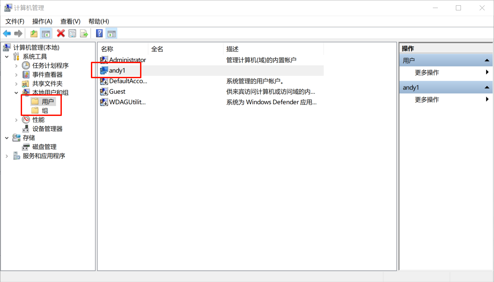


## 局域网文件共享

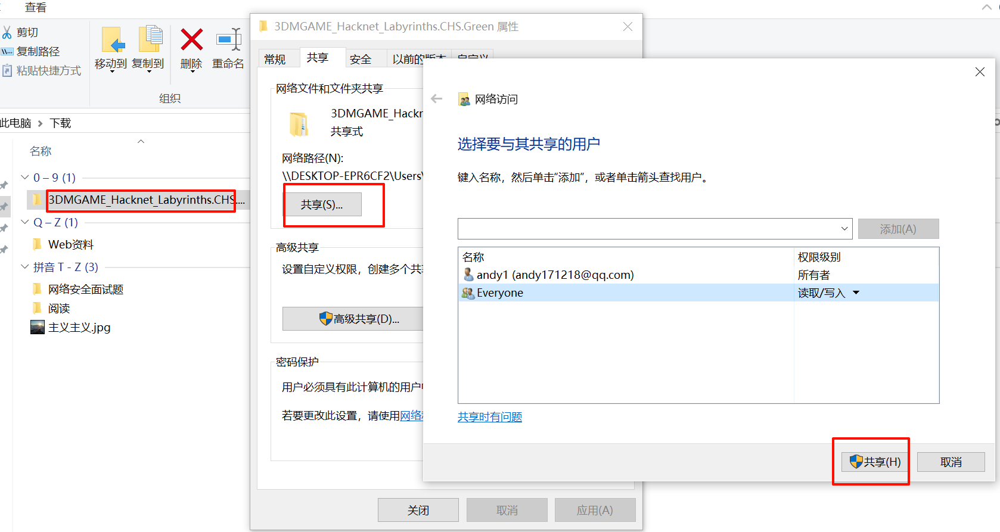


**访问共享文件**

win+R:`\\192.168.31.151\gongxiang`


**网络连接**

连接网络时最好都连接专用网络,不要连接公用网络,容易被发现而遭到工具


## 局域网远程桌面连接

**开启远程桌面控制**

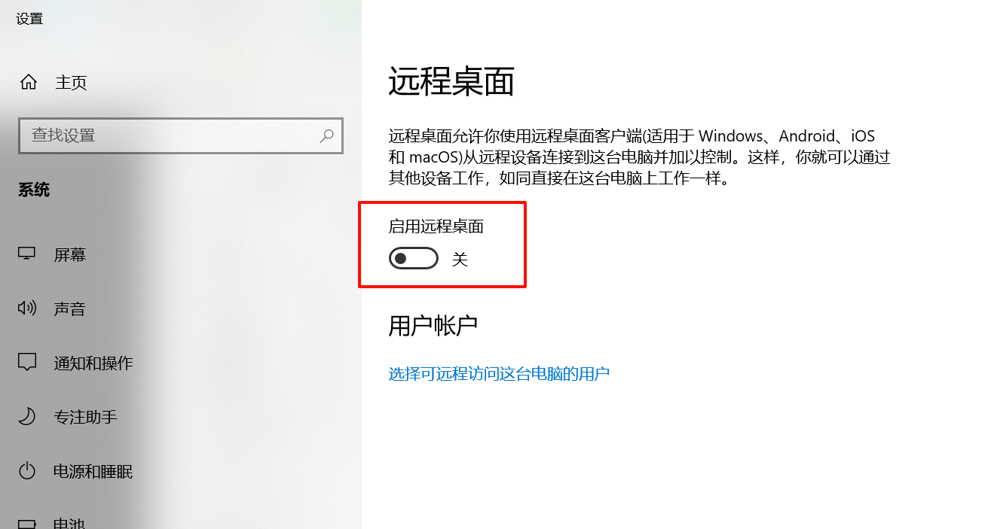 

**连接远程桌面**

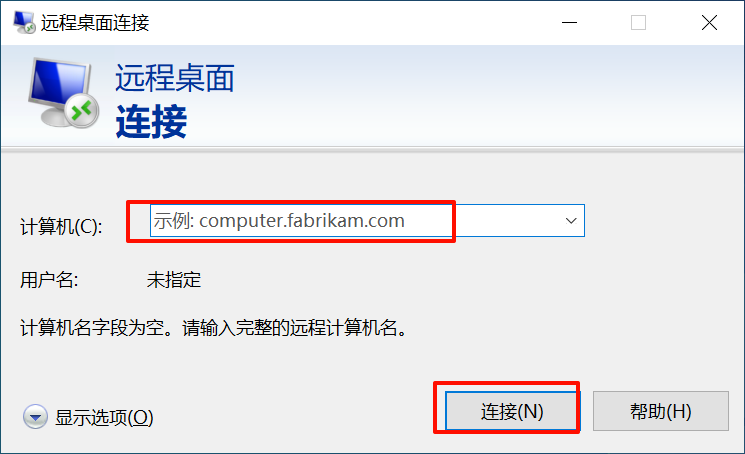


## 注册表


**注册表**

```zsh
windows操作系统称之为登录档案。是Microsoftwindows中的一个重要的数据库，注册表是windows操作系统中的一个核心数据库，其中存放着各种参数，直接控制着windows的启动、硬件驱动程序的装载以及一些windows应用程序的运行，从而在整个系统中起着核心作用。这些作用包括了软、硬件的相关配置和状态信息，比如注册表中保存有应用程序和资源管理器外壳的初始条件、首选项和卸载数据等，联网计算机的整个系统的设置和各种许可，文件扩展名与应用程序的关联，硬件部件的描述、状态和属性，性能记录和其他底层的系统状态信息，以及其他数据等。注册表中还包Windows在运行期间不断引用的信息，例如，每个用户的配置文件、计算机上安装的应用程序以及每个应用程序可以创建的文档类型、文件夹和应用程序图标的属性表设置、系统上存在哪些硬件以及正在使用哪些端口。当一个用户准备运行一个应用程序，注册表提供应用程序信息给操作系统，这样应用程序可以被找到，正确数据文件的位置被规定，其他设置也都可以被使用。
正常情况下，你可以点击开始菜单当中的运行，然后输入regedit或regedit.exe点击确定就能打开windows操作系统自带的注册表编辑器了，友情慎重提醒，操作注册表有可能造成系统故障，若您是对windows注册表不熟悉、不了解或没有经验的windows操作系统用户建议尽量不要随意操作注册表，即便是必须要操作，那么也要提前做好注册表的备份工作。如果上述打开注册表的方法不能使用，说明你没有管理员权限，或者注册表被锁定，如果是没有权限，那么想办法解锁权限。
简单来说：注册表是windows系统来记录和修改用户设置的，不论是软件还是硬件。
```


**注册表的数据结构**

```zsh
注册表由项（也叫主键或称“键”）、子项（子键）和值构成。一个项就是分支中的一个文件夹，而子项就是这个文件夹当中的子文件夹，子项同样它也是一个项。一个值则是一个项的当前定义，由名称、数据类型以及分配的值组成。一个项可以有一个或多个值，每个值的名称各不相同，如果一个值的名称为空，则该值为该项的默认值。
在注册表编辑器（regedit.exe）中，数据结构显示如下，其中，command键是open项的子项，（默认）表示该值是默认值，值名称为空，其数据类型为REG_SZ，数据值为%systemroot%/system32/notepad.exe"%1数据类型。
注册表的数据类型主要有以下四种：显示类型（在编辑器中）数据类型说明
REG_SZ：字符串：文本字符串
REG_MULTI_SZ：多字符串值：含有多个文本值的字符串
REG_BINARY：二进制数：二进制值，以十六进制显示，
REG_DWORD：双字值；一个32位的二进制值，显示为8位的十六进制值。
```


**打卡注册表设置**

win+R:regedit


## 安全组策略


**定义**

```
通俗解释：组策略是一组策略的集合，策略就是制定的规则。
组策略是将系统重要的配置功能汇集成各种配置模块，供用户直接使用，从而达到方便管理计算机的目的。简单点说，组策略就是修改注册表中的配置。当然，组策略使用自己更完善的管理组织方法，可以对各种对象中的设置进行统一的管理和配置，远比手工修改注册表方便、灵活，功能也更加强大
```


**分类**

本地组策略,远程组策略


**打开本地组策略**


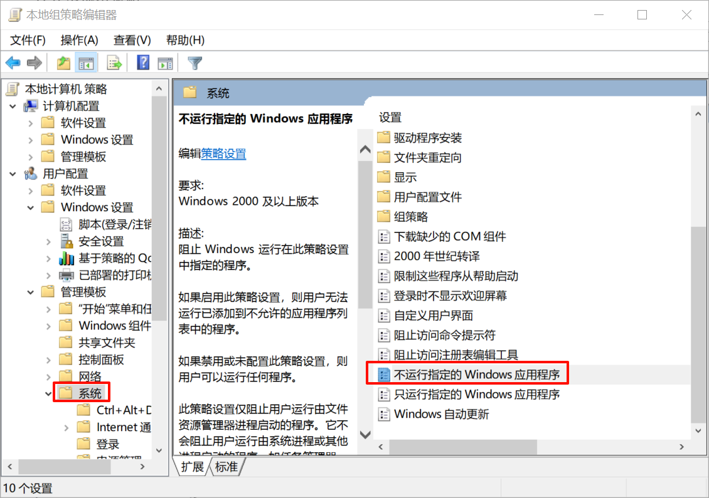


## windows服务


MicrosoftWindows服务（即，以前的NT服务）使您能够创建在它们自己的Windows会话中可长时间运行的可执行应用程序。这些服务可以在计算机启动时自动启动，可以暂停和重新启动而且不显示任何用户界面。这种服务非常适合在服务器上使用，或任何时候，为了不影响在同一台计算机上工作的其他用户，需要长时间运行功能时使用。

Windows服务是一种运行于Windows操作系统之上的一种独立进程。它们不必依赖于任何界面，它们由Windows操作系统本身负责管理维护，可以持续运行，不需要用户的参与，也可以接受来自外部的请求，一般用来运行一些持续运行的后台进程，产生一些定期调度任务或者监测一些外部事件。


**打开服务**

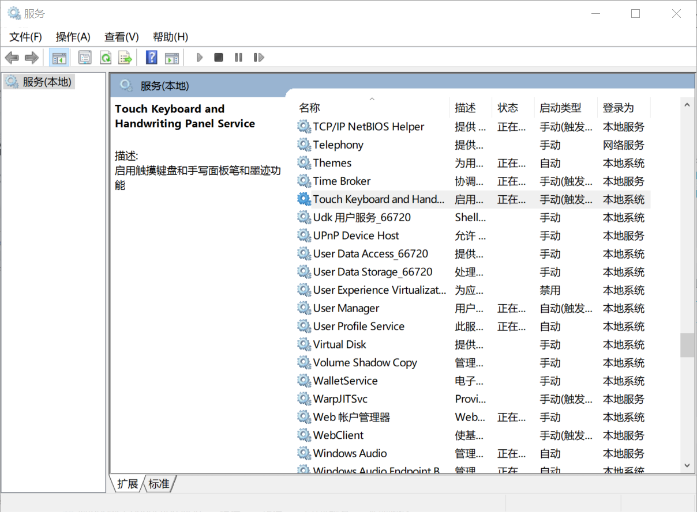


**添加服务(管理员权限)**

```shell
sc create 服务名称 binpath=路径
```

**删除服务(管理员权限)**

```shell
sc delete 服务名称
```

**服务三种状态:**自动,手动,禁用


## 计划任务


**定义**

计划任务是系统的常见功能，利用任务计划功能，可以将任何脚本、程序或文档安排在某个最方便的时间运行。任务计划在每次系统启动的时候启动并在后台运行。当我们需要在服务器上定时执行一些重复性的事件时使用的，可以通过计划任务程序来运行准备好的脚本、批处理文件夹、程序或命令，在某个特定的时间运行。
不知道大家有没有遇到过，电脑在某个时间点经常会弹出一些广告，这种广告行为，好多都是通过计划任务来实现定时弹出的。


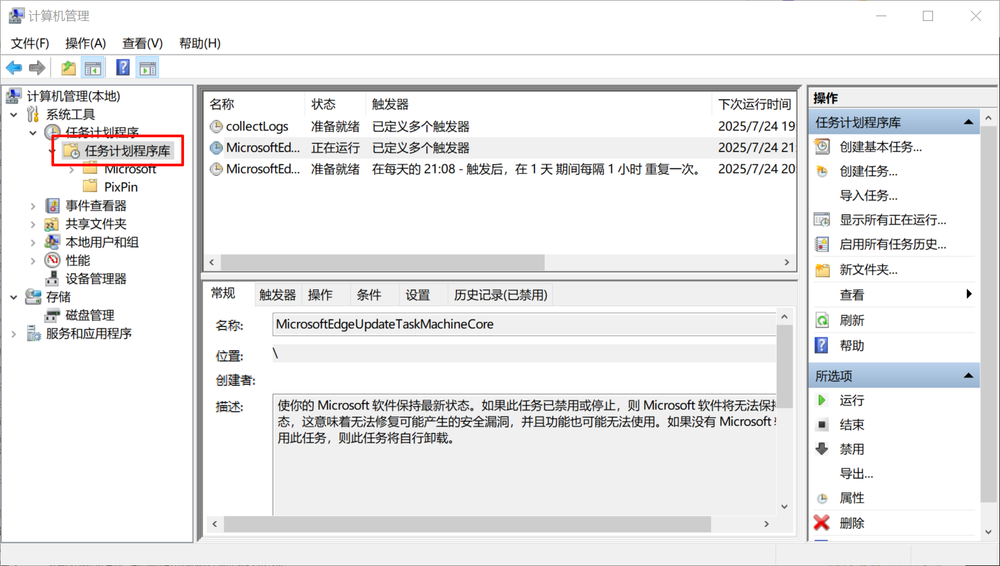


## 用户和用户组

**用户**

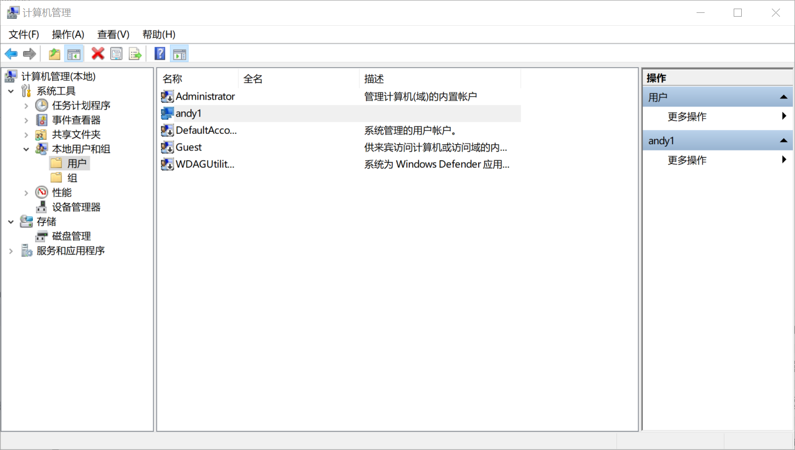

**用户组:管理用户的权限**

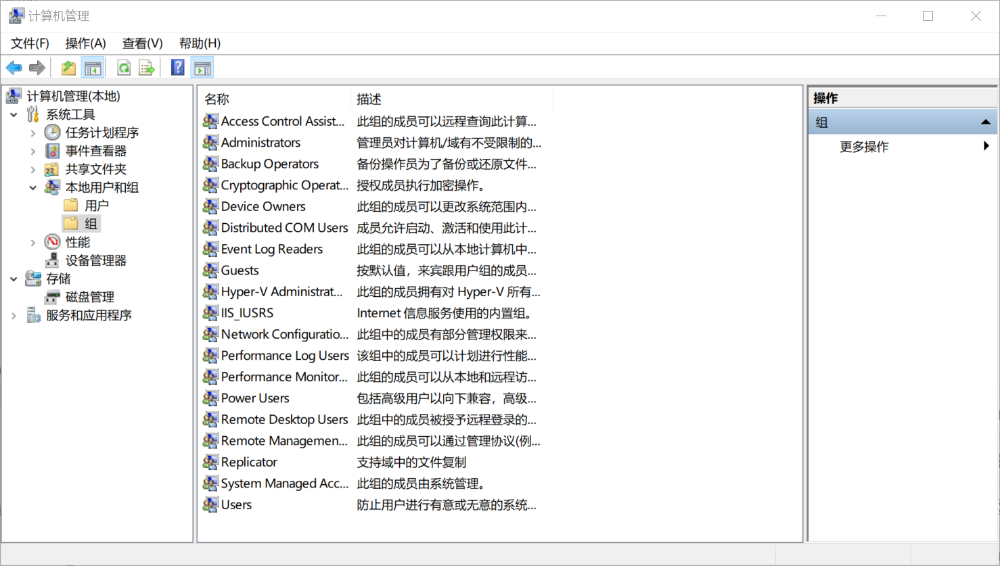

```
需要人为添加成员的组
Administrators：管理员组，属于该administators本地组内的用户，都具备系统管理员的权限，它们拥有对这台计算机最大的控制权限，可以执行整台计算机的管理任务。内置的系统管理员账号Administrator就是本地组的成员，而且无法将它从该组删除，它的操作权限比Administrators组中的其他成员还要高。

Users：普通用户组，该组员只拥有一些基本的权利，例如运行应用程序，但是他们不能修改操作系统的设置、不能更改其它用户的数据、不能关闭服务器级的计算机。

Guests：来宾组，该组是提供没有用户帐户，但是需要访问本地计算机内资源的用户使用，该组的成员无法永久地改变其桌面的工作环境。该组最常见的默认成员为用户帐号Guest。默认这个组是禁用状态，操作权限最低。

动态包含成员的组：也就是它里面的成员是不固定的，随着用户的操作，组成员会动态变化，也可以手动添加。
INTERACTIVE：默认包含本地登录的账户

AuthenticatedUsers：包含了通过验证的用户，不包含来宾用户

Everyone：所有账户都属于这个组（设置全面开放权限时使用)，注意，如果Guest帐号被启用时，则给Everyone这个组指派权限时必须小心，因为当一个没有帐户的用户连接计算机时，他被允许自动利用Guest帐户连接，但是因为Guest也是属于Everyone组，所以他将具备Everyone所拥有的权限。
```
