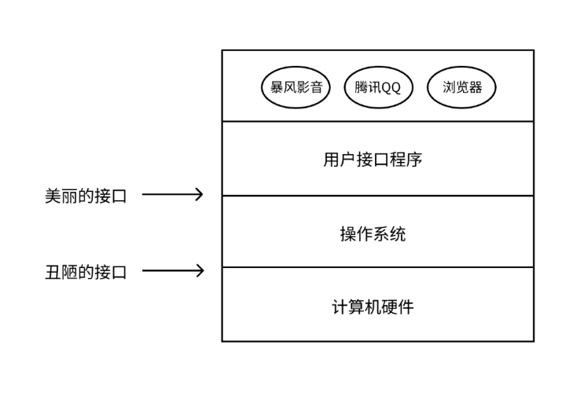
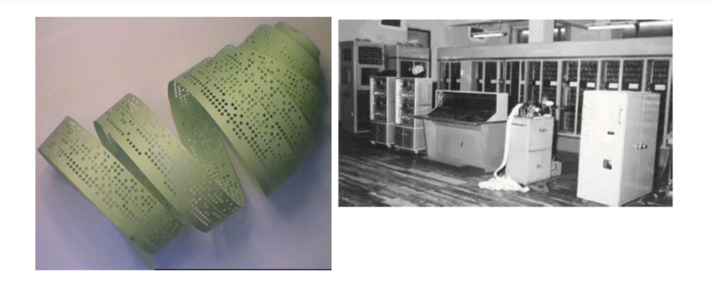
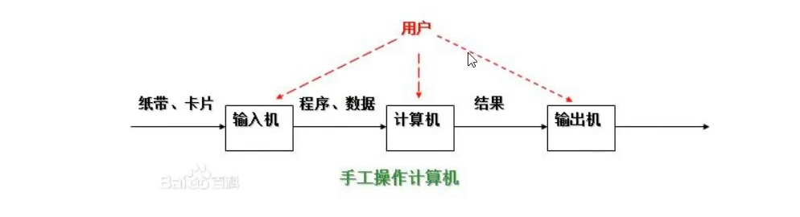
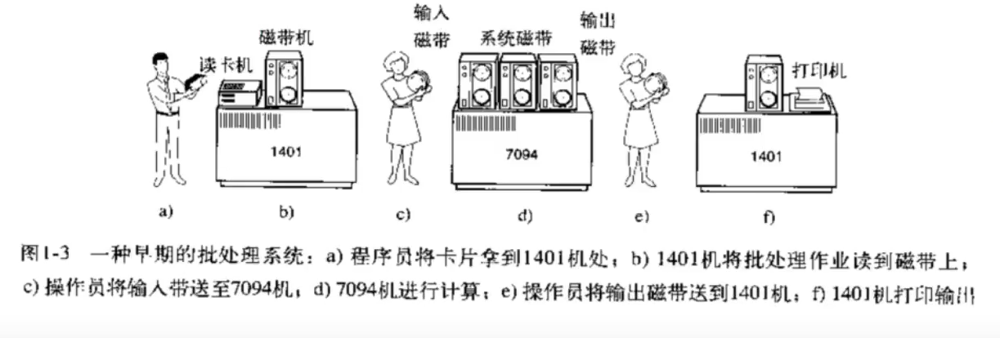
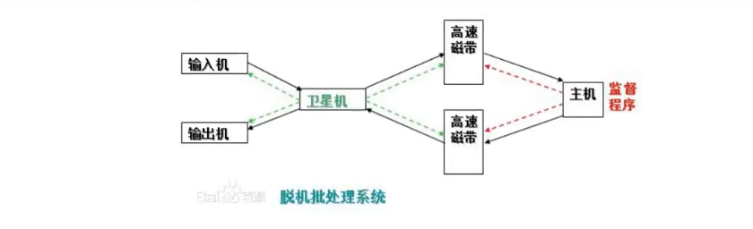
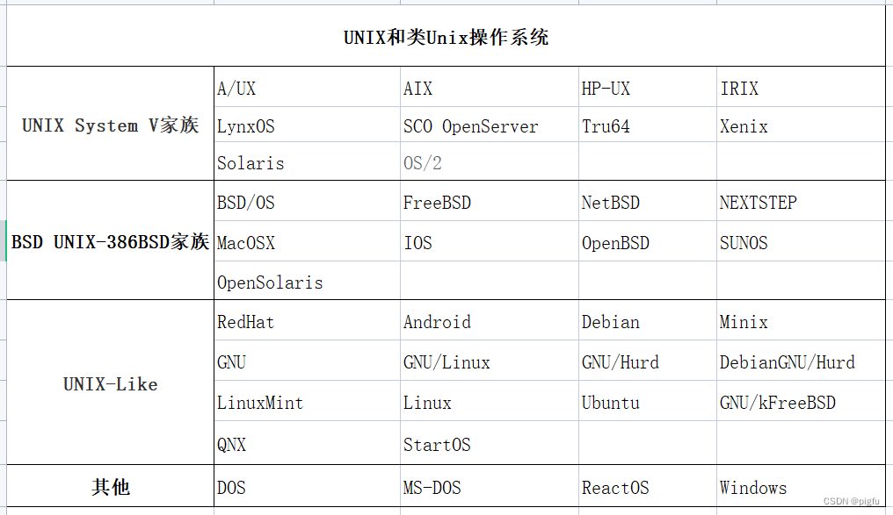
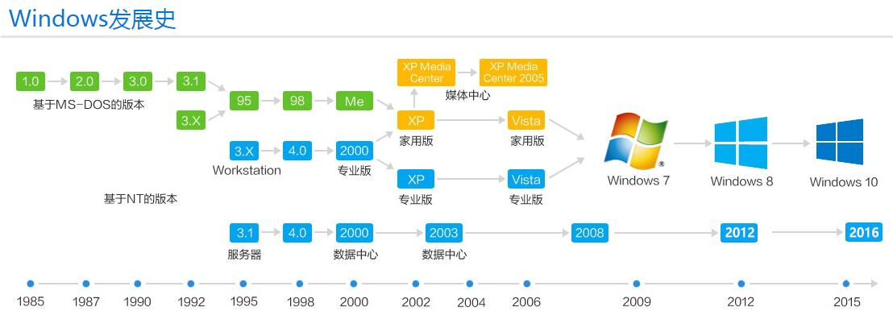
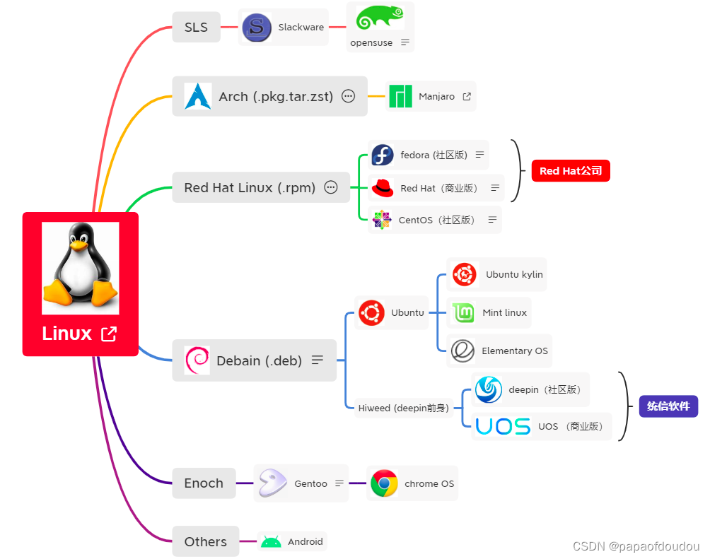

### 操作系统说明


何为操作系统呢？前面我们学习了计算机的基础硬件组成，而这些硬件按照标准流程来配合工作是需要依赖一个控制程序来控制的，这个控制程序就是我们的操作系统，所以操作系统本身就是程序员开发的一套程序软件，这个软件的主要功能就是控制硬件工作，但是随着技术的进步，现在的操作系统不仅仅可以控制硬件的工作，还可以做很多其他的事情，现在主流的操作系统有这么几个主要分支：windows、linux、macos等，windows是微软研发的，也是我们普通人常用的一个操作系统，因为它操作简单，有桌面，提供的功能多，因为windows历史比较悠久，很多工具只有在windows上才能安装使用，但是正版系统是收费的。而linux操作系统操作复杂，但是性能和稳定性更优，并且开源免费，主要是企业在使用，而且需要一些专业人士才可以操作，主要以命令行的形式进行控制操作，当然，linux现在也都有桌面版的，但是相比windows，linux的桌面版入场比较晚，所以普通人还是更多使用windows系统。macos和linux的前身都是一个叫做unix的系统核心，所以他们操作是差不多的，mac电脑性能也很优质，很多普通人也在用，不过就是比较贵。企业用linux居多、然后是windows、mac用的很少，所以我们主要讲解的就是windows和linux。


### 为什么需要操作系统


我们想让计算机帮我们做某些事情，我们需要给计算机下达一些指令，我们在电脑上使用的某些程序，比如QQ、微信、网易云音乐等等，都是我们所说的程序员开发的软件，而这个软件就是程序员写的代码、编写程序，而这些代码程序就是给计算机下达的工作指令。但是控制硬件都是靠的电路信号，而且是大量复杂的单路信号，这些电路信号底层都是通过机器码（二进制0和1）来进行控制，0表示低电压，1表示高电压，如果说控制硬件电路信号的程序都需要程序员自行来编写的话，那么当程序员想让计算机完成自己设定的某些功能时，比如在屏幕上显示一个聊天窗口，那么他就头疼了，需要写大量的、复杂的硬件控制指令。你要想，硬件不仅仅显示器啊，还有好多其他的硬件，并且每个硬件的控制都是相当复杂的。如果都需要程序员自己来写硬件的控制程序，别说我们普通人无法使用电脑，就连专业的程序员用起来都是非常痛苦的，由此慢慢的就诞生了专门的系统硬件控制软件，叫做操作系统，它是无数程序员的心血的结品，底层硬件的控制由操作系统这个软件程序来控制，那么程序员开发程序的时候，他自己写的程序只需要调用操作系统给他提供的硬件控制程序接口，由操作系统来控制硬件，这样就能完成他自己想让计算机帮他做的事情，这样就简单多了。


如此一来，开发软件就变的简单了，市面上有很多的编程语言，这些语言主要都是用来做应用软件开发的，比如java、Python、Go、C、C++，Ruby等等，用这些语言开发软件，软件就是一堆的程序，这些程序通过调用操作系统通过的功能接口来控制计算机硬件工作。而普通人都是使用程序员开发的软件来更加间接的控制计算机工作


接口：封装好的指令，只需要操作系统调用一下，功能就能实现


### 什么是操作系统




操作系统是一个协调软件和硬件的控制程序,位于硬件和应用软件之间,本质也是一个软件

两部分功能:

```txt
1、隐藏了丑陋的硬件调用接口（键盘、鼠标、音箱等等怎么实现的，就不需要你管了），为应用程序员提供调用硬件资源的更好，更简单，更清晰的模型（系统调用接口）。应用程序员有了这些接口后，就不用再考虑操作硬件的细节，专心开发自己的应用程序即可。
例如：操作系统提供了文件这个抽象概念，对文件的操作就是对磁盘的操作，有了文件我们无需再去考虑关于磁盘的读写控制（比如控制磁盘转动，移动磁头读写数据等细节）
2、将应用程序对硬件资源的竞态请求变得有序化
例如：我们安装的这些应用软件其实是共享我们的计算机硬件的，比方说有可能有三个应用程序同时需要申请打印机来输出内容，那么a程序竞争到了打印机资源就打印，然后可能是b竞争到打印机资源，也可能是c，这就导致了无序，打印机可能打印一段a的内容然后又去打印c..，而操作系统的一个重要功能就是将这种无序变得有序。
```


### 操作系统历史

#### 第一代操作系统



第一代（1940-1955）手工操作，是通过穿孔卡片来控制计算机硬件的操作，第一代之前人类是想用机械取代人力，第一代电子计算机的产生是计算机由机械时代进入电子时代的标志。在这个时期，同一个小组里的
工程师们，设计、建造、编程、操作及维护同一台机器，所有的程序设计是用纯粹的机器语言编写的，甚至更糟糕，需要通过成千上万根电缆接到插件板上连成电路来控制机器的基本功能。没有程序设计语言（汇编也没有），操作系统则是从来都没听说过。使用机器的过程更加原始。


穿孔卡带的过程：程序员将对应于程序和数据的已穿孔的纸带（或卡片）装入输入机，然后启动输入机把程序和数据输入计算机内存，接着通过控制台开关启动程序针对数据运行；计算完毕，打印机输出计算结果；用户取走结果并卸下纸带（或卡片）后，才让下一个用户上机。


特点:

```txt
（1）用户独占全机。不会出现因资源已被其他用户占用而等待的现象，但资源的利用率低。
（2）CPU等待手工操作。CPU的利用不充分。
（3）没有操作系统的概念。
（4）所有的程序设计都是直接操控硬件。
```


#### 第二代 批处理系统

第二代（1955~1965）出现了磁带存储，批处理系统。
20世纪50年代后期，出现人机矛盾：手工操作的慢速度和计算机的高速度之间形成了尖锐予盾，手工操作方式已严重损害了系统资源的利用率（使资源利用率降为百分之几，甚至更低），不能容忍。唯一的解决办法：只有摆脱人的手工操作，实现作业的自动过渡。这样就出现了成批处理。
批处理系统：加载在计算机上的一个专门研发的系统软件，在它的控制下，计算机能够自动地、成批地处理一个或多个用户的作业(这作业包括程序、数据和命令）。


##### 联机批处理系统



主机与输入机之间增加一个存储设备一一磁带，在运行于主机上的监督程序(早期操作系统）的自动控制下，计算机可自动完成。
大致就是成批(把一堆人的输入的需要计算的程序攒起来，一起出入，一大波人的程序结果输出赞起来，一起输出）地把输入机上的用户作业读入磁带，依次把磁带上的用户作业读入主机内存并执行并把计算结果向输出机输出。完成了上一批作业后，监督程序又从输入机上输入另一批作业，保存在磁带上，并按上述步骤重复处理。
虽然监督程序不停地处理各个作业，从而实现了作业到作业的自动转接，减少了作业建立时间和手工操作时间，有效克服了人机矛盾，提高了计算机的利用率。但是，在作业输入和结果输出时，主机的高速CPU仍处于空闲状态，等待慢速的输入/输出设备完成工作，那么输入和输出时主机是处于"忙等"状态的。（忙等状态就是说CPU等着输出完成之后再去从输入机上读指令来执行，造成了CPU的浪费），值得注意的时，当时的输入和输出设备和CPU的计算速度相比是相当慢的。





##### 脱机批处理系统

为克服与缓解：高速主机与慢速外设（输入输出设备）的矛盾，提高CPU的利用率，又引I入了脱机批处理系统，即输入/输出(input\output，简称I\O操作）脱离主机控制。





卫星机：一台不与主机直接相连而专门用于与输入/输出设备打交道的。其功能是：

```
（1）从输入机上读取用户作业并放到输入磁带上。
（2）从输出磁带上读取执行结果并传给输出机。
```


这样，主机不是直接与慢速的输入/输出设备打交道，而是与速度相对较快的磁带机发生关系，有效缓解了主机与设备的矛盾。主机与卫星机可并行工作，二者分工明确，可以充分发挥主机的高速计算能力。
脱机批处理系统在20世纪60年代应用十分广泛，它极大缓解了人机矛盾及主机与外设的矛盾。

缺点：但目前为止，所有的程序都还是串行执行的，也就是一个程序结束才执行下一个程序，每次主机内存中仅存放一道作业，每当主机中这个运行期间的作业或者说程序发出输入/输出（IVO）请求后，CPU要去高速磁带里读数据，计算结果要往高速磁带里面写数据，那么高速的CPU便处于等待低速的I/O完成状态，CPU并没有完全的运算起来，也可以理解为我要等着你输入或者等着你输出，致使CPU空闲。注意：之前系统的缺点说的是等待用户将程序全部输入进去，等待程序运行结束后输出最终结果的操作。现在说的是程序运行期间发生的输入\输出操作，也就是去高速磁带里面去读取程序数据，然后将输出数据写到高速磁带中，也是耗时的，CRu这段时间内的利用率也是很低的。为改善CPU的利用率，又引I入了多道程序系统。

我们总结一下上面的几个操作系统：

```
1、为了解决大家都要排队去运行自已的程序，出现了批处理系统
2、为了解决输出设备和输入设备的人工操作以及高速cpu和输入输出设备之间速度的差异问题，出现了高速磁带和脱机批处理系统
3、因为cpu的运算速度比高速磁带的读取和输出的速度要高很多，那么当程序运当中去和高速磁带打交道，并且解决程序串行，也就是一个程序完了之后，才能执行下一个的情况，出现了下面的多道系统。
```


#### 第三代 多道操作系统


第三代（1955-1965），多道程序系统。
多道技术产生的技术背景：cpu在执行一个任务的过程中，若需要操作硬盘，则发送操作硬盘的指令，指令一旦发出，硬盘上的机械手臂滑动读取数据到内存中，这个动作经历的这一段时间，cpu需要等待，时间可能很短，但对于cpu来说已经很长很长，长到可以让cpu做很多其他的任务，如果我们让cpu在这段时间内切换到去做其他的任务，这样cpu不就充分利用了吗。


##### 多道程序设计技术

所谓多道程序设计技术，就是指允许多个程序同时进入内存并运行。即同时把多个程序放入内存，并允许它们交替在CPU中运行，它们共享系统中的各种硬、软件资源。当一道程序因I/O请求而暂停运行时，CPU便立即转去运行另一道程序。


特点:

```txt
（1）多道：计算机内存中同时存放几道相互独立的程序；
（2）宏观上并行：同时进入系统的几道程序都处于运行过程中，即它们先后开始了各自的运行，但都未运行完毕；
（3）微观上串行：实际上，各道程序轮流地用CPU，并交替运行。
```


多道程序系统的出现，标志着操作系统渐趋成熟的阶段，先后出现了作业调度管理、处理机管理、存储器管理、外部设备管理、文件系统管理等功能。
由于多个程序同时在计算机中运行，开始有了空间隔离的概念，只有内存空间的隔离，才能让数据更加安全、稳定。
除了空间隔离之外，多道技术还第一次体现了时空复用的特点，遇到IO操作就切换程序，使得cpu的利用率提高了，计算机的工作效率也随之提高。


两个优点:

**空间上的复用：**将内存分为几部分，每个部分放入一个程序，这样，同一时间内存中就有了多道程序。

**时间上的复用：**当一个程序在等待I/O时，另一个程序可以使用cpu，如果内存中可以同时存放足够多的作业，则cpu的利用率可以接近100%
多道系统其实对应着多道任务，也就是多个任务进入到内存中等待CPU来运行它，而进入到内存中的任务就是我们所说的行进中的程序，简称进程。进程的概念就来自于操作系统的发展。


##### 分时系统

由于CPU速度不断提高和采用分时技术，一台计算机可同时连接多个用户终端，而每个用户可在自己的终端上联机使用计算机，好象自己独占机器一样。

分时技术：把处理机的运行时间分成很短的时间片，按时间片轮流把处理机分配给各联机作业使用。

若某个作业在分配给它的时间片内不能完成其计算，则该作业暂时中断，把处理机让给另一作业使用，等待下一轮时再继续其运行。由于计算机速度很快，作业运行轮转得很快，给每个用户的印象是，好象他独占了一台计算机而每个用户可以通过自己的终端向系统发出各种操作控制命令，在充分的人机交互情况下，完成作业的运行。

具有上述特征的计算机系统称为分时系统，它允许多个用户同时联机使用计算机。


特点:

```
（1）多路性。若干个用户同时使用一台计算机。微观上看是各用户轮流使用计算机；宏观上看是各用户并行工作。
（2）交互性。用户可根据系统对请求的响应结果，进一步向系统提出新的请求。这种能使用户与系统进行人机对话的工作方式，明显地有别于批处理系统，因而，分时系统又被称为交互式系统。
（3）独立性。用户之间可以相互独立操作，互不干扰。系统保证各用户程序运行的完整性，不会发生相互混淆或破坏现象。
（4）及时性。系统可对用户的输入及时作出响应。分时系统性能的主要指标之一是响应时间，它是指：从终端发出命令到系统予以应答所需的时间。
```

**分时系统的主要目标：**对用户响应的及时性，即不至于用户等待每一个命令的处理时间过长。
分时系统可以同时接纳数十个甚至上百个用户，由于内存空间有限，往往采用对换（又称交换）方式的存储方法。即将未"轮到"的作业放入磁盘，一旦"轮到”，再将其调入内存；而时间片用完后，又将作业存回磁盘（俗称"滚进"、“滚出"法），使同一存储区域轮流为多个用户服务。

多用户分时系统是当今计算机操作系统中最普遍使用的一类操作系统。

**注意：**分时系统的分时间片工作，在没有遇到IO操作的时候就用完了自己的时间片被切走了，这样的切换工作其实并没有提高cpu的效率，反而使得计算机的效率降低了。为什么下降了呢？因为CPU需要切换，并且记录每次切换程序执行到了哪里，以便下次再切换回来的时候能够继续之前的程序，虽然我们牺牲了一点效率，但是却实现了多个程序共同执行的效果，这样你就可以在计算机上一边听音乐一边聊qq了。


##### 实时系统

虽然多道批处理系统和分时系统能获得较令人满意的资源利用率和系统响应时间，但却不能满足实时控制与实时信息处理两个应用领域的需求。于是就产生了实时系统，即系统能够及时响应随机发生的外部事件，并在严格的时间范围内完成对该事件的处理。
实时系统在一个特定的应用中常作为一种控制设备来使用。


分类:

```
（1）实时控制系统。当用于飞机飞行、导弹发射等的自动控制时，要求计算机能尽快处理测量系统测得的数据，及时地对飞机或导弹进行控制，或将有关信息通过显示终端提供给决策人员。当用于轧钢、石化等工业生产过程控制时，也要求计算机能及时处理由各类传感器送来的数据，然后控制相应的执行机构。
（2）实时信息处理系统。当用于预定飞机票、查询有关航班、航线、票价等事宜时，或当用于银行系统、情报检索系统时，都要求计算机能对终端设备发来的服务请求及时予以正确的回答。此类对响应及时性的要求稍弱于第一类。
```


特点:

```
（1）及时响应。每一个信息接收、分析处理和发送的过程必须在严格的时间限制内完成。
（2）高可靠性。需采取余措施，双机系统前后台工作，也包括必要的保密措施等。
```


分时与实时

```
分时系统--现在流行的PC，服务器都是采用这种运行模式，即把CPU的运行分成若干时间片分别处理不同的运算请求
实时系统--一般用于单片机上、PLC等，比如电梯的上下控制中，对于按键等动作要求进行实时处理
```


##### 通用操作系统

通用操作系统：具有多种类型操作特征的操作系统。可以同时兼有多道批处理、分时、实时处理的功能，或或其中两种以上的功能。


```
例如：实时处理+批处理=实时批处理系统。首先保证优先处理实时任务，插空进行批处理作业。常把实时任务称为前台作业，批作业称为后台作业。
再如：分时处理+批处理=分时批处理系统。即：时间要求不强的作业放入“后台”（批处理）处理，需频繁交互的作业在“前台”（分时）处理，处理机优先运行“前台”作业。
```


从上世纪60年代中期，国际上开始研制一些大型的通用操作系统。这些系统试图达到功能齐全、可适应各种应用范围和操作方式变化多端的环境的目标。但是，这些系统过于复杂和庞大，不仅付出了巨大的代价，且在解决其可靠性、可维护性和可理解性方面都遇到很大的困难。
相比之下，UNIX操作系统却是一个例外。这是一个通用的多用户分时交互型的操作系统。它首先建立的是一个精干的核心，而其功能却足以与许多大型的操作系统相媲美，在核心层以外，可以支持庞大的软件系统。它很快得到应用和推广，并不断完善，对现代操作系统有着重大的影响。
至此，操作系统的基本概念、功能、基本结构和组成都已形成并渐趋完善。


#### 第四代 现代计算机系统

进入20世纪80年代，大规模集成电路工艺技术的飞跃发展，微处理机的出现和发展，掀起了计算机大发展大普及的浪潮。一方面迎来了个人计算机的时代，同时又向计算机网络、分布式处理、巨型计算机和智能化方向发展。于是，操作系统有了进一步的发展，如：个人计算机操作系统、网络操作系统、分布式操作系统等。


##### 个人计算机操作系统

个人计算机上的操作系统是联机交互的单用户操作系统，它提供的联机交互功能与通用分时系统提供的功能很相似。由于是个人专用，因此一些功能会简单得多。然而，由于个人计算机的应用普及，对于提供更方便友好的用户接口和丰富功能的文件系统的要求会愈来愈迫切。


##### 网络操作系统

计算机网络系统是通过通信设施，将地理上分散的、具有自治功能的多个计算机系统互连起来，实现信息交换、资源共享、互操作和协作处理的系统。

网络操作系统：在原来各自计算机操作系统上，按照网络体系结构的各个协议标准增加网络管理模块，其中包括：通信、资源共享、系统安全和各种网络应用服务。其实就是添加了一些网络方面的功能。


##### 分布式操作系统
表面上看，分布式系统与计算机网络系统没有多大区别。分布式操作系统也是通过通信网络，将地理上分散的具有自治功能的数据处理系统或计算机系统互连起来，实现信息交换和资源共享，协作完成任务。一一硬件连接相同。

分布式：将一个大的任务拆分成几个小的任务，分配给不同的任务处理机制，具体怎么分配是由系统中的算法决定的，大家同时来运行自己的任务，然后各自将人物的返回结果再返回给你这个大的任务。


特点:

```
（1）分布式系统要求一个统一的操作系统，实现系统操作的统一性。
（2）分布式操作系统管理分布式系统中的所有资源，它负责全系统的资源分配和调度、任务划分、信息传输和控制协调工作，并为用户提供一个统一的界面。
（3）用户通过这一界面，实现所需要的操作和使用系统资源，至于操作定在哪一台计算机上执行，或使用哪台计算机的资源，则是操作系统完成的，用户不必知道，此谓：系统的透明性。
（4）分布式系统更强调分布式计算和处理，因此对于多机合作和系统重构、坚强性和容错能力有更高的要求，希望系统有：更短的响应时间、高吞吐量和高可靠性。
```

分布式系统已经很普遍了，一般个人用不到，企业在处理比较大的任务的时候才会使用。
我们现在用的计算机、智能手机、企业服务器等等基本都是通用操作系统。


#### 主流操作系统

##### Unix分支

Unix操作系统在1969年诞生于美国的贝尔实验室。后面绝大多数操作系统都是基于Unix研发出来的，可以说Unix是各类操作系统的鼻祖。




##### Windows分支

MicrosoftWindows是美国微软公司以图形用户界面为基础研发的操作系统[13]，主要运用于计算机、智能手机等设备。共有普通版本（也就是我们个人常说的windows）、服务器版本（WindowsServer，企业使用）、手机版本（WindowsPhone等）、嵌入式版本（WindowsCE等）等子系列，是全球应用最广泛的操作系统之一



windows和windowsNT

```
2000年以前我们说的windows与我们现在说的windows有所区别，我们现在说的windows（比如win2000，winxp，win2003，winvista，win2008，win7）其实都是是windowsNT，全MicrosoftWindowsNT（NewTechnology)即视窗
NT是由微软公司发行的操作系统。只不过现在大家称呼它的时候都叫lwindows而不llwindowsNT。
```


##### Linux分支




```
Linux，全称GNU/Linux，是一种免费使用和自由传播的类UNIX操作系统，其内核由林纳斯·本纳第克特·托瓦兹（LinusBenedictTorVa1ds）于1991年10月5日首次发布，它主要受到Minix和Unix思想的启发，是一个基于P0SIx的多用户、多任务、支持多线程和多CPU的操作系统。它支持32位和64位硬件，能运行主要的Unix工具软件、应用程序和网络协议。
Linux继承了Unix以网络为核心的设计思想，是一个性能稳定的多用户网络操作系统。Linux有上百种不同的发行版，如基于社区开发的debian、archlinux，和基于商业开发的Red Hat EnterpriseLinux、SUSE、OracleLinux等。
```


分支:

```txt
Debian系列：Debian、Ubuntu、Kali等，个人使用ubuntu居多。
Redhat系列：RHEL、Centos、Fedora，企业使用RHEL和Centos居多。
S1ackware Linux系列：SUSE、OpenSUSE等
国产Linux系列：深度Deepin、银河麒麟、统信uos等
移动端andriod系统也是linux的一个分支。
```

