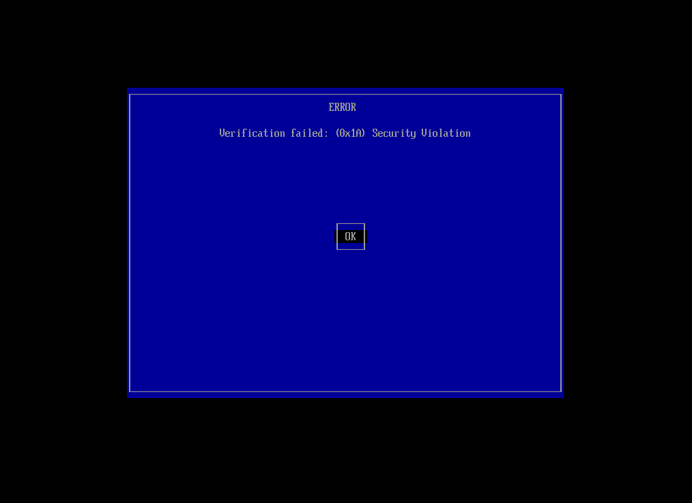

在 kali上使用终端安装和配置 Ventoy 的完整指南：

## Ventoy安装

```bash
wget https://github.com/ventoy/Ventoy/releases/download/v1.0.96/ventoy-1.0.96-linux.tar.gz
tar -xvf ventoy-1.0.96-linux.tar.gz
cd ventoy-1.0.96
```

## 识别USB设别

```bash
# 查看U盘（一般为sdb,请改为你的设备名）
sudo fdisk -l /dev/sdb

# 查看U盘格式
lsblk -f
```

*注意*： 确认您的 USB 设备标识（如 /dev/sdb），*操作将格式化整个设备！*

## 卸除挂载

```bash
sudo umount /dev/sdb*
```

## 安全安装（禁用安全启动支持）

```bash
sudo sh Ventoy2Disk.sh -i -s /dev/sdb
```

📌 重要选项：

- -i 强制安装（覆盖旧版）
- -r SIZE_MB 保留空间（如 -r 4096 保留 4GB）
- -s 启用安全启动支持

## 添加 ISO

```bash
# 复制 ISO 文件 (替换实际路径)
sudo cp ~/路径/系统镜像.iso /mnt/ventoy/
```

## 启动验证

重启电脑选择 USB 启动，Ventoy 将自动扫描并列出所有 ISO 文件

## 更新Ventoy（保留ISO文件）

```bash
sudo sh Ventoy2Disk.sh -u /dev/sdb
```

## 问题

**关闭安全模式**



**其他问题**

请参考：<https://www.ventoy.net/cn/doc_news.html>
