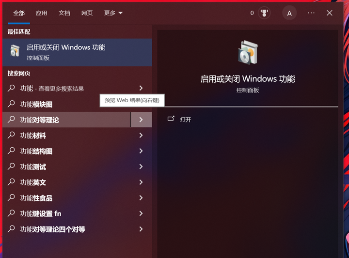
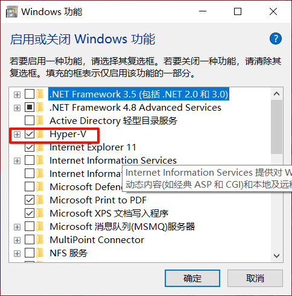
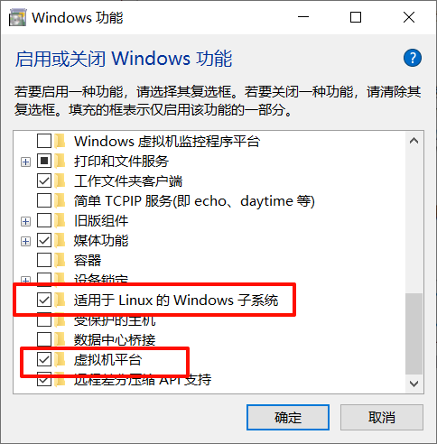
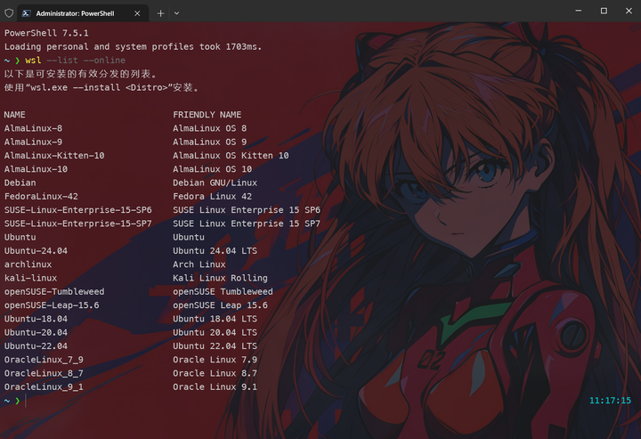

WSL2（Windows Subsystem for Linux 2）是微软开发的第二代Windows Linux子系统，它允许你在Windows 10/11中原生运行Linux环境。以下是关键点：

## 核心特点

- 完整Linux内核：基于微软定制的Linux 4.19内核
- 虚拟机架构：使用轻量级Hyper-V虚拟机（性能损失<1%）
- 100%系统调用兼容：可直接运行Docker等原生Linux应用

## 如何开启

win+s搜索：启用或关闭windows功能->Hyper-v&适用于linux的子系统&虚拟机平台







**然后重启**

## 如何使用

打开powershell

```shell
# 管理员权限:更新一下（很重要！）
wsl --update --web-download
# 将wsl的版本设定为2
wsl --set-default-version 2
# wsl版本
wsl --version
# 查看可安装的linux发行版
wsl --list --online
# 查看已安装的linux发行版
wsl --list -v

# 例子:安装archlinux
wsl --install archlinux --web-download
# 切换默认系统为archlinux
wsl --set-default archlinux

# 启动
wsl -d archlinux
# 退出
exit

# 删除系统
wsl --unregister archlinux

# 导出(备份)
wsl --export archlinux C:\Users\andy1\Downloads\archlinux.tar
# 导入(系统名字 保存路径 压缩包)
wsl --import archlinux D:/wsl archlinux.tar
```
---
可以安装这些linux发行版：




