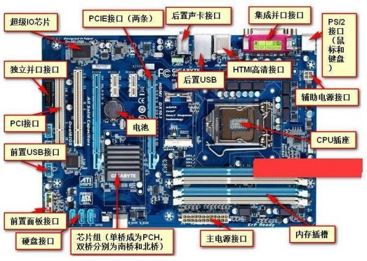

### 主板



生成主板的厂商有很多，主板要和CPU接口类型一致，不然CPU不能用，所以每当Intel发布一款新的CPU之后，很多下游主板厂商都会抢着生产对应的主板。主板也分档次：高端、中端、低端。比如Z690等Z系列的属于高端、B660等B系列的属于中端、H610等H系列的属于低端的，这些是Intel划分出来的，然后各个厂商按照这个档次来进行生产。越高端的板子可以使用的功能越多，同功能的性能越好，扩展性也好，比如插槽多、网卡支持的带宽高、最大支持的内存容量也大等等，我们一般都会选择中端B系列，性价比相对好一些。

```txt
intel：对应的主板厂商：华硕、技嘉、七彩虹、微星、铭瑄、盈通、昂达等等
AMD：对应的主板厂商：华硕、技嘉、七彩虹、微星、铭瑄、盈通、昂达等等
结实耐用的话首选华硕，但是相对贵，如果考虑性价比，就用其他几个的
```

CPU插槽：插槽是按照CPU的针脚来的，也分很多代，intel基本上两代换一个插槽，比如LGA1700是针对12代处理器的，LGA1200是针对10和11代处理的。如果我们的电脑出版坏了，CPU挺不错，那么就可以换一个主板即可，但是主板也是要针对CPU的版本来。

支持的内存类型：主板支持什么样的内存类型，你买对应内存时，也要对应好类型，内存类型目前主要有DDR3、DDR4、DDR5三种。

主板支持的内存容量主要是看CPU和主板插槽的数量。

主板支持的显卡数量，比如支持插入两块显卡，那么比一块显卡的效率就高一些，大概能提升60%，两个显卡配合使用，我们称之为交火(CrossFire)。不是说随便两个显卡就能交火，这个要看显卡是否支持。双显卡适合打大型游戏的朋友。


### 电源

电源：这个主要看CPU的功耗和显卡的功耗，其他的部件功耗比较低，CPU功耗+显卡功耗<电源瓦数

用鲁大师的功耗计算器来查看即可