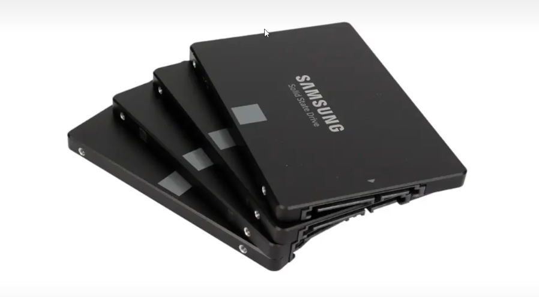

### 机械硬盘(HDD)

**工作原理**

机械硬盘在工作的时候，磁头会悬浮于磁盘面上方几纳米的距离。磁盘面上有很多的小格子，小格子内有很多的小磁粒。这些磁盘上的磁粒有一定的极性，当磁粒极性朝下的时候记为0，磁粒极性朝上的时候记为1，这样磁头就可以通过识别磁盘磁粒的极性读取数据了。而磁头也可以利用其变化的磁场改变磁盘磁粒的极性，这样就做到写入和改写磁盘数据了。


**内部结构:主要由马达,磁盘,磁头臂,磁头组成**


磁盘是密封的，里面一般都是填充氮气，有氮气的，有氮气的，氨气的密度更低，磁盘旋转的阻力更小，磁头可以悬停在盘面上更近的距离，于是就可以在相同的体积的盘腔内，安装更多的盘片和磁头，实现更大的磁盘容量。降低存储成本。磁盘虽然是全密封结构，但是还是难免会有氮气泄漏的问题，氮气盘的质保一般是5年，对于厂家来说，只要5年内，氮气没有漏光就可以。氮气泄漏后，空气会进入，空气进入后，气体的密度增加，影响磁盘的正常运行，氮气泄漏到一定程度后，磁盘会进入写保护的状态，同时磁盘告警，这个时候，只能将磁盘的数据读取出来，抓紧时间进行数据备份。


**机械硬盘参数**

```txt
转速：硬盘转速以每分钟多少转来表示，单位表示为RPM
比如：7200RPM，那么就是一分钟使盘的转轴可以旋转7200转
7200转的一般是给台式机安装用的，5400转的一般是给笔记本准备的，因为硬盘转速越快，声音越大，所以笔记本为了静音，会用转速相对低的硬盘，而台式机一般不考虑这个，因为台式机的CPU风扇、显卡风扇等都会响，不差硬盘这点声音。服务器的专用硬盘一般是10000转、15000转的。

大小分类：台式机上硬盘为3.5寸，笔记本上是2.5寸

接口分类：IDE接口、SATA接口、SCSI接口、SAS接口、M.2接口，IDE接口比较老，现在主流硬盘接口为SATA3.O接口，SAS接口主要用在服务器上，普通电脑没有SAS接口，M.2是现在比较新的接口，传输速度比SATA快很多，SATA接口的传输速度极限也超不过700M/S，M.2接口的速度轻松达到上千M/s，以后M.2接口会成为趋势。IDE接口的只有机械硬盘，SATA接口有机械硬盘、也有固态硬盘，而且IDE接口的硬盘只有3.5寸的，SATA的是2.5和3.5寸的都有，我们买什么样的硬盘也要看主板上有什么样的接口。M.2接口的只有固态硬盘。

硬盘传输速度：100M-300M不等，极限的时候一般也超不过300M，而现在固态硬盘轻轻松松就能达到300M的速度，那么其实你会发现，以前没有固态硬盘的时候你不管买再好的CPU、内存、显卡等，有时候速度，比如开机速度还是提不上去，那就是因为机械硬盘本身的速度就比较低。有了固态硬盘之后，加载速度提升了太多了。
```


### 固态硬盘(SSD)

固态硬盘：SolidStateDisk或So简称SSD原理是电子存贮，将电子通过禁起来来完成数据的存储，里面用到
的是和手机中闪存一样的材质。比机械硬盘更稳定耐用，也更薄，但是更贵。

